# Docker的安装与使用


## 一、安装 Docker Desktop


### 1. 安装之前

在安装之前，我们实现需要将Windows的某些设置开启一下。

我们搜索“启用或关闭Windows功能”，去开启我们Docker所需要的选项。

Windows中的Docker它可以依赖于两种环境，分别是：Hyper-V、WSL。

第一种是一个虚拟环境，也就是虚拟机，第二中是Windows的Linux子系统(系统要求不低于Window10的2021版本)。

选择适用于Linux的Windows子系统WSL。

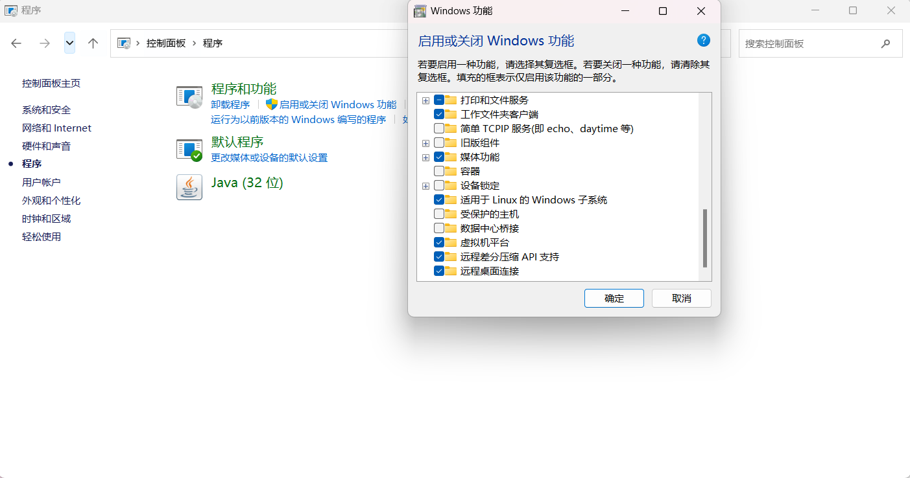 **安装Linux子系统**
```
下载或者更新
wsl --update
重新启动
wsl --shutdown  
```

管理员运行PowerShell，运行开头的两段命令。

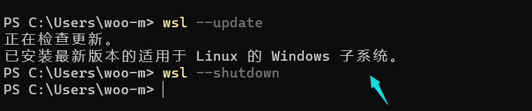  


### 2. 安装 Docker Desktop

1. 下载 Docker Desktop：
    访问 Docker 官网：https://www.docker.com/。
    点击页面上的“Download for Windows - AMD64”按钮，以下载适用于 Windows 系统的 Docker Desktop 安装文件。

2. 安装 Docker Desktop：
    双击下载的安装文件，开始安装 Docker Desktop。
    按照安装向导的指示完成安装。在安装过程中，将提示安装 WSL 2，建议勾选此选项以获得更好的性能。

3. 配置 Docker Desktop：
    安装完成后，启动 Docker Desktop。

  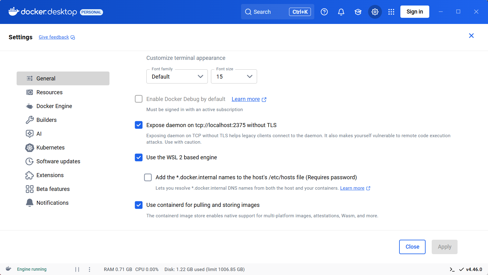

  我们需要开启至少这两个选项，这两个选项分别是开启远程连接(当然，是内网)，第二个是说使用WSL来当作Docker的运行系统，不开启就是使用虚拟机了。

  然后我们配置一下镜像源，国外的官方源太慢了。

  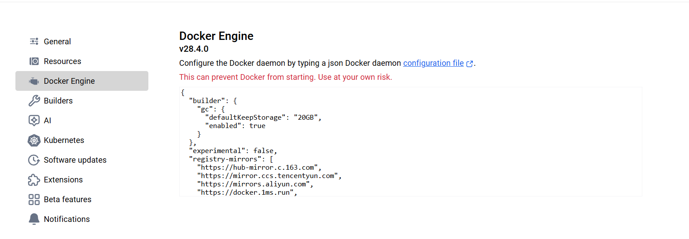    


首次打开时，将出现 Docker 订阅协议，点击 Accept（接受）以继续。

随后，系统将提示用户登录。您可以选择使用 GitHub 账户或 Google 账户登录，若无上述账户，可选择跳过登录步骤。

接下来，将出现调查问卷，您可以根据个人喜好选择填写，或直接跳过此步骤。

最后，Docker Desktop 将正常启动。

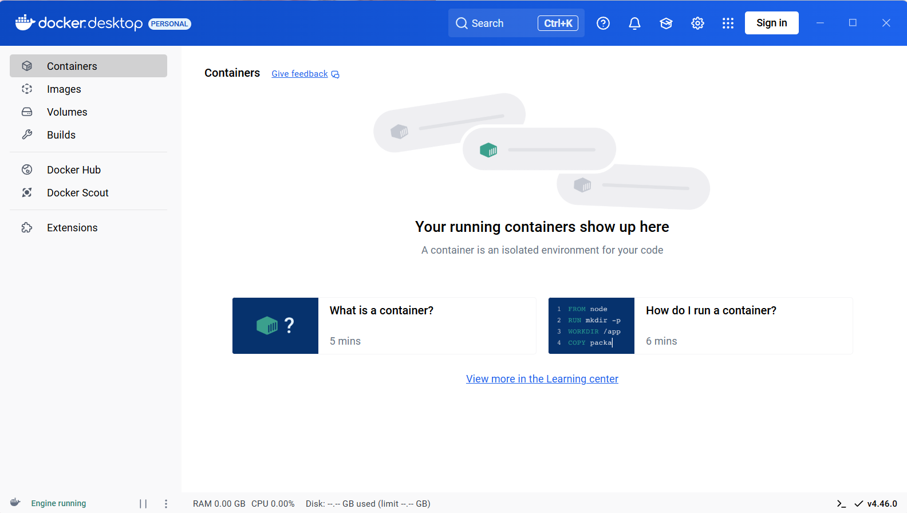


### 3. Docker基础使用

#### **对Docker操作**

安装完成Docker后,默认每次开机的时候都会自动启动,但我们也可以手动启动,关闭或者重启Docker

```dockerfile
# 启动docker
sudo service docker start

# 重启docker
sudo service docker restart

# 停止docker
sudo service docker stop
```

#### **对镜像的基础操作**

```dockerfile
#获取当时所有镜像(docker images)
docker image ls
# 或者
docker images
```

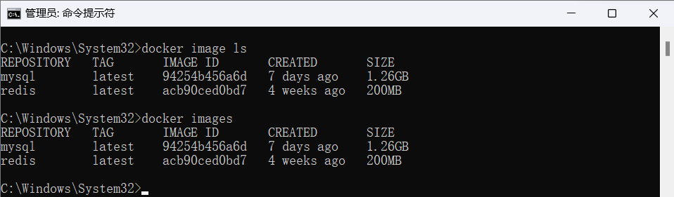  

| 标签       | 含义                                 |
| ---------- | ------------------------------------ |
| REPOSITORY | 镜像所在的仓库名称                   |
| TAG        | 镜像标签                             |
| IMAGEID    | 镜像ID                               |
| CREATED    | 镜像的创建日期(不是获取该镜像的日期) |
| SIZE       | 镜像大小                             |

**拉去镜像(docker pull)**
除了使用官方的镜像外,我们还可以在仓库中申请一个自己的账号,保存自己制作的进行,或者拉去使用他人的镜像。

```dockerfile
# 官方镜像
docker image pull 镜像名称 

# 或简写为 
docker pull 镜像名称

# 比如
docker pull ubuntu
docker pull ubuntu:16.04

# 个人镜像
docker pull 仓库名称/镜像名称
docker pull xunmi/django

# 第三方仓库拉去
docker pull 第三方仓库地址/仓库名称/镜像名称
docker pull hub.c.163.com/library/mysql:latest
(默认仓库名为library,所有从官方获取镜像相当于`sudo docker image pull library/镜像名称`)
```

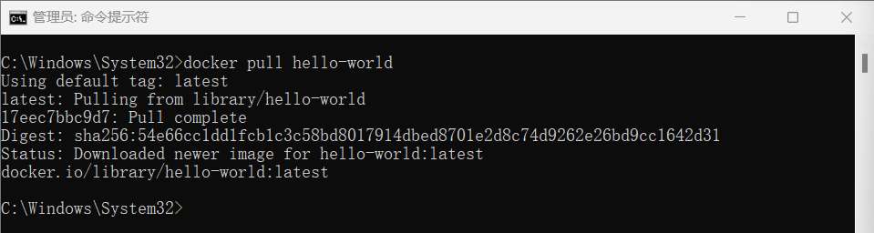  


**删除镜像(docker rmi)**

```
docker image rm 镜像名或镜像ID 或 docker rmi 镜像名或镜像ID
docker image rm hello-world
docker rmi 9e64176cd8a2
```

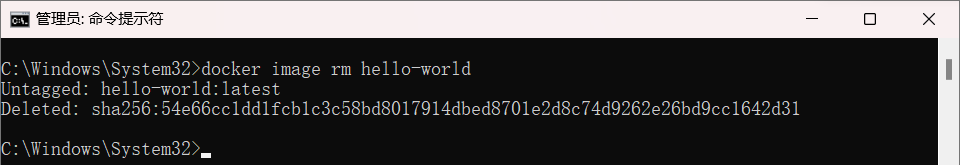  

删除镜像的前提是没有使用这个镜像的容器,如果有需要先删除容器(报错:Error response from daemon: conflict: unable to delete 镜像ID (must be forced) - image is being used by stopped container 容器ID则代表有容器使用了此镜像。)可以尝试先执行docker rm 容器ID删除容器,如果还报错,可以看我下方删除容器的具体方法。

几条删除命令的区别

docker rm: 删除一个或多个 容器
docker rmi: 删除一个或多个 镜像
docker prune: 用来删除不再使用的 docker 对象


**加载镜像(docker run)**
上面我们说过,镜像只是一个只读类型的文件,而我们的环境不可能只是一个这样的文件,所以我们需要把这个镜像加载成我们的环境,也就是让他变成容器。

```
docker run [可选参数] 镜像名 [向启动容器中传入的命令]
运行本项目
```

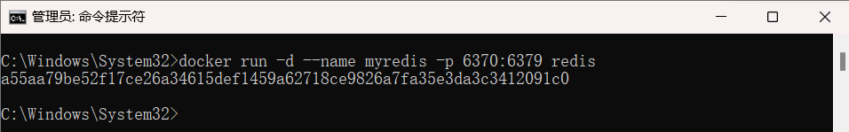  

| **常用可选参数** | **作用**                                                     |
| ---------------- | ------------------------------------------------------------ |
| -i               | 表示以《交互模式》运行容器。                                 |
| -d               | 会创建一个守护式容器在后台运行(这样创建容器后不会自动登录容器)。 |
| -t               | 表示容器启动后会进入其命令行。加入这两个参数后，容器创建就能登录进去。即分配一个伪终端。 |
| -name            | 为创建的容器命名。(默认会随机给名字,不支持中文字符!!!)       |
| -v               | 表示目录映射关系，即宿主机目录:容器中目录。注意:最好做目录映射，在宿主机上做修改，然后共享到容器上。 |
| -p               | 表示端口映射，即宿主机端口:容器中端口。 比如:`-p 8080:80` 就是将容器中的80端口,映射到主机中的8080端口 |
| –network=host    | 表示将主机的网络环境映射到容器中，使容器的网络与主机相同。每个 Docker 容器都有自己的网络连接空间连接到虚拟 LAN。使用此命令则会让容器和主机共享一个网络空间。 |


#### 对容器的基础操作

**查看容器(docker ps)**

查看容器主要会用到ps命令

```
# 查看当前所有正在运行的容器
docker ps

# 查看当前所有的容器
docker ps -a

# 使用过滤器(除了name外,常用的还可以指定id:id= 、所有停止的容器:status=exited,正在运行的容器:status=running 等)
docker ps -f name=指定的名字

# 显示2个上次创建的容器(2可以改变)
docker ps -n 2

# 显示最新创建的容器（包括所有状态）
docker ps -l

# 仅显示ip
docker ps -q

 # 显示容器大小
docker ps -s
```

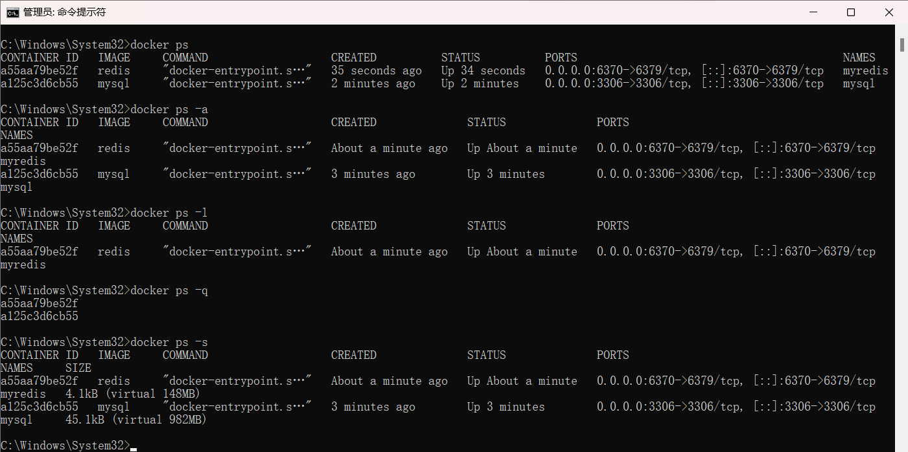  

| 标签         | 含义                                  |
| ------------ | ------------------------------------- |
| CONTAINER ID | 镜像ID                                |
| IMAGE        | 创建容器的镜像名称                    |
| COMMAND      | 默认启动命令(启动时会自动执行)        |
| CREATED      | 创建容器的日期                        |
| STATUS       | 当前的状态(启动了多久,多久之前退出等) |
| PORTS        | 映射的端口                            |
| NAMES        | 容器的名称                            |
| SIZE         | 容器大小(使用-s命令参数时才能看到)    |


**启动和关闭容器**

```dockerfile
# 停止容器
docker container stop 容器名或容器id

# 或可简写为
docker stop 容器名或容器id

# 强制关闭容器
docker container kill 容器名或容器id

# 或可简写为
docker kill 容器名或容器id

# 启动容器
docker container start 容器名或容器id

# 或可简写为
docker start 容器名或容器id
```

- 如果我们成功启动或者关闭一个容器的话,会返回容器名或者容器id
- stop和kill的区别: stop是比较优雅的关掉一个容器,类似我们正常退出一个软件,而kill是当一个进程出现意外无法正常关闭的时候,我们强行进行关闭,有点像我们使用任务管理器进行结束进程操作


**操作后台容器**
之前我们下过一个kali并且放在了后台运行,如果没有下载可以执行下列命令(docker run -i -d -t --name=kali-test kalilinux/kali-rolling),下面我们就用下面的命令开启kali(如果你下的是其他系统,比如ubuntu也可以举一反三一下)
首先我们确保我们要进入的容器是开启状态的,使用docker ps -a查看其中的STATUS属性是否是Up开头,如果不是先照着上面启动容器的方法开启容器
我们开启容器后,如果需要在容器内执行命令,可以将后台切换到前台,也可能使用docker命令将我们需要执行的命令传入。
操作方法有很多种,这里我们介绍一些比较常用的方法

```dockerfile
# 如果我只需要执行简单的一两条命令可以使用docker exec
# 执行单条命令 (-i: 启动并且保留交互式命令行; -t:作用是分配一个虚拟的终端; docker run )
docker exec -it 容器名或容器id 执行的命令
# 比如
docker exec -it mysql mysql -u root -p

# 除了exec外还有attach可以使用,但它有个弊端,多终端启动attach后,都会会同步显示。如果有一个窗口阻塞了，那么其他窗口也无法再进行操作。
docker attach 容器名或容器id
# 比如
docker attach mysql 
```

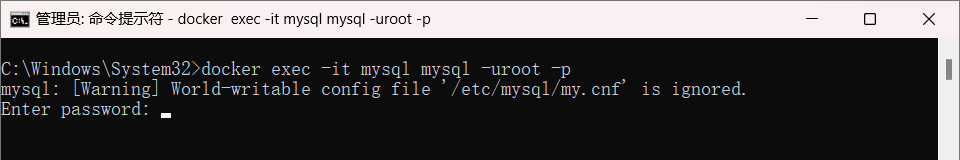  

| exec可选参数 | 作用                                                         |
| ------------ | ------------------------------------------------------------ |
| -d           | 会创建一个守护式容器在后台运行(这样创建容器后不会自动登录容器)。 |
| -e           | 设置环境变量                                                 |
| -i           | 表示以《交互模式》运行容器。                                 |
| -t           | 表示容器启动后会进入其命令行。加入这两个参数后，容器创建就能登录进去。即分配一个伪终端。 |
| -u           | 设置用户名和UID。                                            |
| -w           | 设置容器内的工作目录。                                       |

**删除容器(docker rm)**

如我我们需要删除一个容器,首先需要确保这个容器已经停止了,因为正在运行的容器是无法直接删除。
我们可以运行一下`docker ps -a`,如果发现没有停止,可以使用`docker stop`停止(STATUS下已Exited开头则是停止的)

```
# 使用rm删除容器
docker rm 容器名或容器id
# 列如
docker rm docker-test
```

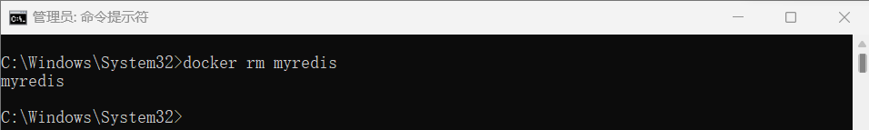  

**容器制作成镜像**

我们为什么要把容器制作成镜像?

- 镜像可以看作为是一种备份,如果我们后期环境出现了问题,可以还原到早期镜像。
- 镜像便于传播,可以让自己的其他设备或他人的重复利用变得更加简单容易。

```
# 将容器制作成镜像
docker commit 容器名 镜像名
# 镜像打包备份(打包备份的文件会自动存放在当前命令行的路径下,如果想让保存的文件可以打开,可以加.tar后缀)
docker save -o 保存的文件名 镜像名
# 镜像解压
docker load -i 文件路径/备份文件
```

我们将打包备份的镜像可以通过网络发送到其他设备上,使用docker镜像解压即可直接使用你的环境。

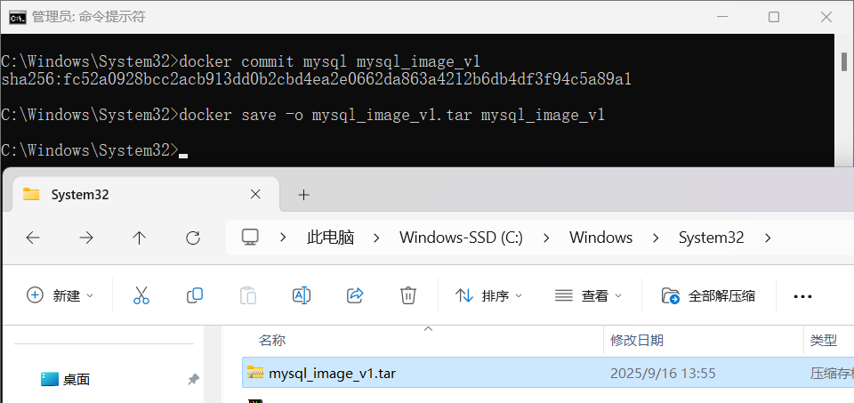  


#### Docker基础命令

| Docker基础命令 | **说明**                       |
| :------------- | :----------------------------- |
| docker pull    | 拉取镜像                       |
| docker push    | 推送镜像到DockerRegistry       |
| docker images  | 查看本地镜像                   |
| docker rmi     | 删除本地镜像                   |
| docker run     | 创建并运行容器（不能重复创建） |
| docker stop    | 停止指定容器                   |
| docker start   | 启动指定容器                   |
| docker restart | 重新启动容器                   |
| docker rm      | 删除指定容器                   |
| docker ps      | 查看容器                       |
| docker logs    | 查看容器运行日志               |
| docker exec    | 进入容器                       |
| docker save    | 保存镜像到本地压缩文件         |
| docker load    | 加载本地压缩文件到镜像         |
| docker inspect | 查看容器详细信息               |


## 二、汉化 Docker Desktop（可选）

若想使 Docker Desktop 显示中文界面，按照以下步骤进行汉化：

1. 下载对应版本的中文语言包：
访问 GitHub，下载适用于 Docker Desktop 的中文语言包，链接地址为：[DockerDesktop-CN](https://github.com/asxez/DockerDesktop-CN/releases)。

将下载的文件解压至 C:\Program Files\Docker 目录下（即 Docker 的安装根目录）。

2. 检查 Docker Desktop 版本：
启动 Docker Desktop，版本号将在右下角显示。

3. 备份并替换 app.asar 文件：
打开 Docker Desktop 中文语言包，选择与您 Docker 版本相符的 app.asar 文件并复制。

导航至 Docker 的安装目录，路径默认为：
C:\Program Files\Docker\Docker\frontend\resources
在该目录下找到 app.asar 文件，建议先备份原文件，然后将复制的中文语言包中的 app.asar 文件粘贴并替换原有文件。

4. 重新启动 Docker Desktop：
完成替换后，请关闭 Docker Desktop，然后重新启动该程序。此时，Docker Desktop 应该以中文界面显示。

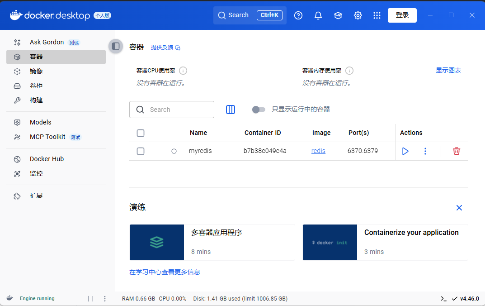  

## 三、Docker Desktop安装Redis

win+R打开windows命令行窗口


输入以下命令拉取redis镜像 #默认拉去最新版本（redis：+版本名 [拉取指定redis版本]）

```
docker pull redis  
```

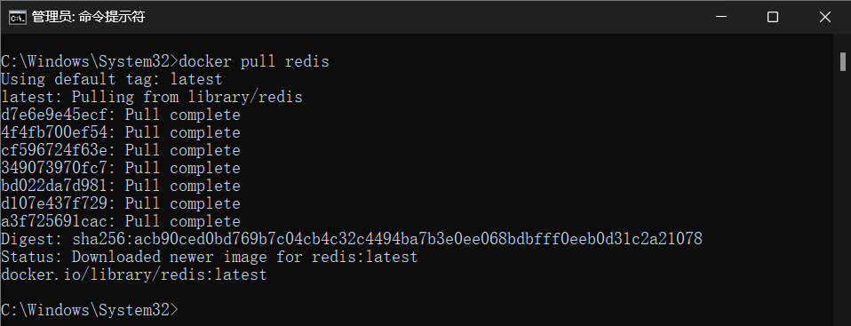  

接下来就可以通过DockerDeskTop查看是否将镜像导入成功

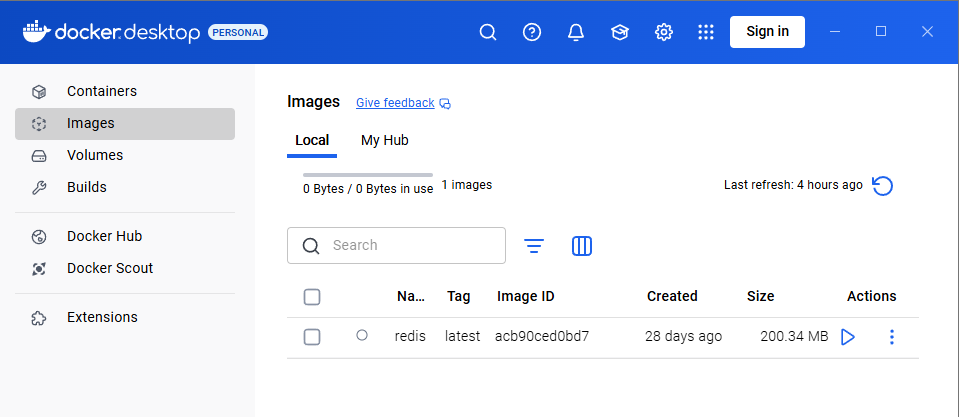  

快速启动Redis

```
docker run -d --name myredis -p 6379:6379 redis
```

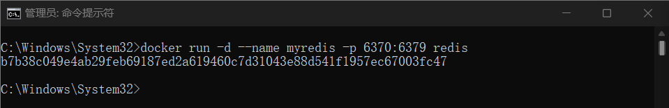

```
docker run --name redis -p 6379:6379 -v /docker/host/dir:/data -d redis redis-server --appendonly yes --requirepass 123456


-p 6379:6379 端口映射：前表示主机部分，：后表示容器部分。

--name redis 指定该容器名称，查看和进行操作都比较方便。

-v 挂载文件或目录 ：前表示主机部分，：后表示容器部分。

-d redis 表示后台启动redis

//redis-server /etc/redis/redis.conf 以配置文件启动redis，加载容器内的conf文件，最终找到的是挂载的目录/usr/local/docker/redis.conf

--appendonly yes 开启redis 持久化

--requirepass 123456 设置密码为123456
```


此时我们可以点击左侧Containers查看已经启动的容器

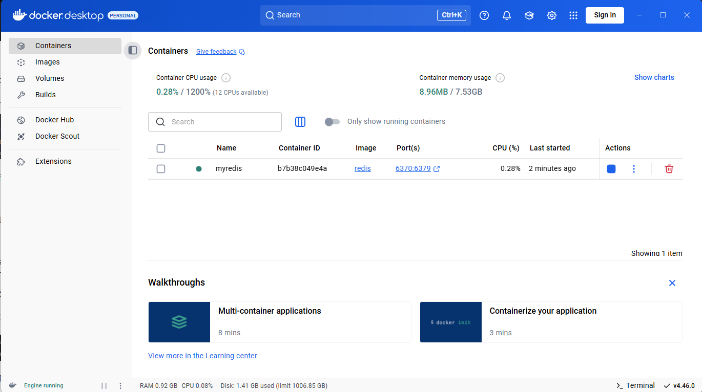

接着我们回到命令行中输入docker ps命令查看当前正在运行的容器

```
docker ps
```

接着我们输入指令 myredis为需要连接进入的容器名即NAMES

```
docker exec -it myredis bash
```


此时输入指令连接redis-cli命令客户端

```
redis-cli
```

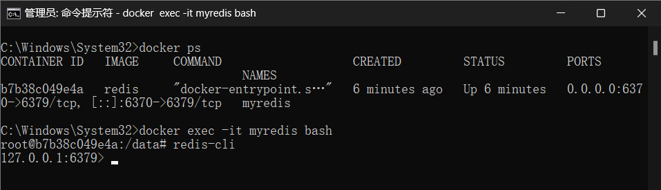  

此时就可以使用redis指令执行操作了


当你觉得每次项目启动前需要启动容器过于繁琐可以开启容器自启动['redis'为你的容器名称]

```
docker update --restart=always redis
```

### Redis 基本使用

**进入 Redis 客户端**

```bash
redis-cli
```

**常见命令**

```mysql
# 测试连接
PING             → PONG

# 设置与获取键值
SET name "Tom"
GET name         → "Tom"

# 删除键
DEL name

# 判断键是否存在
EXISTS name

# 查看所有键
KEYS *

# 设置键过期时间（秒）
EXPIRE name 10
TTL name
```

## 

Redis 支持两种持久化方式：

1. RDB（快照）：定时保存数据库快照到磁盘（体积小，恢复快）。
2. AOF（追加文件）：记录每条写操作日志（更安全，适合重要数据）。

开启 AOF：

```conf
appendonly yes
```

------

**总结：**

Redis**-**cli常用命令：`SET`、`GET`、`DEL`、`EXPIRE`、`KEYS`。

数据结构：String、Hash、List、Set、ZSet。

持久化：RDB（快照）+ AOF（日志）。

## 四、Docker Desktop安装MySQL

在Docker Desktop安装Redis的基础上

终端运行命令

```dockerfile
docker pull mysql
```

  

D盘创建目录docker/mysql/conf,docker/mysql/data

这是mysql的配置文件和存储数据用的目录

切换到终端，输入命令，第一次启动MySQL容器

```dockerfile
docker run --name mysql -p 3306:3306 ^
-e MYSQL_ROOT_PASSWORD=123456 ^
-d mysql
```

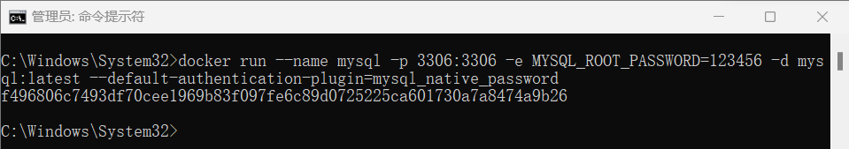

命令解释:

run --name mysql

–name为容器指定名称为mysql

-p 3306:3306

指定端口映射，将主机端口3306映射到容器端口3306

-e MYSQL_ROOT_PASSWORD=123456

-e设置环境变量 ，设置root用户，密码123456

-d mysql:latest --default-authentication-plugin=mysql_native_password

-d后台运行，并返回容器ID ,mysql:latest 镜像名


准备复制MySQL镜像中的配置文件到刚刚创建的本地持久化目录

D:/docker/mysql/conf/

打开docker桌面，点击Images镜像==》选择mysql镜像==》点击In use进入容器==》

点击name:mysql==》点击Files==》打开目录etc/my.cnf点击下载到目录D:/docker/mysql/conf/

关闭容器

终端执行命令
```dockerfile
关闭容器
docker stop mysql

删除容器
docker rm mysql
```

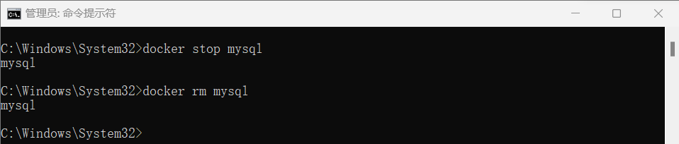  

重新启动容器，执行命令

```dockerfile
docker run --name mysql -p 3306:3306 ^
  -v //d/HBBTJ/Docker/mysql/data:/var/lib/mysql ^
  -v //d/HBBTJ/Docker/mysql/conf/my.cnf:/etc/mysql/my.cnf ^
  -e MYSQL_ROOT_PASSWORD=123456 ^
  -d mysql
```

-v //d/HBBTJ/Docker/mysql/data:/var/lib/mysql

映射主机目录d盘的/docker/mysql/data 到容器的/var/lib/mysql/目录


测试是否持久化

进入 MySQL 容器：

```
docker exec -it mysql mysql -uroot -p
```

新建数据库：

```
CREATE DATABASE testdb;
```

查看 `D:\docker\mysql\data`，应该能看到 `testdb` 文件夹。

  

数据会存到 Docker 管理的 volume 里，用 `docker volume ls` 可以查看。


### MySQL 基本使用

**登录、退出**

```bash
# Linux / Docker 容器内
mysql -u root -p

# 指定主机和端口
mysql -h 127.0.0.1 -P 3306 -u root -p

#退出
exit;
```


#### 1. 基础命令

| 命令                    | 功能           | 示例                      |
| ----------------------- | -------------- | ------------------------- |
| `show databases;`       | 查看所有数据库 | -                         |
| `use 库名;`             | 切换数据库     | `use school;`             |
| `show tables;`          | 查看表         | -                         |
| `desc 表名;`            | 查看表结构     | `desc student;`           |
| `create database 库名;` | 创建数据库     | `create database testdb;` |


#### 2. 数据库与表

**数据库管理**

- 创建：`CREATE DATABASE [IF NOT EXISTS] 库名;`

- 删除：`DROP DATABASE [IF EXISTS] 库名;`

- 查看：`SHOW DATABASES;`

  

**表结构设计**

- **列类型**：数值（int、bigint）、字符串（varchar、text）、时间（datetime）
- **字段属性**：UnSigned（非负）、Auto_InCrement（自增）、DEFAULT（默认值）
- **创建示例**

```sql
CREATE TABLE IF NOT EXISTS `student`(
  `id` INT(4) NOT NULL AUTO_INCREMENT COMMENT '学号',
  `name` VARCHAR(30) NOT NULL DEFAULT '匿名',
  PRIMARY KEY (`id`)
)ENGINE=INNODB DEFAULT CHARSET=utf8;
```


**表修改与删除**

- 重命名：`ALTER TABLE 旧名 RENAME AS 新名;`
- 增字段：`ALTER TABLE 表名 ADD 字段 类型;`
- 删表：`DROP TABLE IF EXISTS 表名;`


#### 3. 数据操作（DML）

**插入（INSERT**）

```sql
-- 单条
INSERT INTO student(`name`) VALUES('张三');
-- 多条
INSERT INTO student(`name`,`pwd`) VALUES('张三','123'),('李四','456');
```


**修改（UPDATE）**

```sql
UPDATE student SET `name`='张三2024' WHERE id=1; -- 加条件避免全表修改
```


**删除（DELETE）**

```sql
DELETE FROM student WHERE id=1; -- 必加WHERE
-- 重置自增用TRUNCATE（不可回滚）
TRUNCATE TABLE student;
```


#### 4. 数据查询（DQL）

**基础查询**

```sql
SELECT `id`,`name` FROM student; -- 指定字段
SELECT DISTINCT `id` FROM result; -- 去重
```


**条件查询（WHERE）**

```sql
-- 区间
SELECT * FROM result WHERE score BETWEEN 90 AND 100;
-- 模糊查询
SELECT * FROM student WHERE `name` LIKE '%张%';
```


**分组与聚合**

```sql
-- 按科目查平均分（>90）
SELECT subject,AVG(score) 
FROM result 
GROUP BY subject 
HAVING AVG(score)>90;
```


**连接查询**

```sql
-- 学生-年级关联
SELECT s.`name`,g.`gradeName` 
FROM student s
INNER JOIN grade g ON s.gradeId=g.id;
```


**排序与分页**

```sql
-- 排序
SELECT * FROM student ORDER BY id DESC;
-- 分页（第1页，5条）
SELECT * FROM student LIMIT 0,5;
```


#### 5. 高级特性

**MD5 加密**

```sql
-- 插入加密
INSERT INTO testMD5 VALUES(1,'张三',MD5('123'));
-- 校验
SELECT * FROM testMD5 WHERE `name`='张三' AND pwd=MD5('123');
```


**事务管理**

- **ACID**：原子性、一致性、隔离性、持久性

```sql
SET autocommit=0; -- 关自动提交
START TRANSACTION; -- 启事务
-- SQL操作
COMMIT; -- 成功提交
-- ROLLBACK; -- 失败回滚
SET autocommit=1; -- 恢复
```


**索引**

- 分类：主键索引、普通索引、唯一索引
- 创建：`CREATE INDEX idx_name ON student(`name`);`
- 原则：查询字段加索引，小表 / 频繁更新字段不加


**用户与权限**

```sql
CREATE USER 'tom'@'%' IDENTIFIED BY '123456';
GRANT ALL PRIVILEGES ON testdb.* TO 'tom'@'%';
FLUSH PRIVILEGES;                       -- 刷新权限
```

------


**数据库备份与恢复**

备份

```sql
mysqldump -u root -p testdb > testdb.sql
```

恢复

```sql
mysql -u root -p testdb < testdb.sql
```

**总结**

安装方式：Linux `apt/yum`、Windows Installer、Docker（推荐）。

核心命令：`CREATE DATABASE`、`CREATE TABLE`、`INSERT`、`SELECT`、`UPDATE`、`DELETE`。

管理工具：命令行 (`mysql`)，图形化工具（MySQL Workbench、Navicat、DBeaver）。

生产环境推荐：Docker + 数据持久化 + AOF 备份。 


