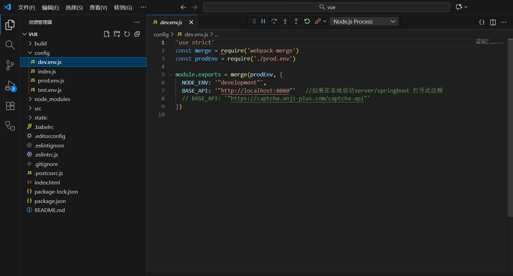
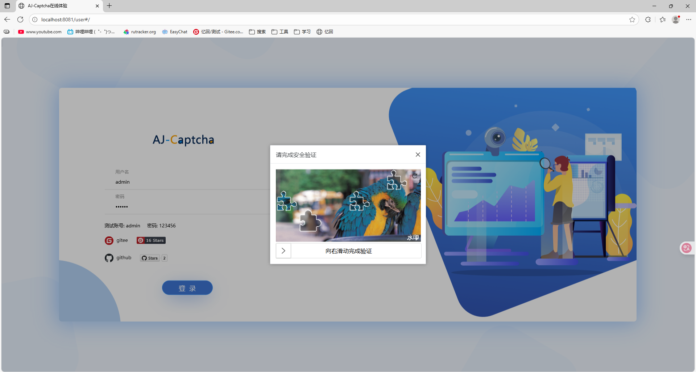

# Aj-Captcha图形验证码

## 一、项目简介

`aj-captcha` 是一款开源的 Java 图形验证码组件，支持：

- 滑块拼图验证码
- 文字点选验证码
- 自定义背景、模板、缓存方式（Redis、Local 等）

Spring Boot 3 集成后，可以非常方便地提供验证码 API 给前端（如 Vue、React、uniapp 等）调用。

## 二、引入 Maven 依赖


```xml
<!--AJ-Captcha 行为验证码功能-->
        <dependency>
            <groupId>com.anji-plus</groupId>
            <artifactId>captcha-spring-boot-starter</artifactId>
            <version>1.4.0</version>
        </dependency>
        <dependency>
            <groupId>javax.annotation</groupId>
            <artifactId>javax.annotation-api</artifactId>
            <version>1.3.2</version>
        </dependency>
```

> 💡 注意：Spring Boot 3 开始默认使用 Jakarta 包命名空间，aj-captcha 1.4.0 之前的版本与 Spring Boot 3 不完全兼容。

------

## 三、基础配置（application.yml）

修改application.yml内容，与spring同级：

```yaml
aj:
    captcha:
#        type: blockPuzzle       # 验证码类型: blockPuzzle(滑块) 或 clickWord(文字点选)
        cache-type: local       # 缓存类型: local/redis
        expire-seconds: 120     # 验证码有效时间(秒)
        water-mark: '水印'   # 可选
        interference-options: '2'  # 干扰项
        font-type: '宋体'          # 字体（可选）
#        puzzle-base-dir: classpath:images/puzzle/
spring: ...
```

------

## 四、后端接口编写

### 生成验证码接口


```java
package com.example.mybatis.controller;

import com.anji.captcha.model.common.ResponseModel;
import com.anji.captcha.model.vo.CaptchaVO;
import com.anji.captcha.service.CaptchaService;
import jakarta.servlet.http.HttpServletRequest;
import org.springframework.beans.factory.annotation.Autowired;
import org.springframework.web.bind.annotation.*;

@RestController
@RequestMapping("/captcha")
public class CaptchaController {

    @Autowired
    private CaptchaService captchaService;

    @PostMapping("/get")
    public ResponseModel get(@RequestBody CaptchaVO data, HttpServletRequest request) {
        data.setBrowserInfo(request.getRemoteAddr() + request.getHeader("user-agent"));
        // 若前端未指定类型，默认使用滑块
        if (data.getCaptchaType() == null) {
            data.setCaptchaType("blockPuzzle");
        }
        return captchaService.get(data);
    }

    @PostMapping("/check")
    public ResponseModel check(@RequestBody CaptchaVO data, HttpServletRequest request) {
        data.setBrowserInfo(request.getRemoteAddr() + request.getHeader("user-agent"));
        return captchaService.check(data);
    }
}
```

------

## 五、修改启动项

添加@ComponentScan(basePackages = {"com.example.mybatis", "com.anji.captcha"})自动配置

```java
package com.example.mybatis;

import org.springframework.boot.SpringApplication;
import org.springframework.boot.autoconfigure.SpringBootApplication;
import org.springframework.context.annotation.ComponentScan;

@SpringBootApplication

@ComponentScan(basePackages = {"com.example.mybatis", "com.anji.captcha"})
public class MybatisApplication {

    public static void main(String[] args) {
        SpringApplication.run(MybatisApplication.class, args);
    }

}
```


## 六、前端调用示例

前端使用官方示例中的前端代码测试

https://gitee.com/anji-plus/captcha.git

先将前端api改为本地启动端口



**本地启动**

 启动后端，运行service/springboot的StartApplication。
 启动前端，使用visual code打开文件夹view/vue，npm install后npm run dev，浏览器登录

```
npm install
npm run dev

DONE  Compiled successfully in 29587ms                       12:06:38
I  Your application is running here: http://localhost:8081
```


------

## 七、测试流程

1. 启动后端，运行service/springboot的StartApplication
2. 启动前端，使用visual code打开文件夹view/vue，npm install后npm run dev
3. 访问接口：http://localhost:8081
4. 点击登录测试滑块验证码
5. 拖动验证后，提交校验接口，提示验证成功并进入主页即测试成功

