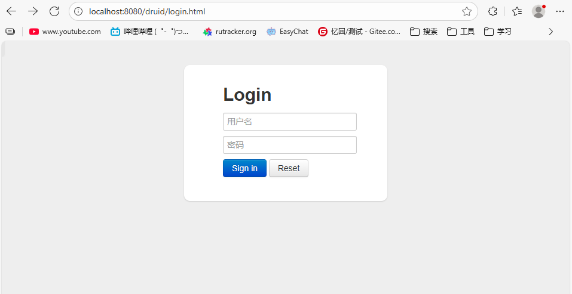
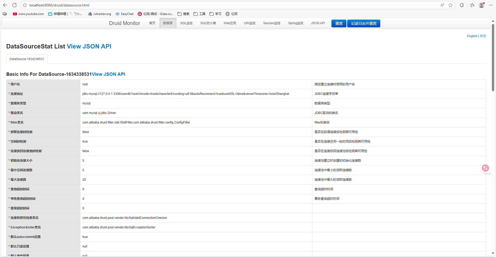
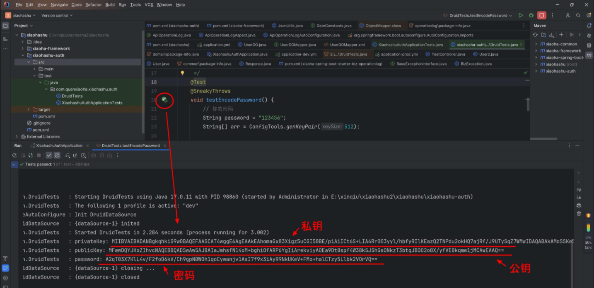
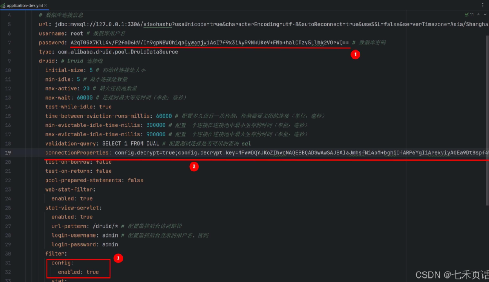

# 集成 Druid 数据源、CORS跨域请求

Spring Boot 3 整合 Druid 数据库连接池（含密码加密）

## 一、Druid 数据源介绍

Druid 是阿里巴巴开源的一个高性能、可扩展的数据库连接池，常用于解决数据库连接池的性能问题。它支持监控、扩展和灵活的配置，特别适合高并发、高负载的应用场景。Druid 提供了 SQL 执行分析、慢查询分析等功能，帮助开发者更加高效地优化数据库性能。

数据库连接池是一种用于管理数据库连接的技术。在传统的数据库连接方式中，每次与数据库建立连接都需要经过一系列的网络通信和身份验证过程，这会消耗大量的系统资源和时间。而数据库连接池则通过预先创建一定数量的数据库连接并将其保存在池中，以供需要时复用，从而避免了重复建立和关闭连接的开销。

**使用数据库连接池有如下优点：**

**提高性能和效率**：数据库连接池可以复用已经建立的数据库连接，减少了每次连接数据库的开销，提高了系统的性能和响应速度。<br>
**资源管理**：数据库连接池可以限制系统中同时存在的连接数量，防止数据库连接过多导致系统资源不足或性能下降。<br>
**连接复用**：数据库连接池可以管理连接的生命周期，确保连接在需要时处于可用状态，并在不再需要时释放资源，从而减少了系统资源的浪费。<br>**连接池监控**：数据库连接池通常提供了监控和管理功能，可以实时监控连接的使用情况、连接的状态和性能指标，帮助管理员及时发现和解决问题。

## 二、集成 Druid 数据源

### 1、**引入依赖**

在 `pom.xml` 中添加 Druid 和 Spring Boot 数据源的依赖。

```java
<!-- Druid 数据库连接池 -->
 <dependency>
     <groupId>com.alibaba</groupId>
     <artifactId>druid-spring-boot-3-starter</artifactId>
     <version>1.2.21</version>
 </dependency>
```

依赖添加完毕后，点击 IDEA 右侧栏的 Reload 按钮，刷新一下 Maven 依赖，将包下载到本地仓库中。

### 2、连接池配置

配置application.yml 或 application.properties

```yml
spring:
  datasource:
    driver-class-name: com.mysql.cj.jdbc.Driver # 指定数据库驱动类
    # 数据库连接信息
    url: jdbc:mysql://127.0.0.1:3306/userdb?useUnicode=true&characterEncoding=utf-8&autoReconnect=true&useSSL=false&serverTimezone=Asia/Shanghai
    username: root # 数据库用户名
    password: 123456 # 数据库密码
    type: com.alibaba.druid.pool.DruidDataSource
    druid: # Druid 连接池
      initial-size: 5 # 初始化连接池大小
      min-idle: 5 # 最小连接池数量
      max-active: 20 # 最大连接池数量
      max-wait: 60000 # 连接时最大等待时间（单位：毫秒）
      test-while-idle: true
      time-between-eviction-runs-millis: 60000 # 配置多久进行一次检测，检测需要关闭的连接（单位：毫秒）
      min-evictable-idle-time-millis: 300000 # 配置一个连接在连接池中最小生存的时间（单位：毫秒）
      max-evictable-idle-time-millis: 900000 # 配置一个连接在连接池中最大生存的时间（单位：毫秒）
      validation-query: SELECT 1 FROM DUAL # 配置测试连接是否可用的查询 sql
      test-on-borrow: false
      test-on-return: false
      pool-prepared-statements: false
      web-stat-filter:
        enabled: true
      stat-view-servlet:
        enabled: true
        url-pattern: /druid/* # 配置监控后台访问路径
        login-username: admin # 配置监控后台登录的用户名、密码
        login-password: admin
      filter:
        stat:
          enabled: true
          log-slow-sql: true # 开启慢 sql 记录
          slow-sql-millis: 2000 # 若执行耗时大于 2s，则视为慢 sql
          merge-sql: true
        wall: # 防火墙
          config:
            multi-statement-allow: true
```

解释一下上面各项配置：

| 配置                                                         | 解释                                                         |
| ------------------------------------------------------------ | ------------------------------------------------------------ |
| type: com.alibaba.druid.pool.DruidDataSource：               | 指定使用 Druid 连接池。                                      |
| initial-size：                                               | 初始化连接池大小，即连接池启动时创建的初始化连接数。         |
| min-idle：                                                   | 最小连接池数量，连接池中保持的最小空闲连接数。               |
| max-active：                                                 | 最大连接池数量，连接池中允许的最大活动连接数。               |
| max-wait：                                                   | 连接时最大等待时间，当连接池中的连接已经用完时，等待从连接池获取连接的最长时间，单位是毫秒。 |
| test-while-idle：                                            | 连接空闲时是否执行检查。                                     |
| time-between-eviction-runs-millis：                          | 配置多久进行一次检测，检测需要关闭的连接，单位是毫秒。       |
| min-evictable-idle-time-millis：                             | 一个连接在连接池中最小生存的时间，单位是毫秒。               |
| max-evictable-idle-time-millis：                             | 一个连接在连接池中最大生存的时间，单位是毫秒。               |
| validation-query：                                           | 测试连接是否可用的查询 SQL。                                 |
| test-on-borrow：                                             | 连接从连接池获取时是否测试连接的可用性。                     |
| test-on-return：                                             | 连接返回连接池时是否测试连接的可用性。                       |
| pool-prepared-statements：                                   | 是否缓存 PreparedStatement，默认为 false。                   |
| web-stat-filter：                                            | 用于配置 Druid 的 Web 监控功能。在这里，enabled 表示是否开启 Web 监控功能。如果设置为 true，就可以通过浏览器访问 Druid 的监控页面。 |
| stat-view-servlet:配置 Druid 的监控后台访问路径、登录用户名和密码。 | `enabled` 表示是否开启监控后台功能。<br/> `url-pattern` 指定了监控后台的访问路径，即通过浏览器访问监控页面时的 URL。 <br/>`login-username` 和 `login-password` 分别指定了监控后台的登录用户名和密码，用于访问监控后台时的身份验证。 |
| filter：用于配置 Druid 的过滤器，包括统计过滤器和防火墙过滤器。 | stat：配置 Druid 的统计过滤器。enabled 表示是否开启统计功能，log-slow-sql 表示是否开启慢 SQL 记录，slow-sql-millis 指定了执行时间超过多少毫秒的 SQL 语句会被认为是慢 SQL，merge-sql 表示是否开启 SQL 合并功能。<br/>wall：配置 Druid 的防火墙过滤器。防火墙用于防止 SQL 注入攻击。在这里，config 配置了防火墙的规则，multi-statement-allow 表示是否允许执行多条 SQL 语句。 |

### 3、**启用 Druid 监控**

重启认证服务，访问地址：http://localhost:8080/druid ，即可登录 Druid 监控后台, 如下图所示，用户名和密码填写刚刚 `yml` 文件中手动配置的：



登录成功后，就能看到各项监控信息了



## 三、数据库密码加密

数据库连接密码加密是为了增强系统的安全性。在配置文件中，明文存储数据库连接密码存在以下几个潜在风险：

**泄露风险：** 如果配置文件被不当地公开或者泄露，其中包含的数据库连接密码也会暴露给不可信的第三方，从而造成数据库的安全威胁。
**权限滥用：** 如果系统中的某个用户拥有访问配置文件的权限，那么他就可以直接获取到数据库连接密码。如果这个用户是不可信的，就有可能滥用这个权限，对数据库进行非法操作。
**审计追踪：** 明文存储密码会降低系统的审计追踪能力。一旦出现安全问题，无法准确追踪是谁在何时何地使用了数据库连接密码。
为了避免以上风险，我们可以采取数据库连接密码加密的方式。加密后的密码可以在配置文件中存储，即使被泄露也不会直接暴露真实的密码，增加了攻击者破解密码的难度。

**Druid 内置工具加密密码**
接下来，我们将通过 Druid 内置的密码加密工具 ConfigTools，来对明文密码进行加密处理。

### 1、新建DruidTests 单元测试


```java
package com.example.mybatis;

import com.alibaba.druid.filter.config.ConfigTools;
import lombok.SneakyThrows;
import lombok.extern.slf4j.Slf4j;
import org.junit.jupiter.api.Test;
import org.springframework.boot.test.context.SpringBootTest;

@SpringBootTest
@Slf4j
class DruidTests {

    /**
     * Druid 密码加密
     */
    @Test
    @SneakyThrows
    void testEncodePassword() {
        // 你的密码
        String password = "123456";
        String[] arr = ConfigTools.genKeyPair(512);

        // 私钥
        log.info("privateKey: {}", arr[0]);
        // 公钥
        log.info("publicKey: {}", arr[1]);

        // 通过私钥加密密码
        String encodePassword = ConfigTools.encrypt(arr[0], password);
        log.info("password: {}", encodePassword);
    }
}
```

| 配置                                                         | 解释                                                         |
| ------------------------------------------------------------ | ------------------------------------------------------------ |
| String password = "123456";                                  | 定义了要加密的密码。                                         |
| String[] arr = ConfigTools.genKeyPair(512);                  | 调用 `ConfigTools` 类的 `genKeyPair` 方法生成 RSA 密钥对。RSA 是一种非对称加密算法，`512` 表示密钥长度为 512 位。 |
| log.info("privateKey: {}", arr[0]);                          | 私钥，用于加密                                               |
| log.info("publicKey: {}", arr[1]);                           | 公钥，用于解密。                                             |
| String encodePassword = ConfigTools.encrypt(arr[0], password); | 调用 `ConfigTools` 类的 `encrypt` 方法，使用生成的私钥对密码进行加密。这里将生成的私钥和密码作为参数传入，返回加密后的密码。 |
| log.info("password: {}", encodePassword);                    | 打印加密后的密码。                                           |



### 2、配置加密后的密码

接下来，编辑 applicaiton-dev.yml 文件，配置密码加密相关配置，如下图标注所示：



.yml核心配置如下：

```yml
spring:
  datasource:
    // 省略...
    password: A2qT03X7KlL4v/F2foD6kV/Ch9gpNBWOh1qoCywanjv1AsI7f9x3iAyR9NkUKeV+FMo+halCTzy5Llbk2VOrVQ== # 数据库密码
    type: com.alibaba.druid.pool.DruidDataSource
    druid: # Druid 连接池
      // 省略...
      connectionProperties: config.decrypt=true;config.decrypt.key=MFwwDQYJKoZIhvcNAQEBBQADSwAwSAJBAIaJmhsfN14oM+bghiOfARP6YgIiArekviyAOEa9Dt8spf4W38kSJShGs0NkzT3btqJB0O2o0X/yfVE8kqme1jMCAwEAAQ==
      // 省略...
      filter:
        config:
          enabled: true
        // 省略...
```


password:A2qT03X7KlL4v/F2foD6kV/Ch9gpNBWOh1qoCywanjv1AsI7f9x3iAyR9NkUKeV+FMo+halCTzy5Llbk2VOrVQ==：这里的密码改为加密后的密码。

connectionProperties: config.decrypt=true;config.decrypt.key=MFwwDQYJKoZIhvcNAQEBBQADSwAwSAJBAIaJmhsfN14oM+bghiOfARP6YgIiArekviyAOEa9Dt8spf4W38kSJShGs0NkzT3btqJB0O2o0X/yfVE8kqme1jMCAwEAAQ==：

这里配置了连接属性，其中 config.decrypt=true 表示开启密码解密功能，config.decrypt.key 是用于解密的密钥，即上面单元测试生成公钥。在 Druid 连接池中，如果我们的密码已经经过了加密处理，就需要在连接属性中配置解密相关的参数，以便 Druid 能够正确解密密码，然后连接到数据库。

filter.config.enabled: true：这里配置了 Druid 连接池的 filter，其中 config 是一个配置项，enabled: true 表示开启该配置项。这个配置项通常用于配置 Druid 连接池的一些额外功能，比如密码解密等。

## 四、配置CORS（跨域请求）

### 1、使用@CrossOrigin注解

你可以直接在Controller类或者具体的请求处理方法上使用@CrossOrigin注解来允许跨域请求。

```java
@RestController  
@RequestMapping("/user")  
@CrossOrigin(origins = "*") // 允许所有来源的请求跨域  
public class UserController {  
    // ...  
}
```

在这个例子中，`@CrossOrigin`注解被添加到了[控制器](https://so.csdn.net/so/search?q=控制器&spm=1001.2101.3001.7020)类上，表示这个控制器下的所有方法都允许来自`http://example.com`的GET和POST请求。你也可以将注解添加到特定的方法上，以对该方法应用CORS配置。

### 2、全局配置CORS

如果你希望全局配置CORS，而不是在每个Controller或方法上单独配置，你可以创建一个配置类来实现WebMvcConfigurer接口，并重写addCorsMappings方法。

```java
import org.springframework.context.annotation.Configuration;  
import org.springframework.web.servlet.config.annotation.CorsRegistry;  
import org.springframework.web.servlet.config.annotation.WebMvcConfigurer;  
  
@Configuration  
public class CorsConfig implements WebMvcConfigurer {  
  
    @Override  
    public void addCorsMappings(CorsRegistry registry) {  
        // 添加映射路径  
        registry.addMapping("/**")  
                .allowedOrigins("*") // 允许哪些域的请求，星号代表允许所有  
                .allowedMethods("POST", "GET", "PUT", "OPTIONS", "DELETE") // 允许的方法  
                .allowedHeaders("*") // 允许的头部设置  
                .allowCredentials(false) // 是否发送cookie  
                .maxAge(168000); // 预检间隔时间  
    }  
}
```

在这个配置中:

addMapping("/**")表示对所有的路径都应用CORS配置。*

*allowedOrigins("*")表示允许所有来源的访问，这在生产环境中可能不是最佳实践，通常你会指定具体的域名。

allowedMethods定义了允许的HTTP方法，allowedHeaders定义了允许的HTTP头部，allowCredentials(true)表示是否允许携带凭证（cookies, HTTP认证及客户端SSL证明等），

maxAge则用于设置预检请求的有效期。
