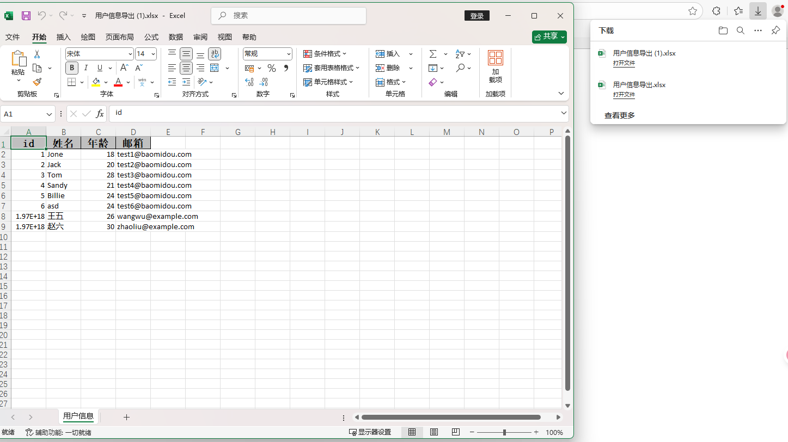

# **EasyExcel 导出数据库表数据**

## 一、添加 EasyExcel 依赖

在 `pom.xml` 的 `<dependencies>` 中加入（放在 `<dependencies>` 内任意位置）：


```xml
<!-- EasyExcel 阿里巴巴 Excel 导出库 -->
<dependency>
    <groupId>com.alibaba</groupId>
    <artifactId>easyexcel</artifactId>
    <version>3.3.4</version>
</dependency>
```

然后执行：

```bash
mvn clean install
```

------

## 二、假设你的数据库有一张用户表 `user`

表结构示例：

| id   | name | age  | email |
| ---- | ---- | ---- | ----- |
|      |      |      |       |

------

## 三、创建实体类 `User.java`

位置：`src/main/java/com/example/entity/User.java`


```java
package com.example.entity;

import com.alibaba.excel.annotation.ExcelProperty;
import lombok.Data;

@Data
public class User {
    @ExcelProperty("ID")
    private Long id;

    @ExcelProperty("姓名")
    private String name;

    @ExcelProperty("年龄")
    private Integer age;

    @ExcelProperty("邮箱")
    private String email;
}
```

------

## 四、Mapper 层

位置：`src/main/java/com/example/mapper/UserMapper.java`


```java
package com.example.mapper;

import com.baomidou.mybatisplus.core.mapper.BaseMapper;
import com.example.entity.User;
import org.apache.ibatis.annotations.Mapper;

@Mapper
public interface UserMapper extends BaseMapper<User> {
}
```

> ✅ 如果你是用 MyBatis-Plus，这样写就能直接使用 `selectList(null)` 查询全部数据。

------

## 五、Service 层

位置：`src/main/java/com/example/service/UserService.java`


```java
package com.example.mybatis.service;

import com.example.mybatis.entity.User;
import com.baomidou.mybatisplus.extension.service.IService;
/**
 * <p>
 *  服务类
 * </p>
 *
 * @author yh
 * @since 2025-09-29
 */
public interface UserService extends IService<User> {
    
}

```

实现类：


```java
package com.example.mybatis.service.impl;

import com.baomidou.mybatisplus.core.conditions.query.QueryWrapper;
import com.example.mybatis.entity.User;
import com.example.mybatis.mapper.UserMapper;
import com.example.mybatis.service.UserService;
import com.baomidou.mybatisplus.extension.service.impl.ServiceImpl;
import org.springframework.stereotype.Service;

/**
 * <p>
 *  服务实现类
 * </p>
 *
 * @author yh
 * @since 2025-09-29
 */
@Service
public class UserServiceImpl extends ServiceImpl<UserMapper, User> implements UserService {

}

```

------

## 六、Controller 导出接口

位置：`src/main/java/com/example/controller/UserExcelController.java`


```java
package com.example.mybatis.controller;

import com.alibaba.excel.EasyExcel;
import com.example.mybatis.entity.User;
import com.example.mybatis.service.UserService;
import io.swagger.v3.oas.annotations.tags.Tag;
import jakarta.servlet.http.HttpServletResponse;
import org.springframework.web.bind.annotation.GetMapping;
import org.springframework.web.bind.annotation.PostMapping;
import org.springframework.web.bind.annotation.RestController;

import java.io.IOException;
import java.net.URLEncoder;
import java.util.List;
@Tag(name = "EasyExcel导出接口", description = "提供excel下载")
@RestController
public class UserExcelController {

    private final UserService userService;

    public UserExcelController(UserService userService) {
        this.userService = userService;
    }

    @GetMapping("/exportUsers")
    public void exportUsers(HttpServletResponse response) throws IOException {
        // 设置响应头
        response.setContentType("application/vnd.ms-excel");
        response.setCharacterEncoding("utf-8");

        String fileName = URLEncoder.encode("用户信息导出", "UTF-8").replaceAll("\\+", "%20");
        response.setHeader("Content-disposition", "attachment;filename=" + fileName + ".xlsx");

        // 从数据库获取数据
        List<User> userList = userService.list();

        // 导出到浏览器
        EasyExcel.write(response.getOutputStream(), User.class)
                .sheet("用户信息")
                .doWrite(userList);
    }
}

```


------

## 七、启动 & 测试

1. 启动你的 Spring Boot 项目

2. 在浏览器访问：

   ```bash
   http://localhost:8080/exportUsers
   ```

3. 浏览器会自动下载文件：

   ```
   用户信息导出.xlsx
   ```

