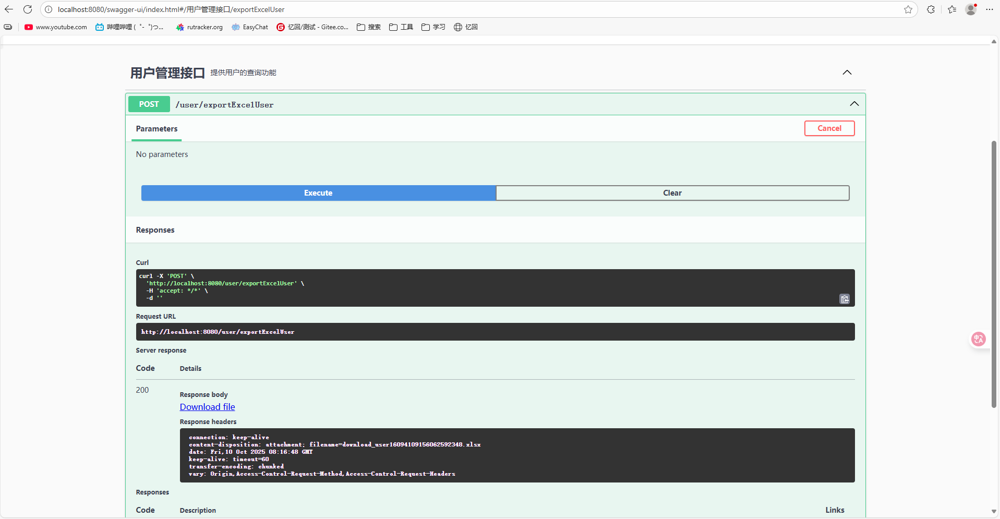
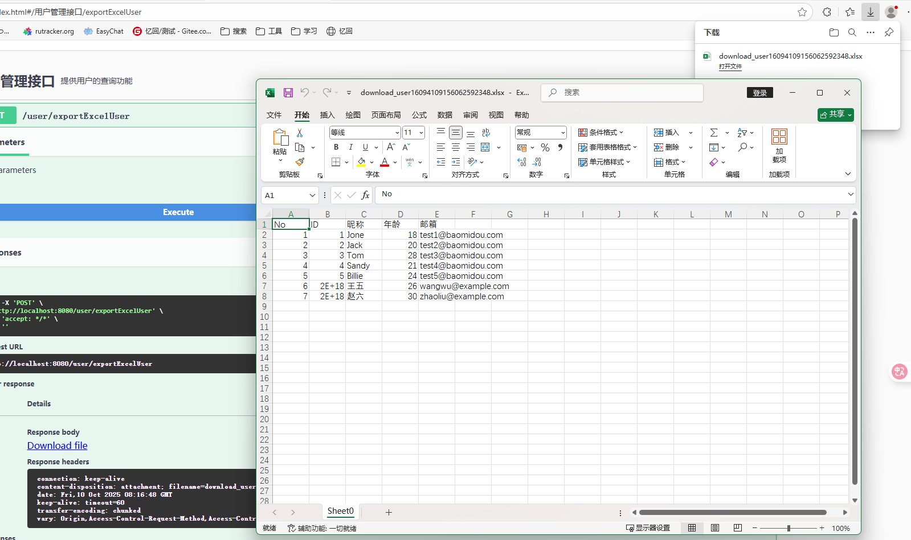

# Excel导出

## 1. **在项目中添加POI依赖**

首先，你需要在 `pom.xml` 文件中添加 `Apache POI` 的依赖。这是实现导出 Excel 的核心库。你的文件里已经展示了如何进行添加：


```xml
<dependency>
    <groupId>org.apache.poi</groupId>
    <artifactId>poi-ooxml</artifactId>
    <version>4.0.1</version>
</dependency>
```

## 2. **创建导出方法**

在你的控制器类中（如 `SysUserController`），添加一个方法来处理用户数据并导出为 Excel 格式。该方法大致如下：


```java
@PostMapping(value = "/exportExcelUser")
    public void exportExcelUser(HttpServletResponse res) {
        // 使用 User 类而非 SysUser
        List<User> records = userService.list(); // 获取所有用户数据
        Workbook workbook = new XSSFWorkbook(); // 创建一个新的 Excel 工作簿
        Sheet sheet = workbook.createSheet(); // 创建一个新的工作表
        Row row0 = sheet.createRow(0); // 创建表头

        // 创建表头
        int columnIndex = 0;
        row0.createCell(columnIndex).setCellValue("No");
        row0.createCell(++columnIndex).setCellValue("ID");
        row0.createCell(++columnIndex).setCellValue("昵称");
        row0.createCell(++columnIndex).setCellValue("年龄");
        row0.createCell(++columnIndex).setCellValue("邮箱");
//        row0.createCell(++columnIndex).setCellValue("手机号");

        // 填充数据
        for (int i = 0; i < records.size(); i++) {
            User user = records.get(i); // 使用 User 对象
            Row row = sheet.createRow(i + 1); // 创建每一行数据
            columnIndex = 0;
            row.createCell(columnIndex).setCellValue(i + 1); // 设置序号
            row.createCell(++columnIndex).setCellValue(user.getId());
            row.createCell(++columnIndex).setCellValue(user.getName());
            row.createCell(++columnIndex).setCellValue(user.getAge());
            row.createCell(++columnIndex).setCellValue(user.getEmail());
//            row.createCell(++columnIndex).setCellValue(user.getPhone());
        }

        // 创建文件并下载
        File file = PoiUtils.createExcelFile(workbook, "download_user");
        FileUtils.downloadFile(res, file, file.getName());
    }
```


## 3. **工具类（如 `PoiUtils`, `FileUtils`）**

你需要一些工具类来处理 Excel 文件的创建和下载。比如：

### `PoiUtils`（处理 Excel 文件的创建）


```java
public class PoiUtils {
    public static File createExcelFile(Workbook workbook, String fileName) {
        OutputStream stream = null;
        File file = null;
        try {
            file = File.createTempFile(fileName, ".xlsx"); // 创建临时 Excel 文件
            stream = new FileOutputStream(file.getAbsoluteFile());
            workbook.write(stream); // 将数据写入文件
        } catch (IOException e) {
            e.printStackTrace();
        } finally {
            IOUtils.closeQuietly(workbook);
            IOUtils.closeQuietly(stream);
        }
        return file;
    }
}
```

### `FileUtils`（处理文件下载）


```java
public class FileUtils {
    public static void downloadFile(HttpServletResponse response, File file, String newFileName) {
        try {
            response.setHeader("Content-Disposition", "attachment; filename=" + new String(newFileName.getBytes("ISO-8859-1"), "UTF-8"));
            BufferedOutputStream bos = new BufferedOutputStream(response.getOutputStream());
            InputStream is = new FileInputStream(file.getAbsolutePath());
            BufferedInputStream bis = new BufferedInputStream(is);
            int length;
            byte[] temp = new byte[1024 * 10];
            while ((length = bis.read(temp)) != -1) {
                bos.write(temp, 0, length);
            }
            bos.flush();
            bis.close();
            bos.close();
            is.close();
        } catch (IOException e) {
            e.printStackTrace();
        }
    }
}
```

## 4. **测试与调试**

你可以通过 `Swagger` 或者 Postman 测试该接口，确保能够成功下载 Excel 文件。Swagger 提供了一个简单的 UI 用于测试接口，你可以通过以下地址来访问：

http://localhost:8080/swagger-ui.html



在 Swagger UI 中，你应该能找到 `POST /user/exportExcelUser` 这个接口，点击执行后可以下载包含所有用户数据的 Excel 文件。


