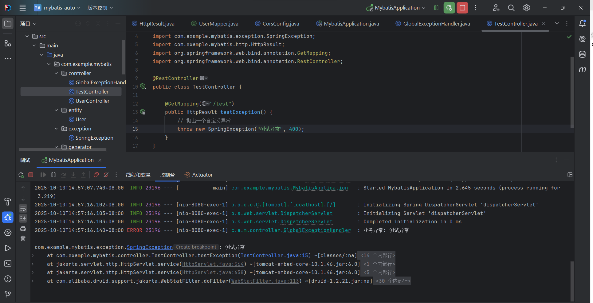

# 统一全局数据处理

## 一、**全局数据处理 (Global Data Processing)**

全局数据处理通常指的是在应用程序的整个生命周期或特定范围内对数据进行统一的处理和管理。这种处理通常与业务逻辑、数据格式转换、验证、权限检查等相关。

**常见场景**：

- **数据格式化**：比如将请求体中的数据转换成特定的格式，或者根据用户的区域设置来格式化日期和货币等。
- **数据验证**：统一处理请求数据的验证，检查必填字段、字段类型是否合法等。
- **请求数据预处理**：在请求到达控制器之前对请求数据进行统一的预处理，例如对传入的参数做统一的转换。
- **权限控制**：比如全局的权限校验、API 安全认证等。

### 1. **创建自定义异常类 (`SpringException`)**

在项中定义一个自定义异常类 `SpringException`。这个类继承了 `RuntimeException`，并提供了多个构造函数，便于设置不同的错误信息和错误码。

#### `SpringException` 类：


```java
package com.example.mybatis.exception;

public class SpringException extends RuntimeException {
    private static final long serialVersionUID = 1L;
    private String msg;
    private int code = 500;

    public SpringException(String msg) {
        super(msg);
        this.msg = msg;
    }

    public SpringException(String msg, Throwable e) {
        super(msg, e);
        this.msg = msg;
    }

    public SpringException(String msg, int code) {
        super(msg);
        this.msg = msg;
        this.code = code;
    }

    public SpringException(String msg, int code, Throwable e) {
        super(msg, e);
        this.msg = msg;
        this.code = code;
    }

    public String getMsg() {
        return msg;
    }

    public void setMsg(String msg) {
        this.msg = msg;
    }

    public int getCode() {
        return code;
    }

    public void setCode(int code) {
        this.code = code;
    }
}

```

展开

### 2. **创建全局返回结果类 (`HttpResult`)**

`HttpResult` 类用于标准化返回的结果。它包含 `code`、`msg` 和 `data` 字段，并提供了多个静态方法，用于返回成功或失败的标准结果。

#### `HttpResult` 类：


```java
package com.example.mybatis.http;

import lombok.Data;
import org.springframework.http.HttpStatus;

@Data
public class HttpResult {
    private int code;
    private String msg;
    private Object data;

    // 成功响应
    public static HttpResult ok() {
        return ok(null);
    }

    public static HttpResult ok(Object data) {
        HttpResult result = new HttpResult();
        result.setCode(HttpStatus.OK.value());
        result.setMsg("操作成功");
        result.setData(data);
        return result;
    }

    // 错误响应
    public static HttpResult error(int code, String msg) {
        return error(code, msg, null);
    }

    public static HttpResult error(int code, String msg, Object data) {
        HttpResult result = new HttpResult();
        result.setCode(code);
        result.setMsg(msg);
        result.setData(data);
        return result;
    }
}
```


### 3. **创建全局异常处理器 (`GlobalExceptionHandler`)**

在 `GlobalExceptionHandler` 类中，您可以捕获所有的 `SpringException` 异常，并将其转换为标准的 HTTP 响应格式。这里我使用了 `@RestControllerAdvice` 注解来处理所有控制器的异常。

#### `GlobalExceptionHandler` 类：


```java
package com.example.mybatis.controller;

import com.example.mybatis.exception.SpringException;
import com.example.mybatis.http.HttpResult;
import lombok.extern.slf4j.Slf4j;
import org.springframework.http.HttpStatus;
import org.springframework.validation.BindingResult;
import org.springframework.validation.FieldError;
import org.springframework.web.bind.MethodArgumentNotValidException;
import org.springframework.web.bind.MissingServletRequestParameterException;
import org.springframework.web.bind.annotation.ExceptionHandler;
import org.springframework.web.bind.annotation.RestControllerAdvice;
import org.springframework.web.method.annotation.MethodArgumentTypeMismatchException;
import org.springframework.web.servlet.NoHandlerFoundException;

import java.sql.SQLException;
import java.io.IOException;
import java.util.HashMap;
import java.util.Map;

@Slf4j
@RestControllerAdvice
public class GlobalExceptionHandler {

    /**
     * 处理自定义业务异常
     */
    @ExceptionHandler(SpringException.class)
    public HttpResult handleSpringException(SpringException e) {
        log.error("业务异常: {}", e.getMessage(), e);
        return HttpResult.error(e.getCode(), e.getMessage());
    }

    /**
     * 处理参数校验异常（@Valid 注解校验失败）
     */
    @ExceptionHandler(MethodArgumentNotValidException.class)
    public HttpResult handleMethodArgumentNotValidException(MethodArgumentNotValidException e) {
        log.error("参数校验异常: {}", e.getMessage(), e);
        BindingResult bindingResult = e.getBindingResult();
        Map<String, String> errorMap = new HashMap<>();
        // 收集所有字段校验错误
        for (FieldError fieldError : bindingResult.getFieldErrors()) {
            errorMap.put(fieldError.getField(), fieldError.getDefaultMessage());
        }
        return HttpResult.error(
                HttpStatus.BAD_REQUEST.value(),
                "参数校验失败",
                errorMap
        );
    }

    /**
     * 处理缺少请求参数异常
     */
    @ExceptionHandler(MissingServletRequestParameterException.class)
    public HttpResult handleMissingServletRequestParameterException(MissingServletRequestParameterException e) {
        log.error("缺少请求参数: {}", e.getMessage(), e);
        String message = String.format("缺少必要的请求参数: %s", e.getParameterName());
        return HttpResult.error(HttpStatus.BAD_REQUEST.value(), message);
    }

    /**
     * 处理参数类型不匹配异常
     */
    @ExceptionHandler(MethodArgumentTypeMismatchException.class)
    public HttpResult handleMethodArgumentTypeMismatchException(MethodArgumentTypeMismatchException e) {
        log.error("参数类型不匹配: {}", e.getMessage(), e);
        String message = String.format(
                "参数 %s 类型不匹配，期望类型: %s，实际值: %s",
                e.getName(),
                e.getRequiredType().getSimpleName(),
                e.getValue()
        );
        return HttpResult.error(HttpStatus.BAD_REQUEST.value(), message);
    }

    /**
     * 处理404异常
     */
    @ExceptionHandler(NoHandlerFoundException.class)
    public HttpResult handleNoHandlerFoundException(NoHandlerFoundException e) {
        log.error("资源未找到: {}", e.getMessage(), e);
        String message = String.format("请求的资源不存在: %s %s", e.getHttpMethod(), e.getRequestURL());
        return HttpResult.error(HttpStatus.NOT_FOUND.value(), message);
    }

    /**
     * 处理数据库异常
     */
    @ExceptionHandler(SQLException.class)
    public HttpResult handleSQLException(SQLException e) {
        log.error("数据库异常: {}", e.getMessage(), e);
        // 生产环境可根据实际情况返回更友好的信息，避免暴露数据库细节
        String message = "数据库操作失败，请联系管理员";
        return HttpResult.error(HttpStatus.INTERNAL_SERVER_ERROR.value(), message);
    }

    /**
     * 处理IO异常
     */
    @ExceptionHandler(IOException.class)
    public HttpResult handleIOException(IOException e) {
        log.error("IO异常: {}", e.getMessage(), e);
        String message = "文件操作失败，请检查文件是否存在或有权限";
        return HttpResult.error(HttpStatus.INTERNAL_SERVER_ERROR.value(), message);
    }

    /**
     * 处理其他未知异常
     */
    @ExceptionHandler(Exception.class)
    public HttpResult handleException(Exception e) {
        log.error("未知异常: {}", e.getMessage(), e);
        return HttpResult.error(
                HttpStatus.INTERNAL_SERVER_ERROR.value(),
                "系统发生了未知错误，请联系管理员"
        );
    }
}package com.bitgeek.core.exception;

import com.bitgeek.core.http.HttpResult;
import org.springframework.http.HttpStatus;
import org.springframework.web.bind.annotation.ExceptionHandler;
import org.springframework.web.bind.annotation.ResponseStatus;
import org.springframework.web.bind.annotation.RestControllerAdvice;

@RestControllerAdvice
public class GlobalExceptionHandler {

    @ExceptionHandler(SpringException.class)
    @ResponseStatus(HttpStatus.INTERNAL_SERVER_ERROR)
    public HttpResult handleSpringException(SpringException ex) {
        return HttpResult.error(ex.getCode(), ex.getMsg());
    }

    @ExceptionHandler(Exception.class)
    @ResponseStatus(HttpStatus.INTERNAL_SERVER_ERROR)
    public HttpResult handleException(Exception ex) {
        return HttpResult.error("服务器内部错误，请联系管理员");
    }
}
```

### 4. **修改控制器以抛出 `SpringException`**

在控制器中，您可以通过抛出自定义异常来触发全局异常处理器。以下是一个简单的控制器示例：

#### `TestController` 示例：


```java
package com.bitgeek.controller;

import com.bitgeek.core.exception.SpringException;
import com.bitgeek.core.http.HttpResult;
import org.springframework.web.bind.annotation.GetMapping;
import org.springframework.web.bind.annotation.RestController;

@RestController
public class TestController {

    @GetMapping("/test")
    public HttpResult testException() {
        // 抛出一个自定义异常
        throw new SpringException("测试异常", 400);
    }
}
```

### 5. **运行和测试**

1. **启动应用程序**：在完成上述步骤后，启动Spring Boot应用程序。
2. **访问接口**：访问 [localhost:8080/test](http://localhost:8080/test)，能看到标准化的错误响应。

**示例响应：**

```json
{
  "code": 400,
  "msg": "测试异常",
  "data": null
}
```



> 注意：如果提示NoSuchMethodError: 'void org.springframework.web.method.ControllerAdviceBean.(java.lang.Object)'报错

```xml
<!--请更新Swagger 2.7.0版本依赖 到 pom.xml   -->
<dependency>
    <groupId>org.springdoc</groupId>
    <artifactId>springdoc-openapi-starter-webmvc-ui</artifactId>
    <version>2.7.0</version>
</dependency>
```

**总结：**

通过以上步骤，您在项目中实现了全局数据处理和全局异常处理：

1. **全局异常处理**：通过 `@RestControllerAdvice` 和 `@ExceptionHandler`，将所有的 `SpringException` 异常捕获并返回标准的错误响应。
2. **全局数据处理**：使用 `@InitBinder` 对请求中的数据（如日期格式）进行统一处理。
3. **封装标准化的返回结果**：使用 `HttpResult` 类封装成功和失败的返回格式。

这样就可以确保整个应用的异常和数据处理是统一且一致的。效期。
