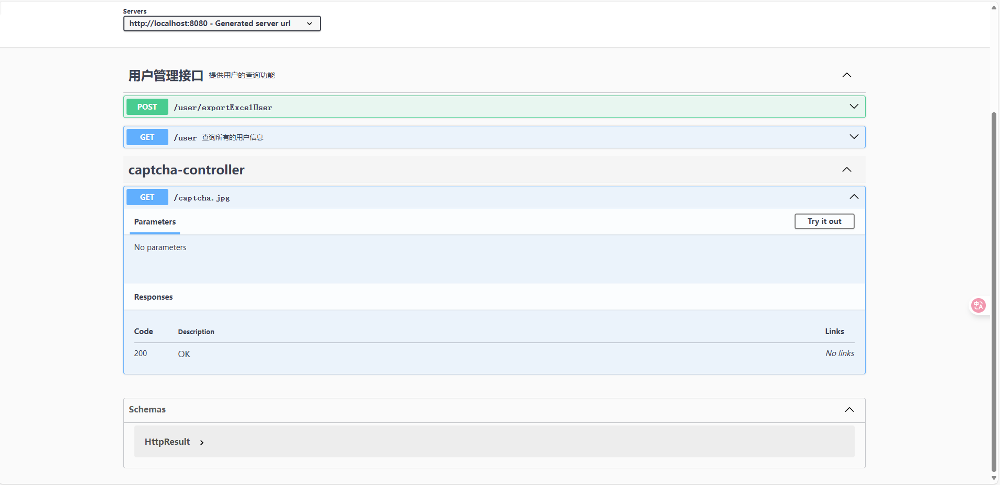
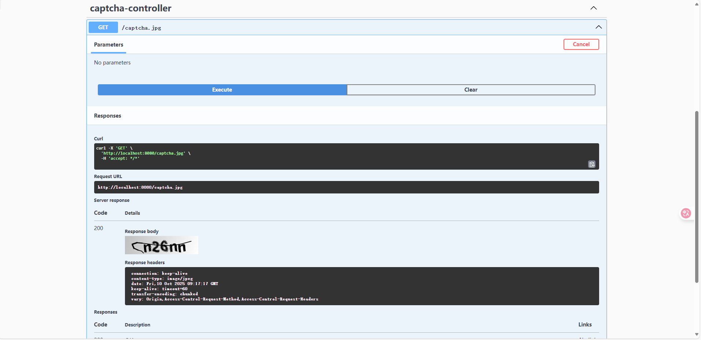

# Kaptcha 集成登录验证码

### 1、**添加 Kaptcha 依赖**

在你的 `pom.xml` 文件中，已经添加了 `kaptcha` 依赖：


```xml
<!--集成登录验证码功能-->
<dependency>
    <groupId>com.github.penggle</groupId>
    <artifactId>kaptcha</artifactId>
    <version>2.3.2</version>
</dependency>
```

这个依赖可以帮助你生成验证码图像。

### 2、**创建验证码配置类**

在项目中添加 `KaptchaConfig` 配置类，它的作用是配置生成验证码所需的参数。以下是该类的代码：


```java
package com.example.mybatis.admin.config;

import java.util.Properties;

import org.springframework.context.annotation.Bean;
import org.springframework.context.annotation.Configuration;

import com.google.code.kaptcha.impl.DefaultKaptcha;
import com.google.code.kaptcha.util.Config;

/**
 * 验证码配置
 */
@Configuration
public class KaptchaConfig {

    @Bean
    public DefaultKaptcha producer() {
        Properties properties = new Properties();
        properties.put("kaptcha.border", "no"); // 不使用边框
        properties.put("kaptcha.textproducer.font.color", "black"); // 字体颜色为黑色
        properties.put("kaptcha.textproducer.char.space", "5"); // 字符之间的间距为 5
        Config config = new Config(properties);
        DefaultKaptcha defaultKaptcha = new DefaultKaptcha();
        defaultKaptcha.setConfig(config);
        return defaultKaptcha;
    }
}

```


### 3、创建验证码生成接口

你需要创建一个接口，用于处理前端验证码请求。这个接口负责生成验证码并返回给前端：


```java
package com.example.mybatis.admin.controller;

import com.google.code.kaptcha.Producer;
import io.swagger.annotations.ApiOperation;
import jakarta.servlet.http.HttpServletRequest;
import jakarta.servlet.http.HttpServletResponse;
import org.springframework.beans.factory.annotation.Autowired;
import org.springframework.web.bind.annotation.GetMapping;
import org.springframework.web.bind.annotation.RestController;

import javax.imageio.ImageIO;
import java.awt.image.BufferedImage;
import java.io.IOException;

@RestController
public class CaptchaController {
    @Autowired
    private Producer captchaProducer;

    @ApiOperation(value = "Get Captcha", notes = "Generate a captcha image. Access at /captcha.jpg")
    @GetMapping("/captcha.jpg")
    public void getCaptcha(HttpServletRequest request, HttpServletResponse response) throws IOException {
        // 生成验证码字符串
        String captchaText = captchaProducer.createText();
        // 将验证码字符串保存到 session 中
        request.getSession().setAttribute("captcha", captchaText);

        // 生成验证码图片
        BufferedImage captchaImage = captchaProducer.createImage(captchaText);

        // 设置响应类型为图片
        response.setContentType("image/jpeg");

        // 使用 ImageIO 将图像写入输出流
        ImageIO.write(captchaImage, "JPEG", response.getOutputStream());
    }
}

```

### 4、Swagger UI 测试

打开 [Swagger UI ](http://localhost:8080/swagger-ui/index.html#/)并查看该接口：




点击 Try it out按钮，浏览器会直接显示验证码。



