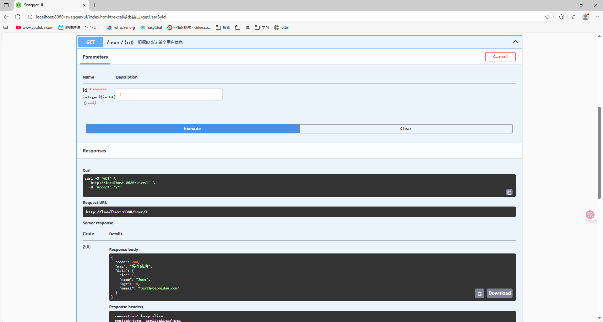
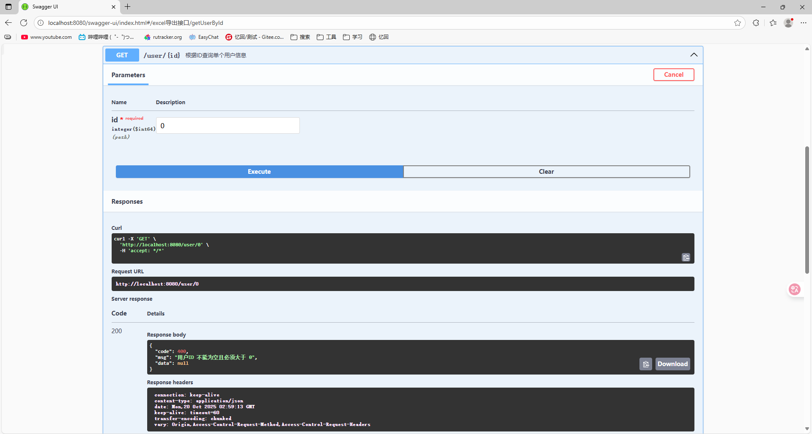

# Guava 的 Preconditions 参数校验功能

### 1、前言

在我们的日常开发中，经常要对入参进行校验，比如是否为空、参数的取值范围是否符合要求等等。如果我们单独进行参数校验的话，代码的重复率比较高，也不是很优雅。Guava提供了PreConditions类来统一校验我们的参数，同时可以抛出对应的异常信息，将参数校验的工作进行了统一。

### 2、**添加 Guava 依赖**

首先，确保你的 `pom.xml`（或 `build.gradle`）中已经包含了 Guava 依赖。如果尚未添加，请按照以下方式添加：

```xml
<dependency>
    <groupId>com.google.guava</groupId>
    <artifactId>guava</artifactId>
    <version>32.1.3-jre</version>
</dependency>
```

### 3、**创建 CheckParamUtils 工具类**

接下来，创建 `CheckParamUtils` 工具类，用来封装所有的参数校验逻辑。将其放置在工具包下：

```java
package com.example.mybatis.common;

import com.google.common.base.Preconditions;
import org.apache.commons.lang3.StringUtils;

public class CheckParamUtils {

    // 检查字符串是否为空
    public static void isNotNull(String field, String fieldDes) {
        Preconditions.checkArgument(!StringUtils.isBlank(field), fieldDes + " 不能为空");
    }

    // 检查 Long 值是否大于 0
    public static void isBiggerZero(Long field, String fieldDes) {
        Preconditions.checkArgument(field != null && field > 0, fieldDes + " 不能为空且必须大于 0");
    }

    // 检查 Integer 值是否大于 0
    public static void isBiggerZero(Integer field, String fieldDes) {
        Preconditions.checkArgument(field != null && field > 0, fieldDes + " 不能为空且必须大于 0");
    }

    // 检查是否为正数，通用方法
    public static void isPositive(Number field, String fieldDes) {
        Preconditions.checkArgument(field != null && field.doubleValue() > 0, fieldDes + " 必须大于 0");
    }
}
```

### 4、**在 Controller 或 Service 中调用校验工具**

你可以将这些工具方法应用到你的业务逻辑中。比如，在 `UserController` 或其他控制器中，进行参数校验。

**示例：在 `UserController` 中使用 `CheckParamUtils`，新增一个根据id查询用户信息的接口**

```java
package com.example.mybatis.controller;

import com.example.mybatis.common.CheckParamUtils;
import com.example.mybatis.entity.User;
import com.example.mybatis.http.HttpResult;
import com.example.mybatis.service.UserService;
import io.swagger.v3.oas.annotations.Operation;
import io.swagger.v3.oas.annotations.tags.Tag;
import org.springframework.beans.factory.annotation.Autowired;
import org.springframework.web.bind.annotation.*;


/**
 * <p>
 *  前端控制器
 * </p>
 *
 * @author yh
 * @since 2025-09-29
 */

@RestController
@RequestMapping("/user")
public class UserController {

    @Autowired
    protected UserService userService;

    @Tag(name = "查询用户信息接口",description = "提供excel下载")
//     测试查询所有用户
    @Operation(
            summary = "查询所有的用户信息",
            description = "结果按创建时间升序排列"
    )
    @GetMapping
    public HttpResult getAllUsers() {
        try {
            // 校验参数
            // CheckParamUtils.isBiggerZero(10L, "用户ID");  // 示例
            // 查询所有用户
            return HttpResult.ok(userService.list());
        } catch (IllegalArgumentException e) {
            return HttpResult.error(400, e.getMessage());
        } catch (Exception e) {
            return HttpResult.error(500, "未知错误");
        }
    }
    @Tag(name = "查询用户信息接口",description = "用户信息查询功能")
    @GetMapping("/{id}")
    @Operation(summary = "根据ID查询单个用户信息")
    public HttpResult getUserById(@PathVariable("id") Long id) {
        try {
            // 参数校验
            CheckParamUtils.isBiggerZero(id, "用户ID");

            User user = userService.getById(id);
            if (user == null) {
                return HttpResult.error(404, "用户不存在");
            }

            return HttpResult.ok(user);
        } catch (IllegalArgumentException e) {
            // 捕获参数校验异常
            return HttpResult.error(400, e.getMessage());
        } catch (Exception e) {
            // 捕获系统异常
            return HttpResult.error(500, "服务器内部错误");
        }
    }
}
```

### 5、**全局异常处理**

 `GlobalExceptionHandler` 类，可以统一处理各类异常，包括校验异常。如果 `CheckParamUtils` 的校验失败，它会抛出 `IllegalArgumentException`，然后通过 `@ExceptionHandler` 捕获异常并返回友好的错误信息。

### 6、**配置统一的返回结构**

 `HttpResult` 类来处理统一的 API 返回结构。使用 `HttpResult` 可以确保所有接口返回格式一致。

```java
public static HttpResult ok(Object data) {
    HttpResult result = new HttpResult();
    result.setCode(HttpStatus.OK.value());
    result.setMsg("操作成功");
    result.setData(data);
    return result;
}

public static HttpResult error(int code, String msg) {
    return error(code, msg, null);
}

public static HttpResult error(int code, String msg, Object data) {
    HttpResult result = new HttpResult();
    result.setCode(code);
    result.setMsg(msg);
    result.setData(data);
    return result;
}
```

### 7、测试id查询接口

在[Swagger](http://localhost:8080/swagger-ui/index.html)接口测试工具根据id查询用户信息接口中输入1与0的对应结果：


