# Git 的安装和使用

## 1.什么是Git

**Git**是一个开源的分布式版本控制系统，它能够高效地处理从小到大的项目。Git是由Linus Torvalds为了更好地管理Linux内核开发而创造的。与其他常见的版本控制工具如CVS和Subversion不同，Git采用了分布式版本库的方式，这意味着每个工作副本都是一个完整的版本库，不依赖于中央服务器


## 2.安装Git


### 2.1 在Windows上安装Git

在Windows上使用Git，也有两种安装方法。

第一种是直接从Git官网直接[下载安装程序](https://git-scm.com/downloads/win)，然后按默认选项安装即可。安装完成后，在开始菜单里找到“Git”->“Git Bash”，蹦出一个类似命令行窗口的东西，就说明Git安装成功。

  

第二种是先安装一个包管理器，推荐[Scoop](https://scoop.sh/)，然后在PowerShell中通过以下命令安装Git：

```plain
C:\> scoop install git
```


安装完成后，在PowerShell下运行命令`git -v`显示Git版本，可看到如下输出：

```
┌─────────────────────────────────────────────────────────┐
│Windows PowerShell                                 - □ x │
├─────────────────────────────────────────────────────────┤
│Windows PowerShell                                       │
│Copyright (C) Microsoft Corporation. All rights reserved.│
│                                                         │
│PS C:\Users\liaoxuefeng> git -v                          │
│git version 2.48.1.windows.1                             │
│PS C:\Users\liaoxuefeng>                                 │
│                                                         │
└─────────────────────────────────────────────────────────┘
```

使用包管理器安装Git只需一条命令，且升级非常方便。Debian/Ubuntu Linux的APT、macOS的Homebrew、Windows的Scoop在命令行下的安装、升级、卸载命令都是类似的，例如，升级Git，三种包管理器对应的命令分别是：

- sudo apt update git
- brew update git
- scoop update git

可以说熟悉一种包管理器的用法后，在其他平台也可迅速上手，推荐使用。


### 2.2 配置Git

安装好Git后，还需要最后一步设置，在命令行输入：

```plain
$ git config --global user.name "Your Name"
$ git config --global user.email "email@example.com"
```

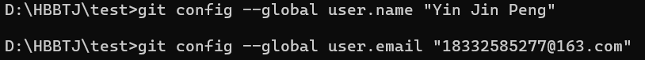

因为Git是分布式版本控制系统，所以，每个机器都必须自报家门：你的名字和Email地址。你也许会担心，如果有人故意冒充别人怎么办？这个不必担心，首先我们相信大家都是善良无知的群众，其次，真的有冒充的也是有办法可查的。

> ⚠️注意:`git config`命令的`--global`参数，用了这个参数，表示你这台机器上所有的Git仓库都会使用这个配置，当然也可以对某个仓库指定不同的用户名和Email地址。


## 3.创建版本库

什么是版本库呢？版本库又名仓库（Repository），你可以简单理解成一个目录，这个目录里面的所有文件都可以被Git管理起来，每个文件的修改、删除，Git都能跟踪，以便任何时刻都可以追踪历史，或者在将来某个时刻可以“还原”。

所以，创建一个版本库非常简单，首先，选择一个合适的地方，创建一个空目录：

```plain
$ mkdir test
$ cd test
$ pwd
/HBBTJ/test
```


`pwd`命令用于显示当前目录。在我的Mac上，这个仓库位于`/Users/michael/learngit`。


> ⚠️注意 : 如果你使用Windows系统，为了避免遇到各种莫名其妙的问题，请确保目录名（包括父目录）不包含中文。


第二步，通过`git init`命令把这个目录变成Git可以管理的仓库：

```plain
$ git init
Initialized empty Git repository in /Users/michael/learngit/.git/
```

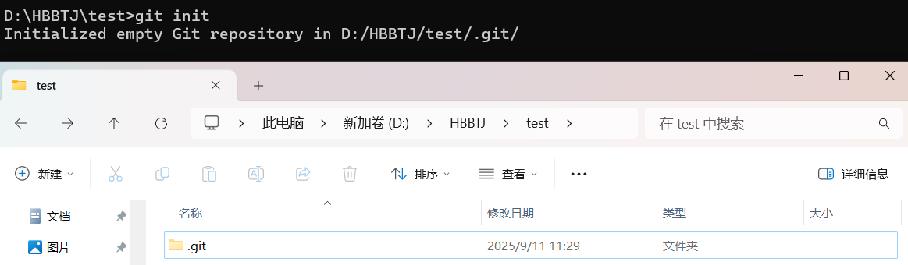

瞬间Git就把仓库建好了，而且告诉你是一个空的仓库（empty Git repository），细心的读者可以发现当前目录下多了一个`.git`的目录，这个目录是Git来跟踪管理版本库的，没事千万不要手动修改这个目录里面的文件，不然改乱了，就把Git仓库给破坏了。

如果你没有看到`.git`目录，那是因为这个目录默认是隐藏的，用`ls -ah`命令就可以看见。

**把文件添加到版本库**

言归正传，现在我们编写一个`readme.txt`文件，内容如下：

```plain
Git is a version control system.
Git is free software.
```

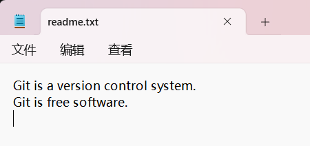

一定要放到`test`目录下（子目录也行），因为这是一个Git仓库，放到其他地方Git再厉害也找不到这个文件。

和把大象放到冰箱需要3步相比，把一个文件放到Git仓库只需要两步。

第一步，用命令`git add`告诉Git，把文件添加到仓库：

```plain
$ git add readme.txt
```

执行上面的命令，没有任何显示，这就对了，Unix的哲学是“没有消息就是好消息”，说明添加成功。

第二步，用命令`git commit`告诉Git，把文件提交到仓库：

```plain
$ git commit -m "wrote a readme file"
[master (root-commit) eaadf4e] wrote a readme file
 1 file changed, 2 insertions(+)
 create mode 100644 readme.txt
```

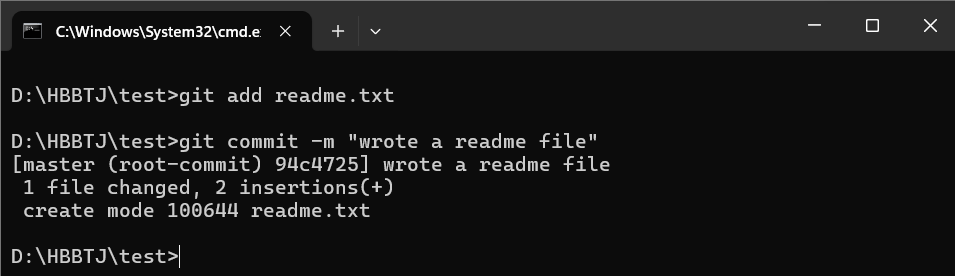

简单解释一下`git commit`命令，`-m`后面输入的是本次提交的说明，可以输入任意内容，当然最好是有意义的，这样你就能从历史记录里方便地找到改动记录。

`git commit`命令执行成功后会告诉你，`1 file changed`：1个文件被改动（我们新添加的readme.txt文件）；`2 insertions`：插入了两行内容（readme.txt有两行内容）。

为什么Git添加文件需要`add`，`commit`一共两步呢？因为`commit`可以一次提交很多文件，所以你可以多次`add`不同的文件，比如：

```plain
$ git add file1.txt
$ git add file2.txt file3.txt
$ git commit -m "add 3 files."
```

**小结**

现在总结一下今天学的两点内容：

初始化一个Git仓库，使用`git init`命令。

添加文件到Git仓库，分两步：

1. 使用命令`git add <file>`，⚠️注意，可反复多次使用，添加多个文件；
2. 使用命令`git commit -m <message>`，完成。


## 4.版本管理

我们已经成功地添加并提交了一个readme.txt文件，现在，是时候继续工作了，于是，我们继续修改readme.txt文件，改成如下内容：

```plain
Git is a distributed version control system.
Git is free software.
```

!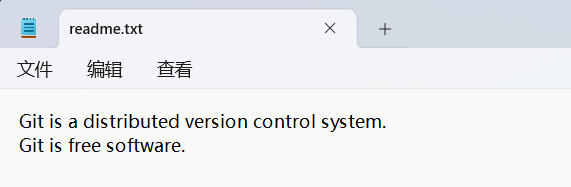  

现在，运行`git status`命令看看结果：

```plain
$ git status
On branch master
Changes not staged for commit:
  (use "git add <file>..." to update what will be committed)
  (use "git checkout -- <file>..." to discard changes in working directory)

	modified:   readme.txt

no changes added to commit (use "git add" and/or "git commit -a")
```

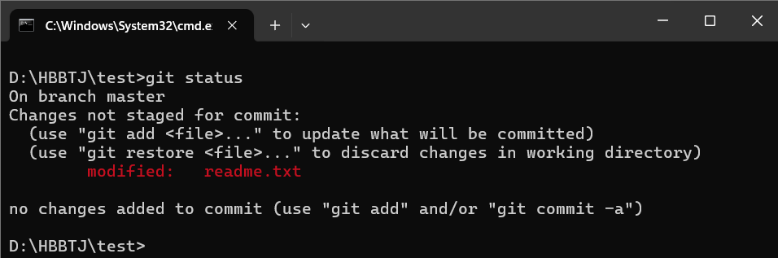  

`git status`命令可以让我们时刻掌握仓库当前的状态，上面的命令输出告诉我们，`readme.txt`被修改过了，但还没有准备提交的修改。

虽然Git告诉我们`readme.txt`被修改了，但如果能看看具体修改了什么内容，自然是很好的。比如你休假两周从国外回来，第一天上班时，已经记不清上次怎么修改的`readme.txt`，所以，需要用`git diff`这个命令看看：

```plain
$ git diff readme.txt 
diff --git a/readme.txt b/readme.txt
index 46d49bf..9247db6 100644
--- a/readme.txt
+++ b/readme.txt
@@ -1,2 +1,2 @@
-Git is a version control system.
+Git is a distributed version control system.
 Git is free software.
```

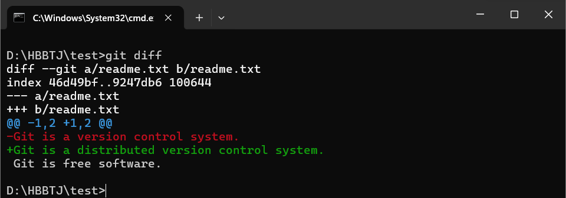 

`git diff`顾名思义就是查看difference，显示的格式正是Unix通用的diff格式，可以从上面的命令输出看到，我们在第一行添加了一个`distributed`单词。

知道了对`readme.txt`作了什么修改后，再把它提交到仓库就放心多了，提交修改和提交新文件是一样的两步，第一步是`git add`：

```plain
$ git add readme.txt
```

同样没有任何输出。在执行第二步`git commit`之前，我们再运行`git status`看看当前仓库的状态：

```plain
$ git status
On branch master
Changes to be committed:
  (use "git reset HEAD <file>..." to unstage)

	modified:   readme.txt
```

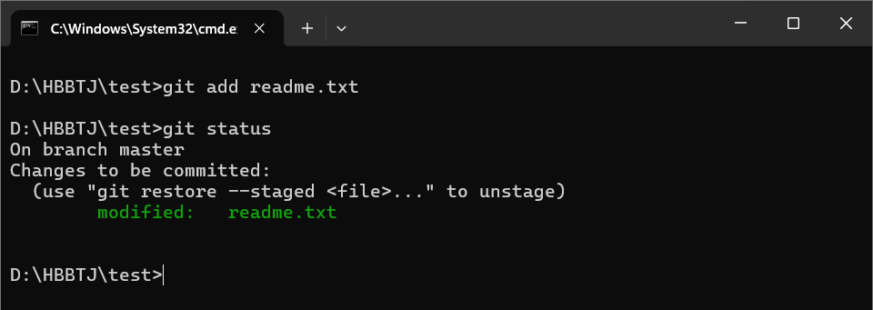  

`git status`告诉我们，将要被提交的修改包括`readme.txt`，下一步，就可以放心地提交了：

```plain
$ git commit -m "add distributed"
[master e475afc] add distributed
 1 file changed, 1 insertion(+), 1 deletion(-)
```

提交后，我们再用`git status`命令看看仓库的当前状态：

```plain
$ git status
On branch master
nothing to commit, working tree clean
```

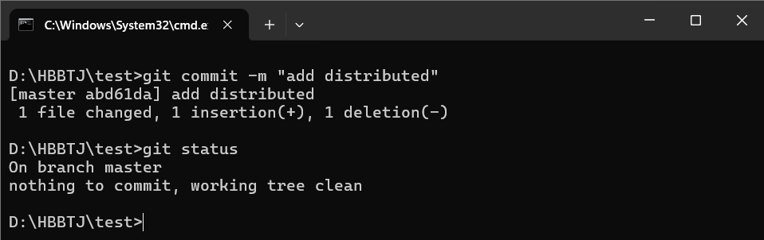 
Git告诉我们当前没有需要提交的修改，而且，工作目录是干净（working tree clean）的。

**小结**

- 要随时掌握工作区的状态，使用`git status`命令。
- 如果`git status`告诉你有文件被修改过，用`git diff`可以查看修改内容。


### 4.1 版本回退


现在，你已经学会了修改文件，然后把修改提交到Git版本库，现在，再练习一次，修改readme.txt文件如下：

```plain
Git is a distributed version control system.
Git is free software distributed under the GPL.
```

然后尝试提交：

```plain
$ git add readme.txt
$ git commit -m "append GPL"
[master 1094adb] append GPL
 1 file changed, 1 insertion(+), 1 deletion(-)
```

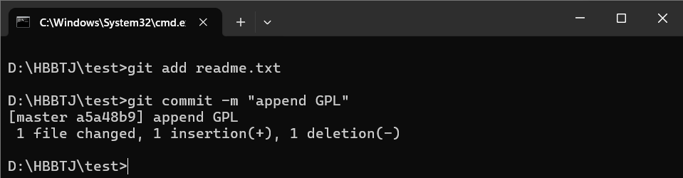 
现在，我们回顾一下`readme.txt`文件一共有几个版本被提交到Git仓库里了：

版本1：wrote a readme file

```plain
Git is a version control system.
Git is free software.
```

版本2：add distributed

```plain
Git is a distributed version control system.
Git is free software.
```

版本3：append GPL

```plain
Git is a distributed version control system.
Git is free software distributed under the GPL.
```

版本控制系统肯定有某个命令可以告诉我们历史记录，在Git中，我们用`git log`命令查看：

```plain
$ git log
commit 1094adb7b9b3807259d8cb349e7df1d4d6477073 (HEAD -> master)
Author: Michael Liao <askxuefeng@gmail.com>
Date:   Fri May 18 21:06:15 2018 +0800

    append GPL

commit e475afc93c209a690c39c13a46716e8fa000c366
Author: Michael Liao <askxuefeng@gmail.com>
Date:   Fri May 18 21:03:36 2018 +0800

    add distributed

commit eaadf4e385e865d25c48e7ca9c8395c3f7dfaef0
Author: Michael Liao <askxuefeng@gmail.com>
Date:   Fri May 18 20:59:18 2018 +0800

    wrote a readme file
```

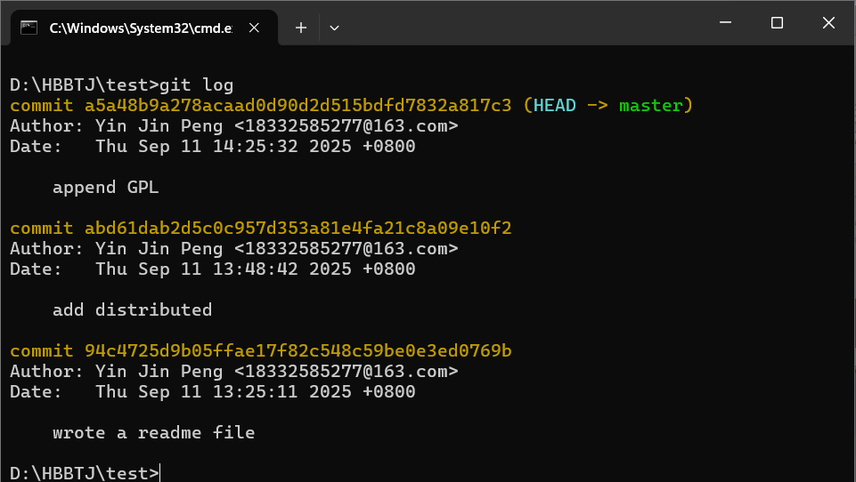  

`git log`命令显示从最近到最远的提交日志，我们可以看到3次提交，最近的一次是`append GPL`，上一次是`add distributed`，最早的一次是`wrote a readme file`。

如果嫌输出信息太多，看得眼花缭乱的，可以试试加上`--pretty=oneline`参数：

```plain
$ git log --pretty=oneline
1094adb7b9b3807259d8cb349e7df1d4d6477073 (HEAD -> master) append GPL
e475afc93c209a690c39c13a46716e8fa000c366 add distributed
eaadf4e385e865d25c48e7ca9c8395c3f7dfaef0 wrote a readme file
```

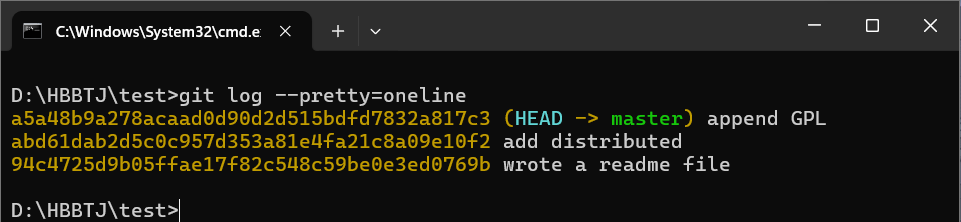  

每提交一个新版本，实际上Git就会把它们自动串成一条时间线。如果使用可视化工具查看Git历史，就可以更清楚地看到提交历史的时间线：

好了，现在我们准备把`readme.txt`回退到上一个版本，也就是`add distributed`的那个版本，怎么做呢？

首先，Git必须知道当前版本是哪个版本，在Git中，用`HEAD`表示当前版本，也就是最新的提交`1094adb...`（注意我的提交ID和你的肯定不一样），上一个版本就是`HEAD^`，上上一个版本就是`HEAD^^`，当然往上100个版本写100个`^`比较容易数不过来，所以写成`HEAD~100`。

现在，我们要把当前版本`append GPL`回退到上一个版本`add distributed`，就可以使用`git reset`命令：

```plain
$ git reset --hard HEAD^
HEAD is now at e475afc add distributed
```

`--hard`参数有啥意义？`--hard`会回退到上个版本的已提交状态，而`--soft`会回退到上个版本的未提交状态，`--mixed`会回退到上个版本未添加状态,现在，先放心使用`--hard`。

看看`readme.txt`的内容是不是版本`add distributed`：

```plain
$ cat readme.txt
Git is a distributed version control system.
Git is free software.
```

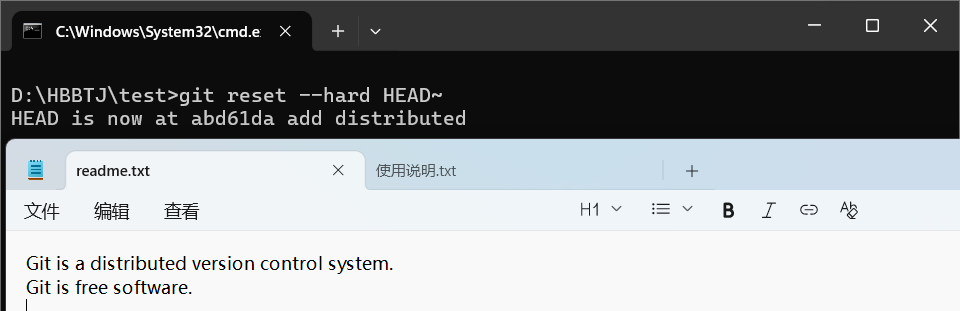  

果然被还原了。

还可以继续回退到上一个版本`wrote a readme file`，不过且慢，让我们用`git log`再看看现在版本库的状态：

```plain
$ git log
commit e475afc93c209a690c39c13a46716e8fa000c366 (HEAD -> master)
Author: Michael Liao <askxuefeng@gmail.com>
Date:   Fri May 18 21:03:36 2018 +0800

    add distributed

commit eaadf4e385e865d25c48e7ca9c8395c3f7dfaef0
Author: Michael Liao <askxuefeng@gmail.com>
Date:   Fri May 18 20:59:18 2018 +0800

    wrote a readme file
```

  

最新的那个版本`append GPL`已经看不到了！好比你从21世纪坐时光穿梭机来到了19世纪，想再回去已经回不去了，肿么办？

办法其实还是有的，只要上面的命令行窗口还没有被关掉，你就可以顺着往上找啊找啊，找到那个`append GPL`的`commit id`是`a5a48b...`，于是就可以指定回到未来的某个版本：

```plain
$ git reset --hard a5a48b
HEAD is now at 83b0afe append GPL
```

版本号没必要写全，前几位就可以了，Git会自动去找。当然也不能只写前一两位，因为Git可能会找到多个版本号，就无法确定是哪一个了。

再小心翼翼地看看`readme.txt`的内容：

```plain
$ cat readme.txt
Git is a distributed version control system.
Git is free software distributed under the GPL.
```

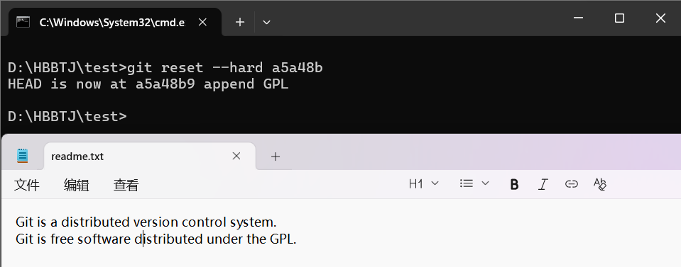 

果然，我胡汉三又回来了。

Git的版本回退速度非常快，因为Git在 内部有个指向当前版本的`HEAD`指针，当你回退版本的时候，Git仅仅是把HEAD从指向`append GPL`：

```
┌────┐
│HEAD│
└────┘
   │
   └──▶ ○ append GPL
        │
        ○ add distributed
        │
        ○ wrote a readme file
```

改为指向`add distributed`：

```
┌────┐
│HEAD│
└────┘
   │
   │    ○ append GPL
   │    │
   └──▶ ○ add distributed
        │
        ○ wrote a readme file
```

然后顺便把工作区的文件更新了。所以你让`HEAD`指向哪个版本号，你就把当前版本定位在哪。

当你用`$ git reset --hard HEAD^`回退到`add distributed`版本时，再想恢复到`append GPL`，就必须找到`append GPL`的commit id。Git提供了一个命令`git reflog`用来记录你的每一次命令：

```plain
$ git reflog
e475afc HEAD@{1}: reset: moving to HEAD^
1094adb (HEAD -> master) HEAD@{2}: commit: append GPL
e475afc HEAD@{3}: commit: add distributed
eaadf4e HEAD@{4}: commit (initial): wrote a readme file
```

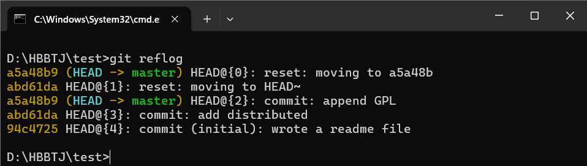 
从输出可知，`append GPL`的commit id是`a5a48b`

**小结**

现在总结一下：

- `HEAD`指向的版本就是当前版本，因此，Git允许我们在版本的历史之间穿梭，使用命令`git reset --hard commit_id`。
- 穿梭前，用`git log`可以查看提交历史，以便确定要回退到哪个版本。
- 要重返未来，用`git reflog`查看命令历史，以便确定要回到未来的哪个版本。


### 4.2 工作区和暂存区


**工作区（Working Directory）**

就是你在电脑里能看到的目录。

**版本库（Repository）**

工作区有一个隐藏目录`.git`，这个不算工作区，而是Git的版本库。

Git的版本库里存了很多东西，其中最重要的就是称为stage（或者叫index）的暂存区，还有Git为我们自动创建的第一个分支`master`，以及指向`master`的一个指针叫`HEAD`。


前面讲了我们把文件往Git版本库里添加的时候，是分两步执行的：

第一步是用`git add`把文件添加进去，实际上就是把文件修改添加到暂存区；

第二步是用`git commit`提交更改，实际上就是把暂存区的所有内容提交到当前分支。

因为我们创建Git版本库时，Git自动为我们创建了唯一一个`master`分支，所以，现在，`git commit`就是往`master`分支上提交更改。

你可以简单理解为，需要提交的文件修改通通放到暂存区，然后，一次性提交暂存区的所有修改。

俗话说，实践出真知。现在，我们再练习一遍，先对`readme.txt`做个修改，比如加上一行内容：

```plain
Git is a distributed version control system.
Git is free software distributed under the GPL.
Git has a mutable index called stage.
```

然后，在工作区新增一个`LICENSE`文本文件（内容随便写）。

先用`git status`查看一下状态：

```plain
$ git status
On branch master
Changes not staged for commit:
  (use "git add <file>..." to update what will be committed)
  (use "git checkout -- <file>..." to discard changes in working directory)

	modified:   readme.txt

Untracked files:
  (use "git add <file>..." to include in what will be committed)

	LICENSE

no changes added to commit (use "git add" and/or "git commit -a")
```

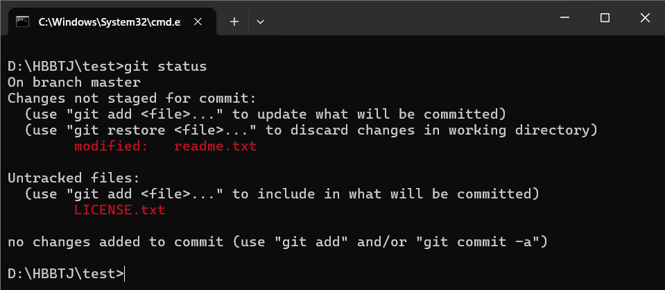   

Git非常清楚地告诉我们，`readme.txt`被修改了，而`LICENSE`还从来没有被添加过，所以它的状态是`Untracked`。

现在，使用两次命令`git add`，把`readme.txt`和`LICENSE`都添加后，用`git status`再查看一下：

```plain
$ git status
On branch master
Changes to be committed:
  (use "git reset HEAD <file>..." to unstage)

	new file:   LICENSE
	modified:   readme.txt
```

 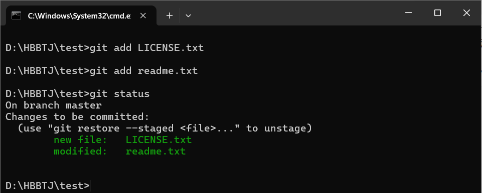   


现在，暂存区的状态就变成这样了：


所以，`git add`命令实际上就是把要提交的所有修改放到暂存区（Stage），然后，执行`git commit`就可以一次性把暂存区的所有修改提交到分支。

```plain
$ git commit -m "understand how stage works"
[master e43a48b] understand how stage works
 2 files changed, 2 insertions(+)
 create mode 100644 LICENSE
```

一旦提交后，如果你又没有对工作区做任何修改，那么工作区就是“干净”的：

```plain
$ git status
On branch master
nothing to commit, working tree clean
```

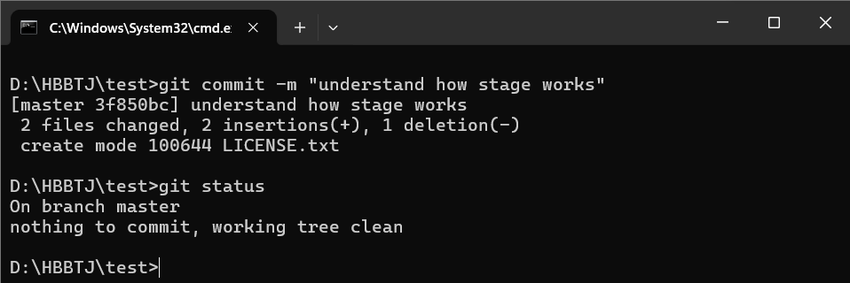   

现在版本库变成了这样，暂存区就没有任何内容了：


### 4.3 管理修改


什么是修改？比如你新增了一行，这就是一个修改，删除了一行，也是一个修改，更改了某些字符，也是一个修改，删了一些又加了一些，也是一个修改，甚至创建一个新文件，也算一个修改。

为什么说Git管理的是修改，而不是文件呢？我们还是做实验。第一步，对readme.txt做一个修改，比如加一行内容：

```plain
$ cat readme.txt
Git is a distributed version control system.
Git is free software distributed under the GPL.
Git has a mutable index called stage.
Git tracks changes.
```

然后，添加：

```plain
$ git add readme.txt
$ git status
# On branch master
# Changes to be committed:
#   (use "git reset HEAD <file>..." to unstage)
#
#       modified:   readme.txt
#
```

然后，再修改readme.txt：

```plain
$ cat readme.txt 
Git is a distributed version control system.
Git is free software distributed under the GPL.
Git has a mutable index called stage.
Git tracks changes of files.
```

提交：

```plain
$ git commit -m "git tracks changes"
[master 519219b] git tracks changes
 1 file changed, 1 insertion(+)
```

提交后，再看看状态：

```plain
$ git status
On branch master
Changes not staged for commit:
  (use "git add <file>..." to update what will be committed)
  (use "git checkout -- <file>..." to discard changes in working directory)

	modified:   readme.txt

no changes added to commit (use "git add" and/or "git commit -a")
```

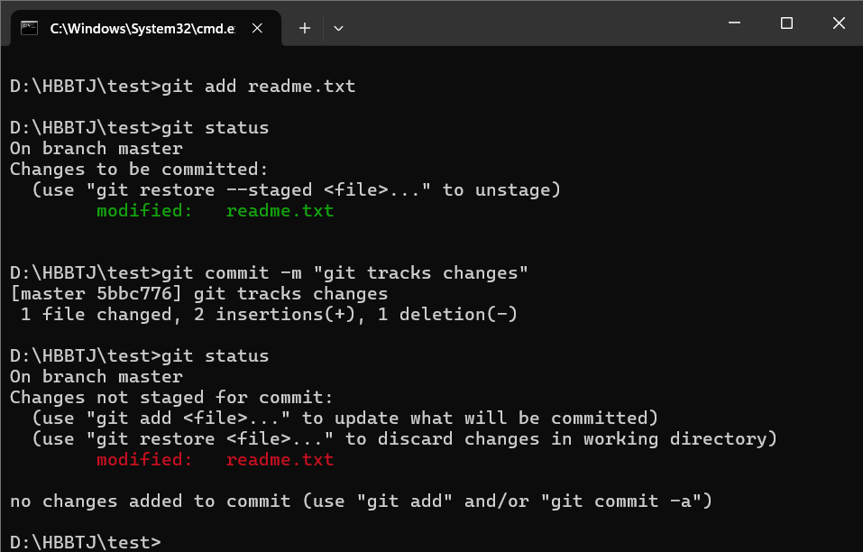 

咦，怎么第二次的修改没有被提交？

第一次修改 -> `git add` -> 第二次修改 -> `git commit`

你看，我们前面讲了，Git管理的是修改，当你用`git add`命令后，在工作区的第一次修改被放入暂存区，准备提交，但是，在工作区的第二次修改并没有放入暂存区，所以，`git commit`只负责把暂存区的修改提交了，也就是第一次的修改被提交了，第二次的修改不会被提交。

提交后，用`git diff HEAD -- readme.txt`命令可以查看工作区和版本库里面最新版本的区别：

```plain
$ git diff HEAD -- readme.txt 
diff --git a/readme.txt b/readme.txt
index 76d770f..a9c5755 100644
--- a/readme.txt
+++ b/readme.txt
@@ -1,4 +1,4 @@
 Git is a distributed version control system.
 Git is free software distributed under the GPL.
 Git has a mutable index called stage.
-Git tracks changes.
+Git tracks changes of files.
```

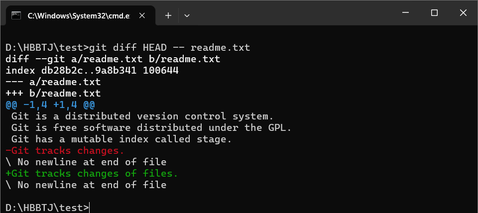   

可见，第二次修改确实没有被提交。那怎么提交第二次修改呢？你可以继续`git add`再`git commit`，也可以别着急提交第一次修改，先`git add`第二次修改，再`git commit`，就相当于把两次修改合并后一块提交了：

第一次修改 -> `git add` -> 第二次修改 -> `git add` -> `git commit`

**小结**

每次修改，如果不用`git add`到暂存区，那就不会加入到`commit`中。


### 4.4 撤销修改


自然，你是不会犯错的。不过现在是凌晨两点，你正在赶一份工作报告，你在`readme.txt`中添加了一行：

```plain
$ cat readme.txt
Git is a distributed version control system.
Git is free software distributed under the GPL.
Git has a mutable index called stage.
Git tracks changes of files.
My stupid boss still prefers SVN.
```

在你准备提交前，一杯咖啡起了作用，你猛然发现了`stupid boss`可能会让你丢掉这个月的奖金！

既然错误发现得很及时，就可以很容易地纠正它。你可以删掉最后一行，手动把文件恢复到上一个版本的状态。如果用`git status`查看一下：

```plain
$ git status
On branch master
Changes not staged for commit:
  (use "git add <file>..." to update what will be committed)
  (use "git checkout -- <file>..." to discard changes in working directory)

	modified:   readme.txt

no changes added to commit (use "git add" and/or "git commit -a")
```

你可以发现，Git会告诉你，`git checkout -- file`可以丢弃工作区的修改：

```plain
$ git checkout -- readme.txt
```

命令`git checkout -- readme.txt`意思就是，把`readme.txt`文件在工作区的修改全部撤销，这里有两种情况：

一种是`readme.txt`自修改后还没有被放到暂存区，现在，撤销修改就回到和版本库一模一样的状态；

一种是`readme.txt`已经添加到暂存区后，又作了修改，现在，撤销修改就回到添加到暂存区后的状态。

总之，就是让这个文件回到最近一次`git commit`或`git add`时的状态。

现在，看看`readme.txt`的文件内容：

```plain
$ cat readme.txt
Git is a distributed version control system.
Git is free software distributed under the GPL.
Git has a mutable index called stage.
Git tracks changes of files.
```

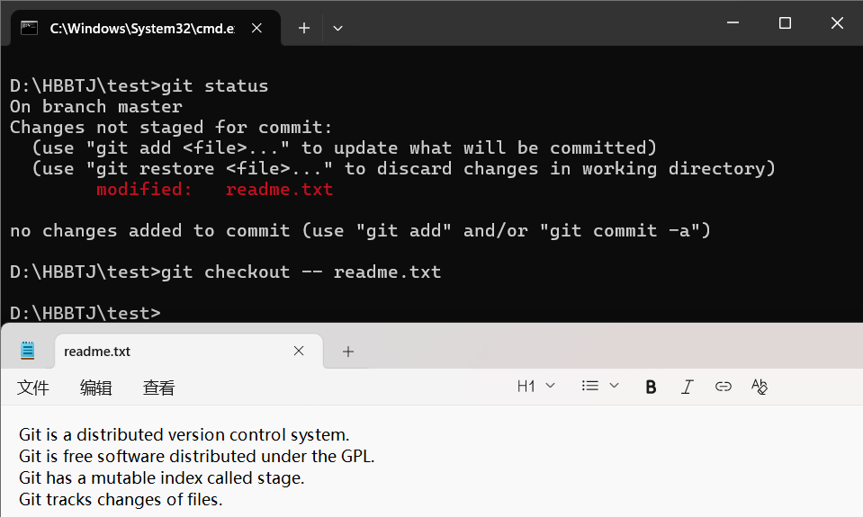   

文件内容果然复原了。


`git checkout -- file`命令中的`--`很重要，没有`--`，就变成了“切换到另一个分支”的命令，我们在后面的分支管理中会再次遇到`git checkout`命令。

现在假定是凌晨3点，你不但写了一些胡话，还`git add`到暂存区了：

```plain
$ cat readme.txt
Git is a distributed version control system.
Git is free software distributed under the GPL.
Git has a mutable index called stage.
Git tracks changes of files.
My stupid boss still prefers SVN.

$ git add readme.txt
```

庆幸的是，在`commit`之前，你发现了这个问题。用`git status`查看一下，修改只是添加到了暂存区，还没有提交：

```plain
$ git status
On branch master
Changes to be committed:
  (use "git reset HEAD <file>..." to unstage)

	modified:   readme.txt
```

Git同样告诉我们，用命令`git reset HEAD <file>`可以把暂存区的修改撤销掉（unstage），重新放回工作区：

```plain
$ git reset HEAD readme.txt
Unstaged changes after reset:
M	readme.txt
```

`git reset`命令既可以回退版本，也可以把暂存区的修改回退到工作区。当我们用`HEAD`时，表示最新的版本。

再用`git status`查看一下，现在暂存区是干净的，工作区有修改：

```plain
$ git status
On branch master
Changes not staged for commit:
  (use "git add <file>..." to update what will be committed)
  (use "git checkout -- <file>..." to discard changes in working directory)

	modified:   readme.txt
```

还记得如何丢弃工作区的修改吗？

```plain
$ git checkout -- readme.txt

$ git status
On branch master
nothing to commit, working tree clean
```

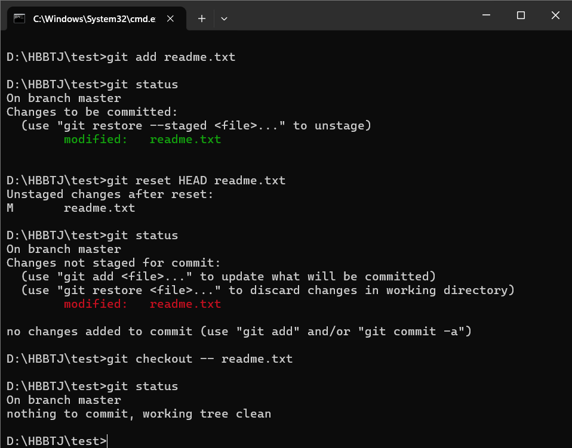  

整个世界终于清静了！

现在，假设你不但改错了东西，还从暂存区提交到了版本库，怎么办呢？还记得[版本回退](https://liaoxuefeng.com/books/git/time-travel/reset/index.html)一节吗？可以回退到上一个版本。不过，这是有条件的，就是你还没有把自己的本地版本库推送到远程。还记得Git是分布式版本控制系统吗？我们后面会讲到远程版本库，一旦你把`stupid boss`提交推送到远程版本库，你就真的惨了……

**小结**

又到了小结时间。

场景1：当你改乱了工作区某个文件的内容，想直接丢弃工作区的修改时，用命令`git checkout -- file`。

场景2：当你不但改乱了工作区某个文件的内容，还添加到了暂存区时，想丢弃修改，分两步，第一步用命令`git reset HEAD <file>`，就回到了场景1，第二步按场景1操作。

场景3：已经提交了不合适的修改到版本库时，想要撤销本次提交，参考[版本回退](https://liaoxuefeng.com/books/git/time-travel/reset/index.html)一节，不过前提是没有推送到远程库。


### 4.5 删除文件


在Git中，删除也是一个修改操作，我们实战一下，先添加一个新文件`test.txt`到Git并且提交：

```plain
$ git add test.txt

$ git commit -m "add test.txt"
[master b84166e] add test.txt
 1 file changed, 1 insertion(+)
 create mode 100644 test.txt
```

一般情况下，你通常直接在文件管理器中把没用的文件删了，或者用`rm`命令删了：

```plain
$ rm test.txt  
```

这个时候，Git知道你删除了文件，因此，工作区和版本库就不一致了，`git status`命令会立刻告诉你哪些文件被删除了：

```plain
$ git status
On branch master
Changes not staged for commit:
  (use "git add/rm <file>..." to update what will be committed)
  (use "git checkout -- <file>..." to discard changes in working directory)

	deleted:    test.txt

no changes added to commit (use "git add" and/or "git commit -a")
```

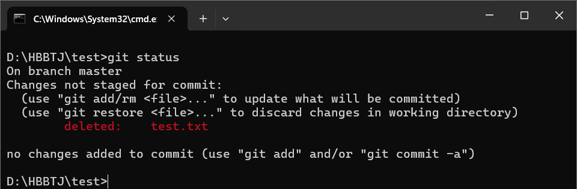 

现在你有两个选择，一是确实要从版本库中删除该文件，那就用命令`git rm`删掉，并且`git commit`：

```plain
$ git rm test.txt
rm 'test.txt'

$ git commit -m "remove test.txt"
[master d46f35e] remove test.txt
 1 file changed, 1 deletion(-)
 delete mode 100644 test.txt
```

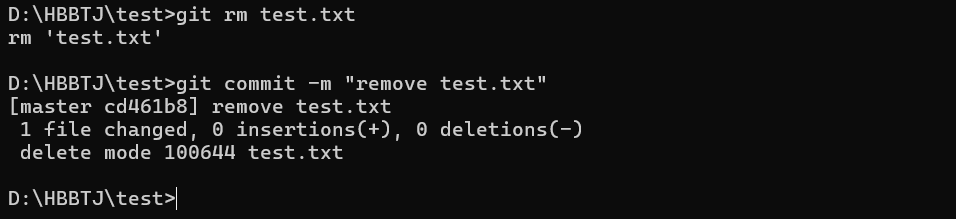  

现在，文件就从版本库中被删除了。

先手动删除文件，然后使用`git rm <file>`和`git add<file>`效果是一样的。

另一种情况是删错了，因为版本库里还有呢，所以可以很轻松地把误删的文件恢复到最新版本：

```plain
$ git checkout -- test.txt
```

`git checkout`其实是用版本库里的版本替换工作区的版本，无论工作区是修改还是删除，都可以“一键还原”。

> ⚠️注意:
>
> 从来没有被添加到版本库就被删除的文件，是无法恢复的！

**小结**

命令`git rm`用于删除一个文件。如果一个文件已经被提交到版本库，那么你永远不用担心误删，但是要小心，你只能恢复文件到最新版本，你会丢失**最近一次提交后你修改的内容**。


## 5.远程仓库


### 使用GutHub

Git是分布式版本控制系统，同一个Git仓库，可以分布到不同的机器上。怎么分布呢？最早，肯定只有一台机器有一个原始版本库，此后，别的机器可以“克隆”这个原始版本库，而且每台机器的版本库其实都是一样的，并没有主次之分。

在继续阅读后续内容前，请自行注册GitHub账号。由于你的本地Git仓库和GitHub仓库之间的传输是通过SSH加密的，所以，需要一点设置：

第1步：创建SSH Key。在用户主目录下，看看有没有.ssh目录，如果有，再看看这个目录下有没有`id_rsa`和`id_rsa.pub`这两个文件，如果已经有了，可直接跳到下一步。如果没有，打开Shell（Windows下打开Git Bash），创建SSH Key：

```
$ ssh-keygen -t rsa -C "youremail@example.com"
```

你需要把邮件地址换成你自己的邮件地址，然后一路回车，使用默认值即可，由于这个Key也不是用于军事目的，所以也无需设置密码。

如果一切顺利的话，可以在用户主目录里找到`.ssh`目录，里面有`id_rsa`和`id_rsa.pub`两个文件，这两个就是SSH Key的秘钥对，`id_rsa`是私钥，不能泄露出去，`id_rsa.pub`是公钥，可以放心地告诉任何人。

第2步：登陆GitHub，打开“Account settings”，“SSH Keys”页面：

然后，点“Add SSH Key”，填上任意Title，在Key文本框里粘贴`id_rsa.pub`文件的内容：


点“Add Key”，你就应该看到已经添加的Key：


为什么GitHub需要SSH Key呢？因为GitHub需要识别出你推送的提交确实是你推送的，而不是别人冒充的，而Git支持SSH协议，所以，GitHub只要知道了你的公钥，就可以确认只有你自己才能推送。

当然，GitHub允许你添加多个Key。假定你有若干电脑，你一会儿在公司提交，一会儿在家里提交，只要把每台电脑的Key都添加到GitHub，就可以在每台电脑上往GitHub推送了。

> ⚠️注意:
>
> 在GitHub上免费托管的Git仓库，任何人都可以看到,但只有你自己才能改,不要把敏感信息放进去。

如果你不想让别人看到Git库，有两个办法，一个是交点保护费，让GitHub把公开的仓库变成私有的，这样别人就看不见了（不可读更不可写）。另一个办法是自己动手，搭一个Git服务器，因为是你自己的Git服务器，所以别人也是看不见的。这个方法我们后面会讲到的，相当简单，公司内部开发必备。


### 使用Gitee

使用GitHub时，国内的用户经常遇到的问题是访问速度太慢，有时候还会出现无法连接的情况（原因你懂的）。

如果我们希望体验Git飞一般的速度，可以使用国内的Git托管服务——[Gitee](https://gitee.com/?utm_source=blog_lxf)（[gitee.com](https://gitee.com/?utm_source=blog_lxf)）。

和GitHub相比，Gitee也提供免费的Git仓库。此外，还集成了代码质量检测、项目演示等功能。对于团队协作开发，Gitee还提供了项目管理、代码托管、文档管理的服务，5人以下小团队免费。

 注意

Gitee的免费版本也提供私有库功能，只是有5人的成员上限。

Gitee 企业版专属购买通道

\>> [Gitee企业版专属购买通道](https://gitee.com/enterprises?utm_source=lxf) <<

使用Gitee和使用GitHub类似，我们在Gitee上注册账号并登录后，需要先上传自己的SSH公钥。选择右上角用户头像 -> 菜单“设置”，然后在左侧菜单选择“SSH公钥”，填写一个便于识别的标题，然后把用户主目录下的`.ssh/id_rsa.pub`文件的内容粘贴进去：


点击“确定”即可完成并看到刚才添加的Key：


  

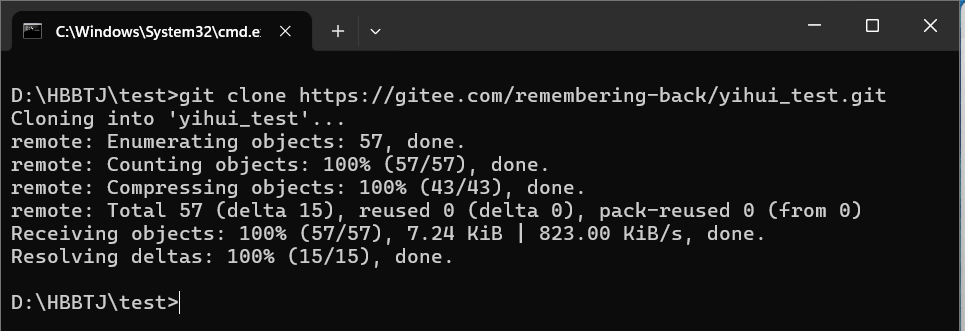  


### 5.1 添加远程库


如果我们已经有了一个本地的git仓库（例如，一个名为learngit的本地库），如何把它关联到Gitee的远程库上呢？

首先，我们在Gitee上创建一个新的项目，选择右上角用户头像旁的加号，然后点击“新建仓库”：


项目名称最好与本地库保持一致。

然后，我们在本地库上使用命令`git remote add`把它和Gitee的远程库关联：

```plain
$ git remote add origin git@gitee.com:liaoxuefeng/learngit.git
```

之后，就可以正常地用`git push`和`git pull`推送了！

如果在使用命令`git remote add`时报错：

```plain
git remote add origin git@gitee.com:liaoxuefeng/learngit.git
fatal: remote origin already exists.
```

这说明本地库已经关联了一个名叫`origin`的远程库，此时，可以先用`git remote -v`查看远程库信息：

```plain
git remote -v
origin	git@github.com:michaelliao/learngit.git (fetch)
origin	git@github.com:michaelliao/learngit.git (push)
```

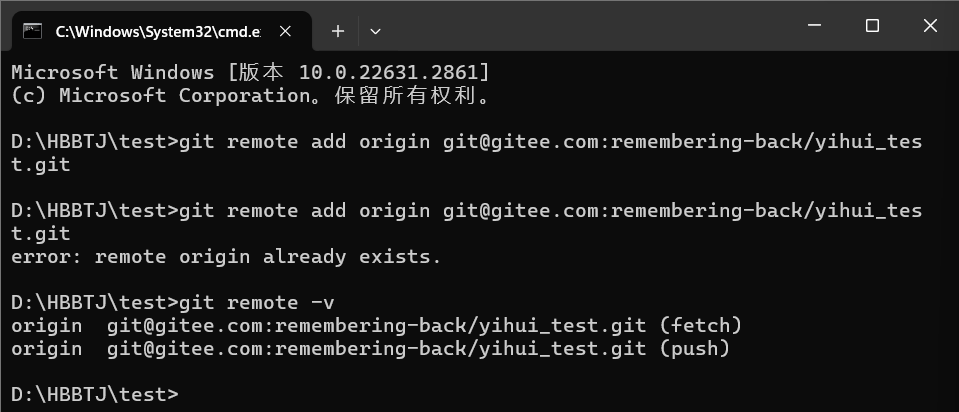   

可以看到，本地库已经关联了`origin`的远程库，并且，该远程库指向GitHub。

我们可以删除已有的GitHub远程库：

```plain
git remote rm origin
```

再关联Gitee的远程库（注意路径中需要填写正确的用户名）：

```plain
git remote add origin git@gitee.com:liaoxuefeng/learngit.git
```

此时，我们再查看远程库信息：

```plain
git remote -v
origin	git@gitee.com:liaoxuefeng/learngit.git (fetch)
origin	git@gitee.com:liaoxuefeng/learngit.git (push)
```

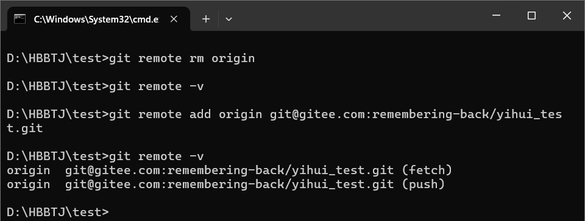   

现在可以看到，origin已经被关联到Gitee的远程库了。通过`git push`命令就可以把本地库推送到Gitee上。

**小结**

要关联一个远程库，使用命令`git remote add origin git@server-name:path/repo-name.git`；

关联一个远程库时必须给远程库指定一个名字，`origin`是默认习惯命名；

关联后，使用命令`git push -u origin master`第一次推送`master`分支的所有内容；

此后，每次本地提交后，只要有必要，就可以使用命令`git push origin master`推送最新修改；


### 5.2 从远程库克隆


上次我们讲了先有本地库，后有远程库的时候，如何关联远程库。

现在，假设我们从零开发，那么最好的方式是先创建远程库，然后，从远程库克隆。

首先，登陆GitHub，创建一个新的仓库，名字叫`gitskills`：


我们勾选`Initialize this repository with a README`，这样GitHub会自动为我们创建一个`README.md`文件。创建完毕后，可以看到`README.md`文件：


现在，远程库已经准备好了，下一步是用命令`git clone`克隆一个本地库：

```plain
$ git clone git@github.com:michaelliao/gitskills.git
Cloning into 'gitskills'...
remote: Counting objects: 3, done.
remote: Total 3 (delta 0), reused 0 (delta 0), pack-reused 3
Receiving objects: 100% (3/3), done.
```

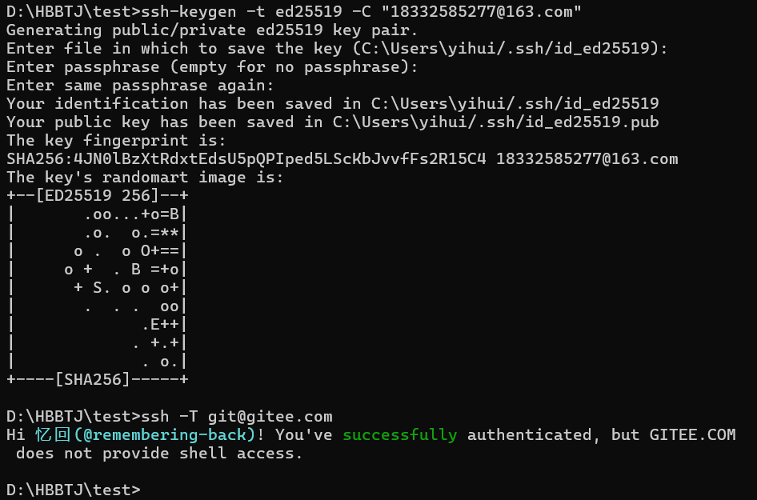 

注意把Git库的地址换成你自己的，然后进入`gitskills`目录看看，已经有`README.md`文件了：

```plain
$ cd gitskills
$ ls
README.md
```

如果有多个人协作开发，那么每个人各自从远程克隆一份就可以了。

你也许还注意到，GitHub给出的地址不止一个，还可以用`https://github.com/michaelliao/gitskills.git`这样的地址。实际上，Git支持多种协议，默认的`git://`使用`ssh`，但也可以使用`https`等其他协议。

使用`https`除了速度慢以外，还有个最大的麻烦是每次推送都必须输入口令，但是在某些只开放`http`端口的公司内部就无法使用`ssh`协议而只能用`https`。


## 6.分支管理


分支在实际中有什么用呢？假设你准备开发一个新功能，但是需要两周才能完成，第一周你写了50%的代码，如果立刻提交，由于代码还没写完，不完整的代码库会导致别人不能干活了。如果等代码全部写完再一次提交，又存在丢失每天进度的巨大风险。

现在有了分支，就不用怕了。你创建了一个属于你自己的分支，别人看不到，还继续在原来的分支上正常工作，而你在自己的分支上干活，想提交就提交，直到开发完毕后，再一次性合并到原来的分支上，这样，既安全，又不影响别人工作。

其他版本控制系统如SVN等都有分支管理，但是用过之后你会发现，这些版本控制系统创建和切换分支比蜗牛还慢，简直让人无法忍受，结果分支功能成了摆设，大家都不去用。

但Git的分支是与众不同的，无论创建、切换和删除分支，Git在1秒钟之内就能完成！无论你的版本库是1个文件还是1万个文件。


### 6.1 创建与合并分支


在[版本回退](https://liaoxuefeng.com/books/git/time-travel/reset/index.html)里，你已经知道，每次提交，Git都把它们串成一条时间线，这条时间线就是一个分支。截止到目前，只有一条时间线，在Git里，这个分支叫主分支，即`master`分支。`HEAD`严格来说不是指向提交，而是指向`master`，`master`才是指向提交的，所以，`HEAD`指向的就是当前分支。

一开始的时候，`master`分支是一条线，Git用`master`指向最新的提交，再用`HEAD`指向`master`，就能确定当前分支，以及当前分支的提交点：

```
                  HEAD
                    │
                    ▼
                 master
                    │
                    ▼
┌───┐    ┌───┐    ┌───┐
│   │───▶│   │───▶│   │
└───┘    └───┘    └───┘
```

每次提交，`master`分支都会向前移动一步，这样，随着你不断提交，`master`分支的线也越来越长。

当我们创建新的分支，例如`dev`时，Git新建了一个指针叫`dev`，指向`master`相同的提交，再把`HEAD`指向`dev`，就表示当前分支在`dev`上：

```
                 master
                    │
                    ▼
┌───┐    ┌───┐    ┌───┐
│   │───▶│   │───▶│   │
└───┘    └───┘    └───┘
                    ▲
                    │
                   dev
                    ▲
                    │
                  HEAD
```

你看，Git创建一个分支很快，因为除了增加一个`dev`指针，改改`HEAD`的指向，工作区的文件都没有任何变化！

不过，从现在开始，对工作区的修改和提交就是针对`dev`分支了，比如新提交一次后，`dev`指针往前移动一步，而`master`指针不变：

```
                 master
                    │
                    ▼
┌───┐    ┌───┐    ┌───┐    ┌───┐
│   │───▶│   │───▶│   │───▶│   │
└───┘    └───┘    └───┘    └───┘
                             ▲
                             │
                            dev
                             ▲
                             │
                           HEAD
```

假如我们在`dev`上的工作完成了，就可以把`dev`合并到`master`上。Git怎么合并呢？最简单的方法，就是直接把`master`指向`dev`的当前提交，就完成了合并：

```
                           HEAD
                             │
                             ▼
                          master
                             │
                             ▼
┌───┐    ┌───┐    ┌───┐    ┌───┐
│   │───▶│   │───▶│   │───▶│   │
└───┘    └───┘    └───┘    └───┘
                             ▲
                             │
                            dev
```

所以Git合并分支也很快！就改改指针，工作区内容也不变！

合并完分支后，甚至可以删除`dev`分支。删除`dev`分支就是把`dev`指针给删掉，删掉后，我们就剩下了一条`master`分支：

```
                           HEAD
                             │
                             ▼
                          master
                             │
                             ▼
┌───┐    ┌───┐    ┌───┐    ┌───┐
│   │───▶│   │───▶│   │───▶│   │
└───┘    └───┘    └───┘    └───┘
```

真是太神奇了，你看得出来有些提交是通过分支完成的吗？

下面开始实战。

首先，我们创建`dev`分支，然后切换到`dev`分支：

```plain
$ git checkout -b dev
Switched to a new branch 'dev'
```

`git checkout`命令加上`-b`参数表示创建并切换，相当于以下两条命令：

```plain
$ git branch dev
$ git checkout dev
Switched to branch 'dev'
```

然后，用`git branch`命令查看当前分支：

```plain
$ git branch
* dev
  master
```

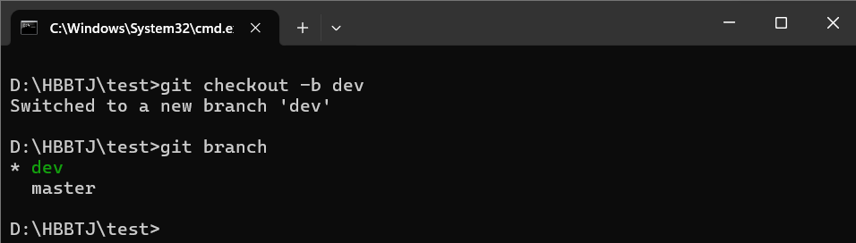  

`git branch`命令会列出所有分支，当前分支前面会标一个`*`号。

然后，我们就可以在`dev`分支上正常提交，比如对`readme.txt`做个修改，加上一行：

```plain
Creating a new branch is quick.
```

然后提交：

```plain
$ git add readme.txt 
$ git commit -m "branch test"
[dev b17d20e] branch test
 1 file changed, 1 insertion(+)
```

现在，`dev`分支的工作完成，我们就可以切换回`master`分支：

```plain
$ git checkout master
Switched to branch 'master'
```

切换回`master`分支后，再查看一个`readme.txt`文件，刚才添加的内容不见了！因为那个提交是在`dev`分支上，而`master`分支此刻的提交点并没有变：

```
                  HEAD
                    │
                    ▼
                 master
                    │
                    ▼
┌───┐    ┌───┐    ┌───┐    ┌───┐
│   │───▶│   │───▶│   │───▶│   │
└───┘    └───┘    └───┘    └───┘
                             ▲
                             │
                            dev
```

现在，我们把`dev`分支的工作成果合并到`master`分支上：

```plain
$ git merge dev
Updating d46f35e..b17d20e
Fast-forward
 readme.txt | 1 +
 1 file changed, 1 insertion(+)
```

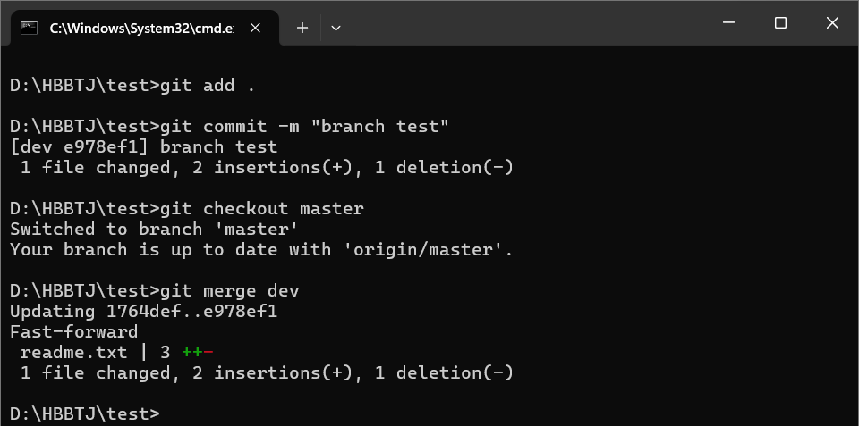   

`git merge`命令用于合并指定分支到当前分支。合并后，再查看`readme.txt`的内容，就可以看到，和`dev`分支的最新提交是完全一样的。

注意到上面的`Fast-forward`信息，Git告诉我们，这次合并是“快进模式”，也就是直接把`master`指向`dev`的当前提交，所以合并速度非常快。

当然，也不是每次合并都能`Fast-forward`，我们后面会讲其他方式的合并。

合并完成后，就可以放心地删除`dev`分支了：

```plain
$ git branch -d dev
Deleted branch dev (was b17d20e).
```

删除后，查看`branch`，就只剩下`master`分支了：

```plain
$ git branch
* master
```

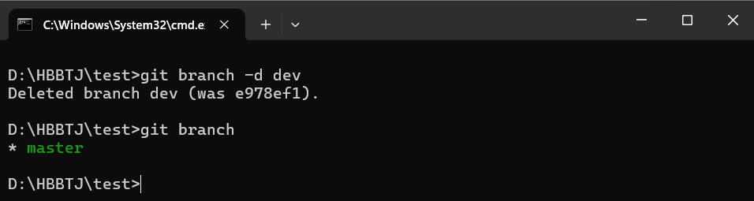  

因为创建、合并和删除分支非常快，所以Git鼓励你使用分支完成某个任务，合并后再删掉分支，这和直接在`master`分支上工作效果是一样的，但过程更安全。


我们注意到切换分支使用`git checkout <branch>`，而前面讲过的撤销修改则是`git checkout -- <file>`，同一个命令，有两种作用，确实有点令人迷惑。

实际上，切换分支这个动作，用`switch`更科学。因此，最新版本的Git提供了新的`git switch`命令来切换分支：

创建并切换到新的`dev`分支，可以使用：

```plain
$ git switch -c dev
```

直接切换到已有的`master`分支，可以使用：

```plain
$ git switch master
```

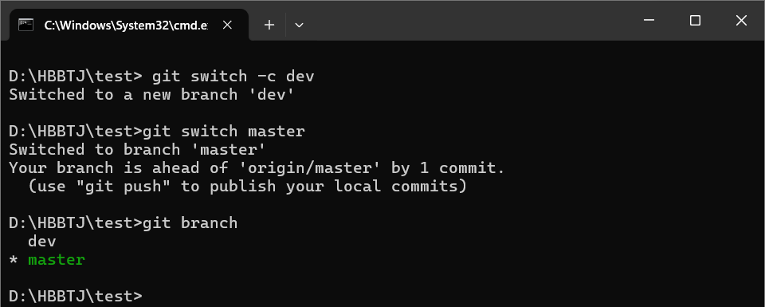 

使用新的`git switch`命令，比`git checkout`要更容易理解。

**小结**

Git鼓励大量使用分支：

查看分支：`git branch`

创建分支：`git branch <name>`

切换分支：`git checkout <name>`或者`git switch <name>`

创建+切换分支：`git checkout -b <name>`或者`git switch -c <name>`

合并某分支到当前分支：`git merge <name>`

删除分支：`git branch -d <name>`


### 6.2 解决冲突


准备新的`feature1`分支，继续我们的新分支开发：

```plain
$ git switch -c feature1
Switched to a new branch 'feature1'
```

修改`readme.txt`最后一行，改为：

```plain
Creating a new branch is quick AND simple.
```

在`feature1`分支上提交：

```plain
$ git add readme.txt

$ git commit -m "AND simple"
[feature1 14096d0] AND simple
 1 file changed, 1 insertion(+), 1 deletion(-)
```

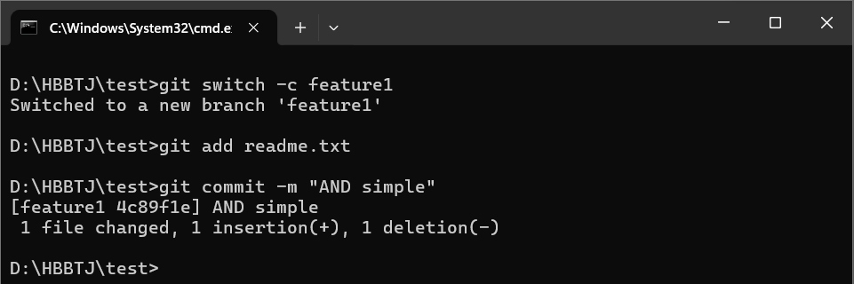  

切换到`master`分支：

```plain
$ git switch master
Switched to branch 'master'
Your branch is ahead of 'origin/master' by 1 commit.
  (use "git push" to publish your local commits)
```

Git还会自动提示我们当前`master`分支比远程的`master`分支要超前1个提交。

在`master`分支上把`readme.txt`文件的最后一行改为：

```plain
Creating a new branch is quick & simple.
```

提交：

```plain
$ git add readme.txt 
$ git commit -m "& simple"
[master 5dc6824] & simple
 1 file changed, 1 insertion(+), 1 deletion(-)
```

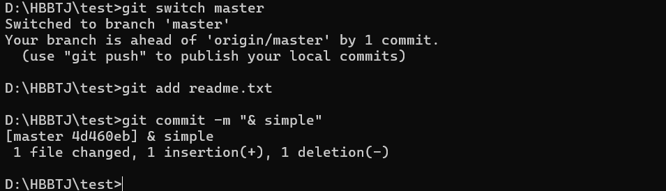  

现在，`master`分支和`feature1`分支各自都分别有新的提交，变成了这样：

```
                            HEAD
                              │
                              ▼
                           master
                              │
                              ▼
                            ┌───┐
                         ┌─▶│   │
┌───┐    ┌───┐    ┌───┐  │  └───┘
│   │───▶│   │───▶│   │──┤
└───┘    └───┘    └───┘  │  ┌───┐
                         └─▶│   │
                            └───┘
                              ▲
                              │
                          feature1
```

这种情况下，Git无法执行“快速合并”，只能试图把各自的修改合并起来，但这种合并就可能会有冲突，我们试试看：

```plain
$ git merge feature1
Auto-merging readme.txt
CONFLICT (content): Merge conflict in readme.txt
Automatic merge failed; fix conflicts and then commit the result.
```

果然冲突了！Git告诉我们，`readme.txt`文件存在冲突，必须手动解决冲突后再提交。`git status`也可以告诉我们冲突的文件：

```plain
$ git status
On branch master
Your branch is ahead of 'origin/master' by 2 commits.
  (use "git push" to publish your local commits)

You have unmerged paths.
  (fix conflicts and run "git commit")
  (use "git merge --abort" to abort the merge)

Unmerged paths:
  (use "git add <file>..." to mark resolution)

	both modified:   readme.txt

no changes added to commit (use "git add" and/or "git commit -a")
```

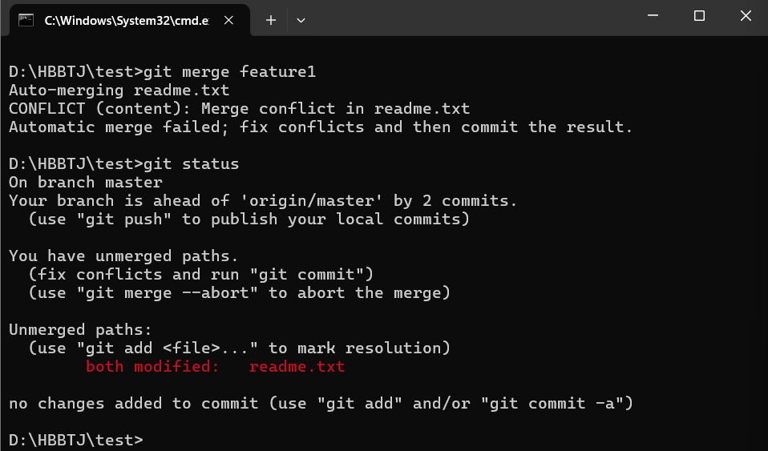   

我们可以直接查看readme.txt的内容：

```plain
Git is a distributed version control system.
Git is free software distributed under the GPL.
Git has a mutable index called stage.
Git tracks changes of files.
<<<<<<< HEAD
Creating a new branch is quick & simple.
=======
Creating a new branch is quick AND simple.
>>>>>>> feature1
```

Git用`<<<<<<<`，`=======`，`>>>>>>>`标记出不同分支的内容，我们修改如下后保存：

```plain
Git is a distributed version control system.
Git is free software distributed under the GPL.
Git has a mutable index called stage.
Git tracks changes of files.
Creating a new branch is quick and simple.
```


再提交：

```plain
$ git add readme.txt 
$ git commit -m "conflict fixed"
[master cf810e4] conflict fixed
```


现在，`master`分支和`feature1`分支变成了下图所示：

```
                                     HEAD
                                       │
                                       ▼
                                    master
                                       │
                                       ▼
                            ┌───┐    ┌───┐
                         ┌─▶│   │───▶│   │
┌───┐    ┌───┐    ┌───┐  │  └───┘    └───┘
│   │───▶│   │───▶│   │──┤             ▲
└───┘    └───┘    └───┘  │  ┌───┐      │
                         └─▶│   │──────┘
                            └───┘
                              ▲
                              │
                          feature1
```

用带参数的`git log`也可以看到分支的合并情况：

```plain
$ git log --graph --pretty=oneline --abbrev-commit
*   cf810e4 (HEAD -> master) conflict fixed
|\  
| * 14096d0 (feature1) AND simple
* | 5dc6824 & simple
|/  
* b17d20e branch test
* d46f35e (origin/master) remove test.txt
* b84166e add test.txt
* 519219b git tracks changes
* e43a48b understand how stage works
* 1094adb append GPL
* e475afc add distributed
* eaadf4e wrote a readme file
```

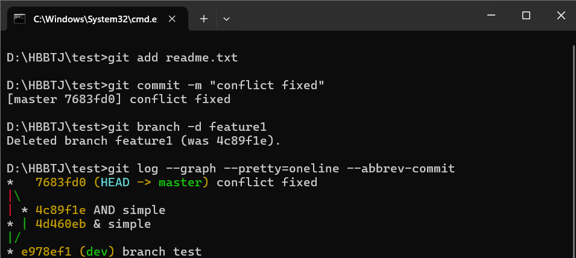  

最后，删除`feature1`分支：

```plain
$ git branch -d feature1
Deleted branch feature1 (was 14096d0).
```

工作完成。

**小结**

当Git无法自动合并分支时，就必须首先解决冲突。解决冲突后，再提交，合并完成。

解决冲突就是把Git合并失败的文件手动编辑为我们希望的内容，再提交。

用`git log --graph`命令可以看到分支合并图。


### 6.3 分支管理策略


通常，合并分支时，如果可能，Git会用`Fast forward`模式，但这种模式下，删除分支后，会丢掉分支信息。

如果要强制禁用`Fast forward`模式，Git就会在merge时生成一个新的commit，这样，从分支历史上就可以看出分支信息。

下面我们实战一下`--no-ff`方式的`git merge`：

首先，仍然创建并切换`dev`分支：

```plain
$ git switch -c dev
Switched to a new branch 'dev'
```

修改readme.txt文件，并提交一个新的commit：

```plain
$ git add readme.txt 
$ git commit -m "add merge"
[dev f52c633] add merge
 1 file changed, 1 insertion(+)
```

现在，我们切换回`master`：

```plain
$ git switch master
Switched to branch 'master'
```


准备合并`dev`分支，请注意`--no-ff`参数，表示禁用`Fast forward`：

```plain
$ git merge --no-ff -m "merge with no-ff" dev
Merge made by the 'recursive' strategy.
 readme.txt | 1 +
 1 file changed, 1 insertion(+)
```


因为本次合并要创建一个新的commit，所以加上`-m`参数，把commit描述写进去。

合并后，我们用`git log`看看分支历史：

```plain
$ git log --graph --pretty=oneline --abbrev-commit
*   e1e9c68 (HEAD -> master) merge with no-ff
|\  
| * f52c633 (dev) add merge
|/  
*   cf810e4 conflict fixed
...
```

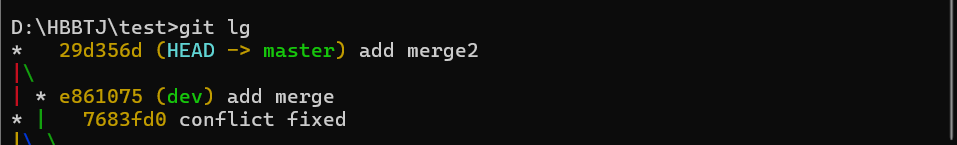   

可以看到，不使用`Fast forward`模式，merge后就像这样：

```
                                 HEAD
                                  │
                                  ▼
                                master
                                  │
                                  ▼
                                ┌───┐
                         ┌─────▶│   │
┌───┐    ┌───┐    ┌───┐  │      └───┘
│   │───▶│   │───▶│   │──┤        ▲
└───┘    └───┘    └───┘  │  ┌───┐ │
                         └─▶│   │─┘
                            └───┘
                              ▲
                              │
                             dev
```


**分支策略**

在实际开发中，我们应该按照几个基本原则进行分支管理：

首先，`master`分支应该是非常稳定的，也就是仅用来发布新版本，平时不能在上面干活；

那在哪干活呢？干活都在`dev`分支上，也就是说，`dev`分支是不稳定的，到某个时候，比如1.0版本发布时，再把`dev`分支合并到`master`上，在`master`分支发布1.0版本；

你和你的小伙伴们每个人都在`dev`分支上干活，每个人都有自己的分支，时不时地往`dev`分支上合并就可以了。

所以，团队合作的分支看起来就像这样：


**小结**

Git分支十分强大，在团队开发中应该充分应用。

合并分支时，加上`--no-ff`参数就可以用普通模式合并，合并后的历史有分支，能看出来曾经做过合并，而`fast forward`合并就看不出来曾经做过合并。


### 6.4 Bug分支


软件开发中，bug就像家常便饭一样。有了bug就需要修复，在Git中，由于分支是如此的强大，所以，每个bug都可以通过一个新的临时分支来修复，修复后，合并分支，然后将临时分支删除。

当你接到一个修复一个代号101的bug的任务时，很自然地，你想创建一个分支`issue-101`来修复它，但是，等等，当前正在`dev`上进行的工作还没有提交：

```plain
$ git status
On branch dev
Changes to be committed:
  (use "git reset HEAD <file>..." to unstage)

	new file:   hello.py

Changes not staged for commit:
  (use "git add <file>..." to update what will be committed)
  (use "git checkout -- <file>..." to discard changes in working directory)

	modified:   readme.txt
```


并不是你不想提交，而是工作只进行到一半，还没法提交，预计完成还需1天时间。但是，必须在两个小时内修复该bug，怎么办？

幸好，Git还提供了一个`stash`功能，可以把当前工作现场“储藏”起来，等以后恢复现场后继续工作：

```plain
$ git stash
Saved working directory and index state WIP on dev: f52c633 add merge
```

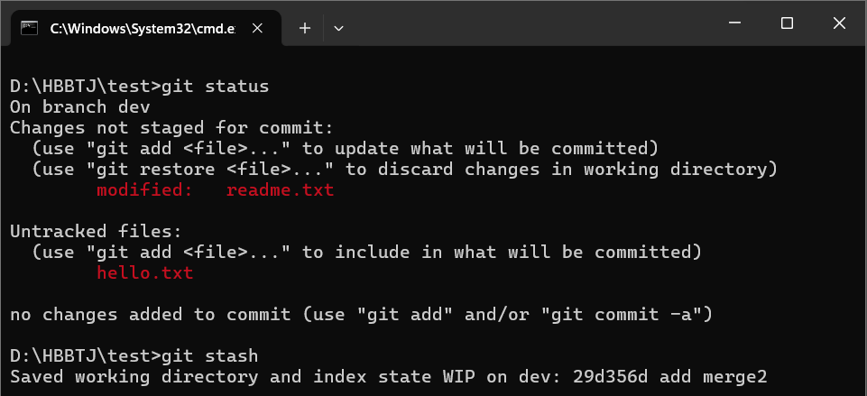   

现在，用`git status`查看工作区，就是干净的（除非有没有被Git管理的文件），因此可以放心地创建分支来修复bug。

首先确定要在哪个分支上修复bug，假定需要在`master`分支上修复，就从`master`创建临时分支：

```plain
$ git checkout master
Switched to branch 'master'
Your branch is ahead of 'origin/master' by 6 commits.
  (use "git push" to publish your local commits)

$ git checkout -b issue-101
Switched to a new branch 'issue-101'
```


现在修复bug，需要把“Git is free software ...”改为“Git is a free software ...”，然后提交：

```plain
$ git add readme.txt 
$ git commit -m "fix bug 101"
[issue-101 4c805e2] fix bug 101
 1 file changed, 1 insertion(+), 1 deletion(-)
```

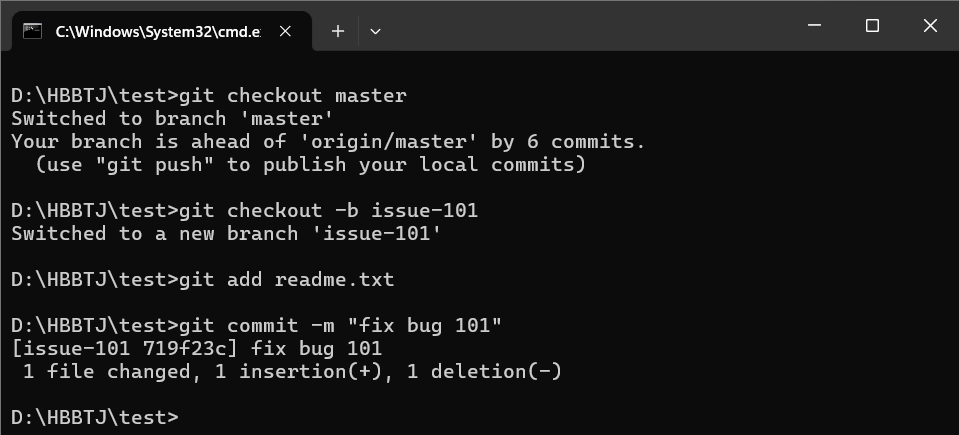  

修复完成后，切换到`master`分支，并完成合并，最后删除`issue-101`分支：

```plain
$ git switch master
Switched to branch 'master'
Your branch is ahead of 'origin/master' by 6 commits.
  (use "git push" to publish your local commits)

$ git merge --no-ff -m "merged bug fix 101" issue-101
Merge made by the 'recursive' strategy.
 readme.txt | 2 +-
 1 file changed, 1 insertion(+), 1 deletion(-)
```

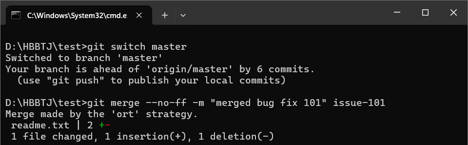   

太棒了，原计划两个小时的bug修复只花了5分钟！现在，是时候接着回到`dev`分支干活了！

```plain
$ git switch dev
Switched to branch 'dev'

$ git status
On branch dev
nothing to commit, working tree clean
```


工作区是干净的，刚才的工作现场存到哪去了？用`git stash list`命令看看：

```plain
$ git stash list
stash@{0}: WIP on dev: f52c633 add merge
```


工作现场还在，Git把`stash`内容存在某个地方了，但是需要恢复一下，有两个办法：

一是用`git stash apply`恢复，但是恢复后，`stash`内容并不删除，你需要用`git stash drop`来删除；

另一种方式是用`git stash pop`，恢复的同时把`stash`内容也删了：

```plain
$ git stash pop
On branch dev
Changes to be committed:
  (use "git reset HEAD <file>..." to unstage)

	new file:   hello.py

Changes not staged for commit:
  (use "git add <file>..." to update what will be committed)
  (use "git checkout -- <file>..." to discard changes in working directory)

	modified:   readme.txt

Dropped refs/stash@{0} (5d677e2ee266f39ea296182fb2354265b91b3b2a)
```

再用`git stash list`查看，就看不到任何`stash`内容了：

```plain
$ git stash list
```

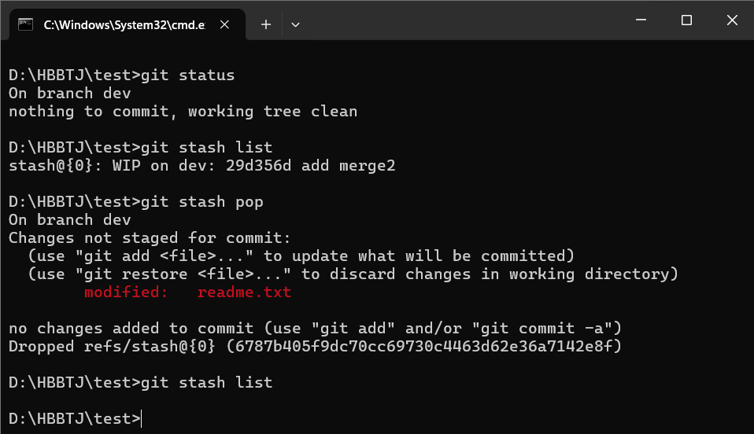  

你可以多次`stash`，恢复的时候，先用`git stash list`查看，然后恢复指定的`stash`，用命令：

```plain
$ git stash apply stash@{0}
```

在`master`分支上修复了bug后，我们要想一想，`dev`分支是早期从`master`分支分出来的，所以，这个bug其实在当前`dev`分支上也存在。

那怎么在`dev`分支上修复同样的bug？重复操作一次，提交不就行了？

有木有更简单的方法？

有！

同样的bug，要在`dev`上修复，我们只需要把`4c805e2 fix bug 101`这个提交所做的修改“复制”到`dev`分支。注意：我们只想复制`4c805e2 fix bug 101`这个提交所做的修改，并不是把整个`master`分支merge过来。

为了方便操作，Git专门提供了一个`cherry-pick`命令，让我们能复制一个特定的提交到当前分支：

```plain
$ git branch
* dev
  master
$ git cherry-pick 4c805e2
[master 1d4b803] fix bug 101
 1 file changed, 1 insertion(+), 1 deletion(-)
```

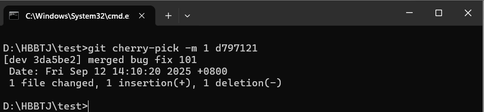  

Git自动给`dev`分支做了一次提交，注意这次提交的commit是`1d4b803`，它并不同于`master`的`4c805e2`，因为这两个commit只是改动相同，但确实是两个不同的commit。用`git cherry-pick`，我们就不需要在`dev`分支上手动再把修bug的过程重复一遍。

有些聪明的童鞋会想了，既然可以在`master`分支上修复bug后，在`dev`分支上可以“重放”这个修复过程，那么直接在`dev`分支上修复bug，然后在`master`分支上“重放”行不行？当然可以，不过你仍然需要`git stash`命令保存现场，才能从`dev`分支切换到`master`分支。

**小结**

修复bug时，我们会通过创建新的bug分支进行修复，然后合并，最后删除；

当手头工作没有完成时，先把工作现场`git stash`一下，然后去修复bug，修复后，再`git stash pop`，回到工作现场；

在`master`分支上修复的bug，想要合并到当前`dev`分支，可以用`git cherry-pick <commit>`命令，把bug提交的修改“复制”到当前分支，避免重复劳动。


### 6.5 Feature分支


软件开发中，总有无穷无尽的新的功能要不断添加进来。

添加一个新功能时，你肯定不希望因为一些实验性质的代码，把主分支搞乱了，所以，每添加一个新功能，最好新建一个feature分支，在上面开发，完成后，合并，最后，删除该feature分支。

现在，你终于接到了一个新任务：开发代号为Vulcan的新功能，该功能计划用于下一代星际飞船。

于是准备开发：

```plain
$ git switch -c feature-vulcan
Switched to a new branch 'feature-vulcan'
```


5分钟后，开发完毕：

```plain
$ git add vulcan.py

$ git status
On branch feature-vulcan
Changes to be committed:
  (use "git reset HEAD <file>..." to unstage)

	new file:   vulcan.py

$ git commit -m "add feature vulcan"
[feature-vulcan 287773e] add feature vulcan
 1 file changed, 2 insertions(+)
 create mode 100644 vulcan.py
```


切回`dev`，准备合并：

```plain
$ git switch dev
```


一切顺利的话，feature分支和bug分支是类似的，合并，然后删除。

但是！

就在此时，接到上级命令，因经费不足，新功能必须取消！

虽然白干了，但是这个包含机密资料的分支还是必须就地销毁：

```plain
$ git branch -d feature-vulcan
error: The branch 'feature-vulcan' is not fully merged.
If you are sure you want to delete it, run 'git branch -D feature-vulcan'.
```


销毁失败。Git友情提醒，`feature-vulcan`分支还没有被合并，如果删除，将丢失掉修改，如果要强行删除，需要使用大写的`-D`参数。。

现在我们强行删除：

```plain
$ git branch -D feature-vulcan
Deleted branch feature-vulcan (was 287773e).
```

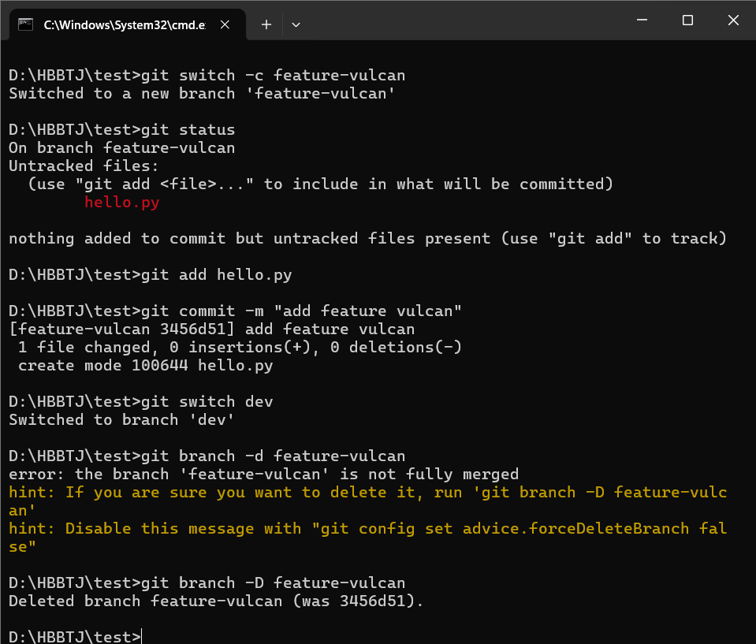 

终于删除成功！

**小结**

开发一个新功能，最好新建一个分支；

如果要丢弃一个没有被合并过的分支，可以通过`git branch -D <name>`强行删除。


### 6.6 多人协作


当你从远程仓库克隆时，实际上Git自动把本地的`master`分支和远程的`master`分支对应起来了，并且，远程仓库的默认名称是`origin`。

要查看远程库的信息，用`git remote`：

```plain
$ git remote
origin
```

或者，用`git remote -v`显示更详细的信息：

```plain
$ git remote -v
origin  git@github.com:michaelliao/learngit.git (fetch)
origin  git@github.com:michaelliao/learngit.git (push)
```

上面显示了可以抓取和推送的`origin`的地址。如果没有推送权限，就看不到push的地址。

**推送分支**

推送分支，就是把该分支上的所有本地提交推送到远程库。推送时，要指定本地分支，这样，Git就会把该分支推送到远程库对应的远程分支上：

```plain
$ git push origin master
```

如果要推送其他分支，比如`dev`，就改成：

```plain
$ git push origin dev
```

但是，并不是一定要把本地分支往远程推送，那么，哪些分支需要推送，哪些不需要呢？

- `master`分支是主分支，因此要时刻与远程同步；
- `dev`分支是开发分支，团队所有成员都需要在上面工作，所以也需要与远程同步；
- bug分支只用于在本地修复bug，就没必要推到远程了，除非老板要看看你每周到底修复了几个bug；
- feature分支是否推到远程，取决于你是否和你的小伙伴合作在上面开发。

总之，就是在Git中，分支完全可以在本地自己藏着玩，是否推送，视你的心情而定！

**抓取分支**

多人协作时，大家都会往`master`和`dev`分支上推送各自的修改。

现在，模拟一个你的小伙伴，可以在另一台电脑（注意要把SSH Key添加到GitHub）或者同一台电脑的另一个目录下克隆：

```plain
$ git clone git@github.com:michaelliao/learngit.git
Cloning into 'learngit'...
remote: Counting objects: 40, done.
remote: Compressing objects: 100% (21/21), done.
remote: Total 40 (delta 14), reused 40 (delta 14), pack-reused 0
Receiving objects: 100% (40/40), done.
Resolving deltas: 100% (14/14), done.
```


当你的小伙伴从远程库clone时，默认情况下，你的小伙伴只能看到本地的`master`分支。不信可以用`git branch`命令看看：

```plain
$ git branch
* master
```


现在，你的小伙伴要在`dev`分支上开发，就必须创建远程`origin`的`dev`分支到本地，于是他用这个命令创建本地`dev`分支：

```plain
$ git checkout -b dev origin/dev
```


现在，他就可以在`dev`上继续修改，然后，时不时地把`dev`分支`push`到远程：

```plain
$ git add env.txt

$ git commit -m "add env"
[dev 7a5e5dd] add env
 1 file changed, 1 insertion(+)
 create mode 100644 env.txt

$ git push origin dev
Counting objects: 3, done.
Delta compression using up to 4 threads.
Compressing objects: 100% (2/2), done.
Writing objects: 100% (3/3), 308 bytes | 308.00 KiB/s, done.
Total 3 (delta 0), reused 0 (delta 0)
To github.com:michaelliao/learngit.git
   f52c633..7a5e5dd  dev -> dev
```

你的小伙伴已经向`origin/dev`分支推送了他的提交，而碰巧你也对同样的文件作了修改，并试图推送：

```plain
$ cat env.txt
env

$ git add env.txt

$ git commit -m "add new env"
[dev 7bd91f1] add new env
 1 file changed, 1 insertion(+)
 create mode 100644 env.txt

$ git push origin dev
To github.com:michaelliao/learngit.git
 ! [rejected]        dev -> dev (non-fast-forward)
error: failed to push some refs to 'git@github.com:michaelliao/learngit.git'
hint: Updates were rejected because the tip of your current branch is behind
hint: its remote counterpart. Integrate the remote changes (e.g.
hint: 'git pull ...') before pushing again.
hint: See the 'Note about fast-forwards' in 'git push --help' for details.
```


推送失败，因为你的小伙伴的最新提交和你试图推送的提交有冲突，解决办法也很简单，Git已经提示我们，先用`git pull`把最新的提交从`origin/dev`抓下来，然后，在本地合并，解决冲突，再推送：

```plain
$ git pull
There is no tracking information for the current branch.
Please specify which branch you want to merge with.
See git-pull(1) for details.

    git pull <remote> <branch>

If you wish to set tracking information for this branch you can do so with:

    git branch --set-upstream-to=origin/<branch> dev
```

`git pull`也失败了，原因是没有指定本地`dev`分支与远程`origin/dev`分支的链接，根据提示，设置`dev`和`origin/dev`的链接：

```plain
$ git branch --set-upstream-to=origin/dev dev
Branch 'dev' set up to track remote branch 'dev' from 'origin'.
```

再pull：

```plain
$ git pull
Auto-merging env.txt
CONFLICT (add/add): Merge conflict in env.txt
Automatic merge failed; fix conflicts and then commit the result.
```

这回`git pull`成功，但是合并有冲突，需要手动解决，解决的方法和分支管理中的[解决冲突](https://liaoxuefeng.com/books/git/branch/merge/index.html)完全一样。解决后，提交，再push：

```plain
$ git commit -m "fix env conflict"
[dev 57c53ab] fix env conflict

$ git push origin dev
Counting objects: 6, done.
Delta compression using up to 4 threads.
Compressing objects: 100% (4/4), done.
Writing objects: 100% (6/6), 621 bytes | 621.00 KiB/s, done.
Total 6 (delta 0), reused 0 (delta 0)
To github.com:michaelliao/learngit.git
   7a5e5dd..57c53ab  dev -> dev
```

因此，多人协作的工作模式通常是这样：

1. 首先，可以尝试用`git push origin <branch-name>`推送自己的修改；
2. 如果推送失败，则因为远程分支比你的本地更新，需要先用`git pull`试图合并；
3. 如果合并有冲突，则解决冲突，并在本地提交；
4. 没有冲突或者解决掉冲突后，再用`git push origin <branch-name>`推送就能成功！

如果`git pull`提示`no tracking information`，则说明本地分支和远程分支的链接关系没有创建，用命令`git branch --set-upstream-to <branch-name> origin/<branch-name>`。

这就是多人协作的工作模式，一旦熟悉了，就非常简单。

**小结**

- 查看远程库信息，使用`git remote -v`；

- 本地新建的分支如果不推送到远程，对其他人就是不可见的；

- 从本地推送分支，使用`git push origin branch-name`，如果推送失败，先用`git pull`抓取远程的新提交；

- 在本地创建和远程分支对应的分支，使用`git checkout -b branch-name origin/branch-name`，本地和远程分支的名称最好一致；

- 建立本地分支和远程分支的关联，使用`git branch --set-upstream branch-name origin/branch-name`；

- 从远程抓取分支，使用`git pull`，如果有冲突，要先处理冲突。

  

### 6.7 Rebase


在上一节我们看到了，多人在同一个分支上协作时，很容易出现冲突。即使没有冲突，后push的童鞋不得不先pull，在本地合并，然后才能push成功。

每次合并再push后，分支变成了这样：

```plain
$ git log --graph --pretty=oneline --abbrev-commit
* d1be385 (HEAD -> master, origin/master) init hello
*   e5e69f1 Merge branch 'dev'
|\  
| *   57c53ab (origin/dev, dev) fix env conflict
| |\  
| | * 7a5e5dd add env
| * | 7bd91f1 add new env
| |/  
* |   12a631b merged bug fix 101
|\ \  
| * | 4c805e2 fix bug 101
|/ /  
* |   e1e9c68 merge with no-ff
|\ \  
| |/  
| * f52c633 add merge
|/  
*   cf810e4 conflict fixed
```


总之看上去很乱，有强迫症的童鞋会问：为什么Git的提交历史不能是一条干净的直线？

其实是可以做到的！

Git有一种称为`rebase`的操作。

在和远程分支同步后，我们对`hello.py`这个文件做了两次提交。用`git log`命令看看：

```plain
$ git log --graph --pretty=oneline --abbrev-commit
* 582d922 (HEAD -> master) add author
* 8875536 add comment
* d1be385 (origin/master) init hello
*   e5e69f1 Merge branch 'dev'
|\  
| *   57c53ab (origin/dev, dev) fix env conflict
| |\  
| | * 7a5e5dd add env
| * | 7bd91f1 add new env
...
```


注意到Git用`(HEAD -> master)`和`(origin/master)`标识出当前分支的HEAD和远程origin的位置分别是`582d922 add author`和`d1be385 init hello`，本地分支比远程分支快两个提交。

现在我们尝试推送本地分支：

```plain
$ git push origin master
To github.com:michaelliao/learngit.git
 ! [rejected]        master -> master (fetch first)
error: failed to push some refs to 'git@github.com:michaelliao/learngit.git'
hint: Updates were rejected because the remote contains work that you do
hint: not have locally. This is usually caused by another repository pushing
hint: to the same ref. You may want to first integrate the remote changes
hint: (e.g., 'git pull ...') before pushing again.
hint: See the 'Note about fast-forwards' in 'git push --help' for details.
```


很不幸，失败了，这说明有人先于我们推送了远程分支。按照经验，先pull一下：

```plain
$ git pull
remote: Counting objects: 3, done.
remote: Compressing objects: 100% (1/1), done.
remote: Total 3 (delta 1), reused 3 (delta 1), pack-reused 0
Unpacking objects: 100% (3/3), done.
From github.com:michaelliao/learngit
   d1be385..f005ed4  master     -> origin/master
 * [new tag]         v1.0       -> v1.0
Auto-merging hello.py
Merge made by the 'recursive' strategy.
 hello.py | 1 +
 1 file changed, 1 insertion(+)
```


再用`git status`看看状态：

```plain
$ git status
On branch master
Your branch is ahead of 'origin/master' by 3 commits.
  (use "git push" to publish your local commits)

nothing to commit, working tree clean
```


加上刚才合并的提交，现在我们本地分支比远程分支超前3个提交。

用`git log`看看：

```plain
$ git log --graph --pretty=oneline --abbrev-commit
*   e0ea545 (HEAD -> master) Merge branch 'master' of github.com:michaelliao/learngit
|\  
| * f005ed4 (origin/master) set exit=1
* | 582d922 add author
* | 8875536 add comment
|/  
* d1be385 init hello
...
```


这个时候，rebase就派上了用场。我们输入命令`git rebase`试试：

```plain
$ git rebase
First, rewinding head to replay your work on top of it...
Applying: add comment
Using index info to reconstruct a base tree...
M	hello.py
Falling back to patching base and 3-way merge...
Auto-merging hello.py
Applying: add author
Using index info to reconstruct a base tree...
M	hello.py
Falling back to patching base and 3-way merge...
Auto-merging hello.py
```


输出了一大堆操作，到底是啥效果？再用`git log`看看：

```plain
$ git log --graph --pretty=oneline --abbrev-commit
* 7e61ed4 (HEAD -> master) add author
* 3611cfe add comment
* f005ed4 (origin/master) set exit=1
* d1be385 init hello
...
```


原本分叉的提交现在变成一条直线了！这种神奇的操作是怎么实现的？其实原理非常简单。我们注意观察，发现Git把我们本地的提交“挪动”了位置，放到了`f005ed4 (origin/master) set exit=1`之后，这样，整个提交历史就成了一条直线。rebase操作前后，最终的提交内容是一致的，但是，我们本地的commit修改内容已经变化了，它们的修改不再基于`d1be385 init hello`，而是基于`f005ed4 (origin/master) set exit=1`，但最后的提交`7e61ed4`内容是一致的。

这就是rebase操作的特点：把分叉的提交历史“整理”成一条直线，看上去更直观。缺点是本地的分叉提交已经被修改过了。

最后，通过push操作把本地分支推送到远程：

```plain
Mac:~/learngit michael$ git push origin master
Counting objects: 6, done.
Delta compression using up to 4 threads.
Compressing objects: 100% (5/5), done.
Writing objects: 100% (6/6), 576 bytes | 576.00 KiB/s, done.
Total 6 (delta 2), reused 0 (delta 0)
remote: Resolving deltas: 100% (2/2), completed with 1 local object.
To github.com:michaelliao/learngit.git
   f005ed4..7e61ed4  master -> master
```


再用`git log`看看效果：

```plain
$ git log --graph --pretty=oneline --abbrev-commit
* 7e61ed4 (HEAD -> master, origin/master) add author
* 3611cfe add comment
* f005ed4 set exit=1
* d1be385 init hello
...
```

远程分支的提交历史也是一条直线。

**小结**

- rebase操作可以把本地未push的分叉提交历史整理成直线；
- rebase的目的是使得我们在查看历史提交的变化时更容易，因为分叉的提交需要三方对比。
