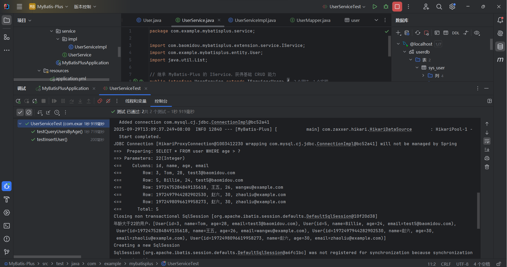
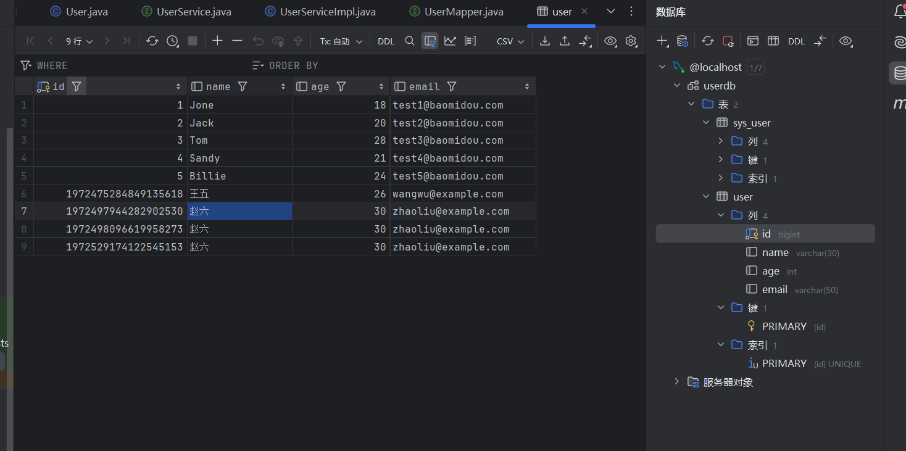
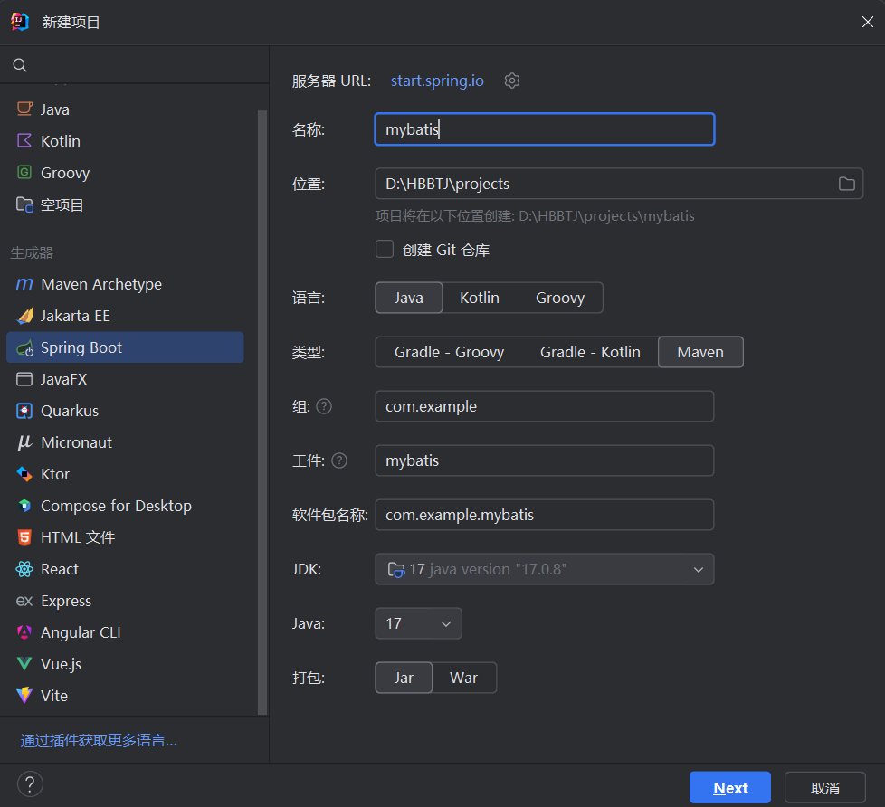
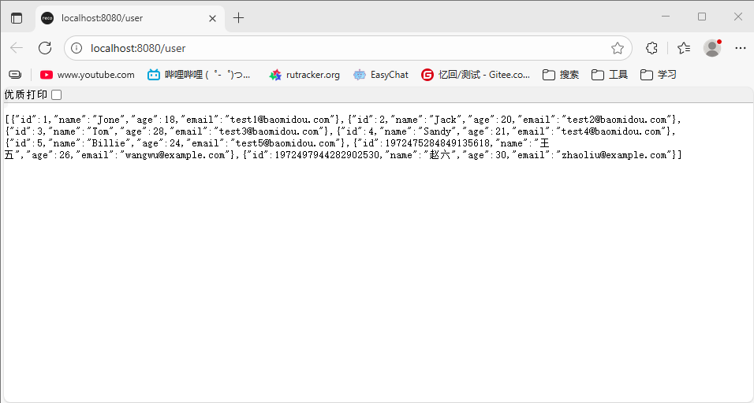

# MyBatis-Plus的配置与部署

## 一、MyBatis-Plus介绍

**MyBatis-Plus** 是基于 MyBatis 的一款增强工具包，旨在简化 MyBatis 的开发流程，减少开发者的重复劳动，提高开发效率。MyBatis 本身是一个支持定制化 SQL 的持久层框架，而 MyBatis-Plus 是在 MyBatis 的基础上，提供了更高层次的封装，自动化和便捷的功能。

它简化了 CRUD 操作、SQL 生成、分页查询、条件构造等，减少了开发者手动编写大量的重复 SQL 代码，让开发者可以专注于业务逻辑的实现。

## 二、MyBatis-Plus 的核心特性

**1、自动化的 CRUD 操作**

- MyBatis-Plus 提供了通用的 Mapper（`BaseMapper`）和服务（`Service`）接口，直接继承它们就能获得一系列通用的增删改查方法，无需自己编写 SQL。
- **增**：`insert`、`insertBatch`；
- **删**：`deleteById`、`deleteBatchIds`；
- **改**：`updateById`、`update`；
- **查**：`selectById`、`selectOne`、`selectList`、`selectPage`。****

**2、分页查询**

MyBatis-Plus 内置了分页插件，可以自动生成分页 SQL，无需手动编写分页逻辑。只需要调用 `Page` 类进行分页查询，插件会自动处理分页参数（如 limit 和 offset）。


```java
IPage<User> page = userService.page(new Page<>(1, 10)); // 查询第一页，10条记录
```

**3、条件构造器**

MyBatis-Plus 提供了 **Wrapper**（包括 `QueryWrapper` 和 `UpdateWrapper`）来构建查询条件。通过流式 API，可以非常方便地构建复杂的查询条件，无需手写 SQL。


```java
QueryWrapper<User> queryWrapper = new QueryWrapper<>();
queryWrapper.eq("status", 1).like("name", "Tom");
List<User> users = userService.list(queryWrapper);
```

**4、乐观锁**

MyBatis-Plus 提供了乐观锁机制，自动处理数据库中的并发问题。你只需要在实体类中添加 `@Version` 注解，并且在更新时使用 MyBatis-Plus 提供的 `update` 方法，它会自动加上乐观锁机制。


```java
@Version
private Integer version; // 乐观锁字段
```

**5、自动填充**

MyBatis-Plus 支持自动填充（例如自动填充创建时间、修改时间等字段）。可以在对应的实体字段上添加 `@TableField(fill = FieldFill.INSERT)` 或 `@TableField(fill = FieldFill.INSERT_UPDATE)` 注解，MyBatis-Plus 会自动为这些字段赋值。


```java
@TableField(fill = FieldFill.INSERT)
private LocalDateTime createTime;
```

**6、代码生成器***

MyBatis-Plus 提供了代码生成器，可以自动生成实体类、Mapper、Service、Controller 等代码，减少了开发人员的重复劳动。通过简单的配置和模板，快速生成基础代码。


```java
AutoGenerator mpg = new AutoGenerator();
mpg.setGlobalConfig(new GlobalConfig().setOutputDir("output_dir"));
mpg.setDataSource(new DataSourceConfig().setUrl("jdbc:mysql://localhost:3306/mydb"));
mpg.setPackageInfo(new PackageConfig().setParent("com.example"));
mpg.execute();
```

## 三、MyBatis-Plus 的架构原理与逻辑

#### 1. **扩展 MyBatis 的 `Mapper` 接口**

MyBatis-Plus 提供的 `BaseMapper` 接口，封装了 MyBatis 常见的 CRUD 操作。开发者只需在自己的 Mapper 接口中继承 `BaseMapper`，即可自动拥有基本的增删改查功能。

```java
public interface UserMapper extends BaseMapper<User> {
    // 你可以在这里定义自定义的查询方法
}
```

`BaseMapper` 继承了 MyBatis 的 `Mapper`，并增加了一些通用的方法，比如 `insert`、`delete`、`update`、`select` 等。

#### 2. **通用 Service 层**

MyBatis-Plus 提供了一个 `IService` 接口，开发者可以直接继承这个接口，自动获得常用的 CRUD 方法和其他扩展方法。


```java
public interface UserService extends IService<User> {
    // 可以自定义业务方法
}
```

`IService` 通过继承 `BaseService` 统一提供了增、删、改、查等常用的方法。它的实现类（`ServiceImpl`）会自动处理服务层的逻辑。

#### 3. **分页插件**

MyBatis-Plus 提供的分页功能基于拦截器实现，使用分页插件时，所有的分页查询都会被拦截并自动生成分页 SQL。你可以通过 `Page` 类来传递分页参数，查询时自动分页。

```java
Page<User> page = new Page<>(1, 10);  // 第1页，每页10条记录
Page<User> result = userMapper.selectPage(page, null);  // 执行分页查询
```

#### 4. **条件构造器（Wrapper）**

MyBatis-Plus 提供了 `QueryWrapper` 和 `UpdateWrapper`，这些工具类可以帮助构建查询条件和更新条件。它们封装了 SQL 的 `WHERE` 子句，通过链式调用来创建复杂的查询条件。

```java
QueryWrapper<User> wrapper = new QueryWrapper<>();
wrapper.eq("status", 1).like("name", "Tom");
List<User> users = userMapper.selectList(wrapper);
```

`QueryWrapper` 和 `UpdateWrapper` 通过 `Wrapper` 类内部的 SQL 构建器将条件转化为最终的 SQL 查询语句。

#### 5. **乐观锁插件**

MyBatis-Plus 提供了乐观锁插件，帮助开发者避免数据的并发更新冲突。开发者只需要在实体类中标注 `@Version`，插件就会自动处理版本号的更新。

```java
@Version
private Integer version;  // 乐观锁版本字段
```

#### 6. **自动填充**

MyBatis-Plus 通过 `MetaObjectHandler` 接口来实现自动填充。开发者只需实现 `MetaObjectHandler` 接口并覆盖 `insertFill` 和 `updateFill` 方法，就能实现自动填充功能。

```java
public class MyMetaObjectHandler implements MetaObjectHandler {
    @Override
    public void insertFill(MetaObject metaObject) {
        // 自动填充字段
        this.strictInsertFill(metaObject, "createTime", LocalDateTime.class, LocalDateTime.now());
    }

    @Override
    public void updateFill(MetaObject metaObject) {
        // 更新时填充字段
        this.strictUpdateFill(metaObject, "updateTime", LocalDateTime.class, LocalDateTime.now());
    }
}
```

## 四、**MyBatis-Plus 的使用步骤**

### 1、**引入 MyBatis-Plus 依赖**

首先，需要在 `pom.xml` 或 `build.gradle` 中引入 MyBatis-Plus 的相关依赖。

```xml
		<!-- MyBatis 核心 -->
        <dependency>
            <groupId>com.baomidou</groupId>
            <artifactId>mybatis-plus-spring-boot3-starter</artifactId>
            <version>3.5.6</version>
        </dependency>

        <!-- MySQL 驱动 -->
        <dependency>
            <groupId>com.mysql</groupId>
            <artifactId>mysql-connector-j</artifactId>
            <scope>runtime</scope>
        </dependency>

        <!-- Lombok 简化代码 -->
        <dependency>
            <groupId>org.projectlombok</groupId>
            <artifactId>lombok</artifactId>
            <optional>true</optional>
        </dependency>

        <!-- 测试 -->
        <dependency>
            <groupId>org.springframework.boot</groupId>
            <artifactId>spring-boot-starter-test</artifactId>
            <scope>test</scope>
        </dependency>
```

### 2、配置 MyBatis-Plus

在 `application.yml` 或 `application.properties` 中配置 MyBatis-Plus

>userdb 为数据库名称 、root 为账号 、123456 为密码

```yaml
spring:
  application:
    name: MyBatis-Plus

  datasource:
    driver-class-name: com.mysql.cj.jdbc.Driver
    url: jdbc:mysql://127.0.0.1:3306/userdb?useUnicode=true&characterEncoding=UTF-8
    username: root
    password: 123456
mybatis-plus:
  type-aliases-package: com.example.mybatisplus.entity
  configuration:
    map-underscore-to-camel-case: true
    log-impl: org.apache.ibatis.logging.stdout.StdOutImpl
```

### 3、**创建实体类**

定义你的实体类（如 `User`）并使用 MyBatis-Plus 的注解进行配置。

```java
package com.example.mybatisplus.entity;

import lombok.Data;

@Data //lombok中的注解，自动生成getter&setter方法
public class User {
    private Long id;
    private String name;
    private Integer age;
    private String email;
}
```

### 4、**创建 Mapper 接口**

创建继承 `BaseMapper` 的 Mapper 接口。

```java
package com.example.mybatisplus.mapper;

import com.baomidou.mybatisplus.core.mapper.BaseMapper;
import com.example.mybatisplus.entity.User;
import org.apache.ibatis.annotations.Mapper;
import org.apache.ibatis.annotations.Select;
import java.util.List;

@Mapper
public interface UserMapper extends BaseMapper<User> {
    // 自定义 SQL：查询年龄大于指定值的用户
    @Select("SELECT * FROM user WHERE age > #{age}")
    List<User> selectByAgeGreaterThan(Integer age);
}
```

### 5、**创建 Service 层**

创建 Service 接口继承 `IService` 接口，提供常用的 CRUD 操作。


```java
package com.example.mybatisplus.service;

import com.baomidou.mybatisplus.extension.service.IService;
import com.example.mybatisplus.entity.User;
import java.util.List;

// 继承 MyBatis-Plus 的 IService，获得基础 CRUD 能力
public interface UserService extends IService<User> {
    // 可添加自定义业务方法（示例）
    List<User> getUsersByAgeGreaterThan(Integer age);
}
```

###  6、创建  Service 实现类

```java
package com.example.mybatisplus.service.impl;

import com.baomidou.mybatisplus.extension.service.impl.ServiceImpl;
import com.example.mybatisplus.entity.User;
import com.example.mybatisplus.mapper.UserMapper;
import com.example.mybatisplus.service.UserService;
import org.springframework.stereotype.Service;
import java.util.List;

@Service // 标记为服务层组件
public class UserServiceImpl extends ServiceImpl<UserMapper, User> implements UserService {

    // 自定义业务方法：查询年龄大于指定值的用户
    @Override
    public List<User> getUsersByAgeGreaterThan(Integer age) {
        // 调用 Mapper 层的自定义方法（需在 UserMapper 中定义）
        return baseMapper.selectByAgeGreaterThan(age);
    }
}
```

###  7、创建  Controller 层

你可以直接调用 `Service` 层或 `Mapper` 层的方法来进行 CRUD 操作。

注入 `Service`

```java
package com.example.mybatisplus.controller;

import com.example.mybatisplus.entity.User;
import com.example.mybatisplus.service.UserService;
import org.springframework.beans.factory.annotation.Autowired;
import org.springframework.web.bind.annotation.*;
import java.util.List;

@RestController
@RequestMapping("user")
public class UserController {

    // 注入 Service 层
    @Autowired
    private UserService userService;

    // 查询所有用户
    @GetMapping
    public List<User> getAllUsers() {
        return userService.list(); // 调用 Service 层的 list() 方法（继承自 IService）
    }

    // 新增用户
    @PostMapping
    public String addUser(@RequestBody User user) {
        boolean success = userService.save(user); // 调用 Service 层的 save() 方法
        return success ? "插入成功" : "插入失败";
    }

    // 新增接口：查询年龄大于指定值的用户
    @GetMapping("/age/{age}")
    public List<User> getUsersByAge(@PathVariable Integer age) {
        return userService.getUsersByAgeGreaterThan(age);
    }
}
```

## 五、****测试****

### 1、修改测试类（UserMapperTest.java）

测试 Service 层功能：

```java
package com.example.mybatisplus;

import com.example.mybatisplus.entity.User;
import com.example.mybatisplus.service.UserService;
import org.junit.jupiter.api.Test;
import org.springframework.beans.factory.annotation.Autowired;
import org.springframework.boot.test.context.SpringBootTest;
import java.util.List;

@SpringBootTest
public class UserServiceTest { // 建议重命名为 UserServiceTest

    @Autowired
    private UserService userService; // 注入 Service 层

    @Test
    public void testInsertUser() {
        User user = new User();
        user.setName("赵六");
        user.setAge(30);
        user.setEmail("zhaoliu@example.com");

        boolean success = userService.save(user);
        System.out.println("插入结果：" + (success ? "成功" : "失败"));
        System.out.println("自增ID：" + user.getId());
    }

    @Test
    public void testQueryUsersByAge() {
        List<User> users = userService.getUsersByAgeGreaterThan(25);
        System.out.println("年龄大于25的用户：" + users);
    }
}

```

### 2、运行测试类

新增赵六信息，查询年龄大于22的用户信息。





### **3、MyBatis-Plus 与传统 MyBatis 的区别**

| 特性        | MyBatis          | MyBatis-Plus                  |
| ----------- | ---------------- | ----------------------------- |
| CRUD 自动化 | 需要手动写 SQL   | 提供了通用的 CRUD 方法        |
| 分页查询    | 需要手写分页 SQL | 内置分页插件，自动分页        |
| 条件构造器  | 需要手写 SQL     | 提供了 `Wrapper` 方式构建条件 |
| 乐观锁      | 需要自己实现     | 自动处理乐观锁                |
| 自动填充    | 无自动填充功能   | 支持自动填充（如创建时间）    |
| 代码生成器  | 需要手动生成代码 | 提供了代码生成器              |

### 4、总结

MyBatis-Plus 在 MyBatis 基础上做了封装，提供了许多开箱即用的功能。通过通用的 `BaseMapper` 和 `IService`，开发者可以快速实现常见的 CRUD 操作；通过内置的分页插件和条件构造器，减少了手写 SQL 的麻烦；乐观锁和自动填充等功能则帮助开发者实现更多的企业级需求。MyBatis-Plus 大大提高了开发效率，减少了重复代码。

## 六、MyBatis-Plus 代码生成器

首先，创建一个springboot项目，语言选中Java，类型是maven项目，我的jdk是17的，所以我选的是jdk17



不选择依赖直接点下一步，然后在 `pom.xml` 或 `build.gradle` 中引入 MyBatis-Plus 的相关依赖。

```xml
<!-- MySQL 驱动 -->
        <dependency>
            <groupId>com.mysql</groupId>
            <artifactId>mysql-connector-j</artifactId>
            <scope>runtime</scope>
        </dependency>
        <!-- MyBatis-Plus 核心依赖 -->
        <dependency>
            <groupId>com.baomidou</groupId>
            <artifactId>mybatis-plus-boot-starter</artifactId>
            <version>3.5.5</version> <!-- 与 Spring Boot 3.x 兼容的版本 -->
        </dependency>
        <!-- MyBatis-Plus 代码生成器 -->
        <dependency>
            <groupId>com.baomidou</groupId>
            <artifactId>mybatis-plus-generator</artifactId>
            <version>3.5.5</version>
        </dependency>
        <dependency>
            <groupId>org.mybatis</groupId>
            <artifactId>mybatis</artifactId>
            <version>3.5.16</version> <!-- 必须 ≥ 3.5.13 -->
        </dependency>
        <dependency>
            <groupId>org.mybatis</groupId>
            <artifactId>mybatis-spring</artifactId>
            <version>3.0.3</version> <!-- 与 MyBatis 3.5.16 匹配 -->
        </dependency>
        <!-- 模板引擎 (必须添加) -->
        <dependency>
            <groupId>org.apache.velocity</groupId>
            <artifactId>velocity-engine-core</artifactId>
            <version>2.3</version>
        </dependency>
        <!-- Lombok 简化实体类 -->
        <dependency>
            <groupId>org.projectlombok</groupId>
            <artifactId>lombok</artifactId>
            <optional>true</optional>
        </dependency>
        <!--Spring Web 相关依赖-->
        <dependency>
            <groupId>org.springframework.boot</groupId>
            <artifactId>spring-boot-starter-web</artifactId>
        </dependency>
```


接下来在application.yml文件中配置数据源

>userdb 为数据库名称 、root 为账号 、123456 为密码

```
spring:
    datasource:
        driver-class-name: com.mysql.cj.jdbc.Driver  
        url: jdbc:mysql://localhost:3306/userdb?useSSL=false&serverTimezone=UTC&characterEncoding=utf8
        username: root
        password: 123456

# MyBatis-Plus 配置（可选）
mybatis-plus:
    configuration:
        log-impl: org.apache.ibatis.logging.stdout.StdOutImpl
    mapper-locations: classpath:mapper/*.xml  # Mapper XML 
```

配置代码生成器，新建`CodeGenerator.java`

```java
package com.example.mybatis.generator;

import com.baomidou.mybatisplus.generator.FastAutoGenerator;
import com.baomidou.mybatisplus.generator.config.OutputFile;
import com.baomidou.mybatisplus.generator.engine.VelocityTemplateEngine;
import java.util.Collections;

public class CodeGenerator {

    public static void main(String[] args) {
        // 数据库连接配置
        String url = "jdbc:mysql://localhost:3306/userdb?useSSL=false&serverTimezone=UTC&allowPublicKeyRetrieval=true";
        String username = "root";
        String password = "123456";

        // 代码生成器
        FastAutoGenerator.create(url, username, password)
                // 全局配置
                .globalConfig(builder -> {
                    builder.author("yh") // 设置作者
                            .outputDir(System.getProperty("user.dir") + "/src/main/java") // 输出目录
                            .commentDate("yyyy-MM-dd") // 注释日期
                            .disableOpenDir(); // 生成后不打开文件夹
                })
                // 包配置
                .packageConfig(builder -> {
                    builder.parent("com.example.mybatis") // 父包名
                            .moduleName("") // 子模块名，无则留空
                            .entity("entity") // 实体类包名
                            .mapper("mapper") // Mapper接口包名
                            .service("service") // Service接口包名
                            .serviceImpl("service.impl") // Service实现类包名
                            .controller("controller") // Controller包名
                            // Mapper XML文件输出路径
                            .pathInfo(Collections.singletonMap(OutputFile.xml,
                                    System.getProperty("user.dir") + "/src/main/resources/mapper"));
                })
                // 策略配置
                .strategyConfig(builder -> {
                    builder.addInclude("user", "role") // 需要生成的表名，多个表用逗号分隔
                            .addTablePrefix("t_", "sys_") // 表前缀，生成类名时会去除

                            // 实体类策略
                            .entityBuilder()
                            .enableLombok() // 开启Lombok
                            .enableTableFieldAnnotation() // 生成字段注解
                            .logicDeleteColumnName("deleted") // 逻辑删除字段

                            // Controller策略
                            .controllerBuilder()
                            .enableRestStyle() // 生成@RestController
                            .enableHyphenStyle() // URL中驼峰转连字符

                            // Service策略
                            .serviceBuilder()
                            .formatServiceFileName("%sService") // Service接口命名格式
                            .formatServiceImplFileName("%sServiceImpl"); // Service实现类命名格式
                })
                // 模板引擎配置
                .templateEngine(new VelocityTemplateEngine())
                // 执行生成
                .execute();
    }
}
```

编写好代码生成器配置类后，直接运行该类即可生成代码,生成后测试代码生成器修改UserController.java，添加**查询所有用户**

```java
@RestController
@RequestMapping("/user")
public class UserController {

    @Autowired
    protected UserService userService;

    // 测试查询所有用户
    @GetMapping
    public List<User> getAllUsers() {
        return userService.list();
    }
}
```

修改完毕后运行MybatisApplication.java


**访问 Swagger UI 的地址：**
👉 http://localhost:8080/user

