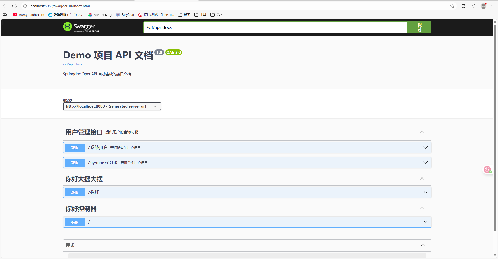

# Swagger 3.0配置

## 一、swagger介绍

Swagger 是一套基于 OpenAPI 规范（OpenAPI Specification，OAS）构建的开源工具，后来成为了 Open API 标准的主要定义者。
对于 Rest API 来说很重要的一部分内容就是文档，Swagger 为我们提供了一套通过代码和注解自动生成文档的方法，这一点对于保证API 文档的及时性将有很大的帮助。

swagger2于17年停止维护，现在最新的版本为17年发布的 Swagger3（Open Api3）。

**springfox-swagger 2**

SpringBoot项目整合swagger2需要用到两个依赖：springfox-swagger2和springfox-swagger-ui，用于自动生成swagger文档。

springfox-swagger2：这个组件的功能用于帮助我们自动生成描述API的json文件
springfox-swagger-ui：就是将描述API的json文件解析出来，用一种更友好的方式呈现出来。

**SpringFox 3.0.0 发布**
Spring5，Webflux支持（仅支持请求映射，尚不支持功能端点）。
Spring Integration支持。
SpringBoot支持springfox Boot starter依赖性（零配置、自动配置支持）。
支持OpenApi 3.0.3。
零依赖。几乎只需要spring-plugin，swagger-core ，现有的swagger2注释将继续工作并丰富openapi3.0规范。
兼容性说明：
需要Java 8、Spring5.x、SpringBoot 2.2+

**swagger3.0 与2.xx配置差异：****
应用主类添加注解@EnableOpenApi (swagger2是@EnableSwagger2)
swagger配置类SwaggerProperties.class，与swagger2.xx 版本有差异，具体看下文
自定义一个配置类 SwaggerConfiguration.class,看下文

## **二、整合使用完整过程** (示例)

### 1、引入依赖

Maven项目pom.xml中引入springfox-boot-starter依赖：

```xml
<!--	swagger的maven依赖-->

<!--	swagger2.xx 版本-->
<!--		<dependency>-->
<!--			<groupId>io.springfox</groupId>-->
<!--			<artifactId>springfox-swagger2</artifactId>-->
<!--			<version>2.9.2</version>-->
<!--		</dependency>-->
<!--		<dependency>-->
<!--			<groupId>io.springfox</groupId>-->
<!--			<artifactId>springfox-swagger-ui</artifactId>-->
<!--			<version>2.9.2</version>-->
<!--		</dependency>-->
		<dependency>
			<groupId>org.springdoc</groupId>
			<artifactId>springdoc-openapi-starter-webmvc-ui</artifactId>
			<version>2.6.0</version>
		</dependency>
		<dependency>
			<groupId>org.springframework.boot</groupId>
			<artifactId>spring-boot-starter-validation</artifactId>
		</dependency>

		<dependency>
			<groupId>io.swagger</groupId>
			<artifactId>swagger-annotations</artifactId>
			<version>1.5.21</version>
		</dependency>
		<dependency>
			<groupId>io.swagger</groupId>
			<artifactId>swagger-models</artifactId>
			<version>1.5.21</version>
		</dependency>
```


### 2、创建 SysUser实体类

```java
package com.example.demo.entity;

import io.swagger.v3.oas.annotations.media.Schema;

@Schema(description = "系统用户实体")
public class SysUser {

    @Schema(description = "用户编号")
    private String id;

    @Schema(description = "姓名")
    private String name;

    @Schema(description = "邮箱")
    private String email;

    @Schema(description = "创建时间")
    private String createTime;

    // getter 和 setter 方法
    public String getId() {
        return id;
    }
    public void setId(String id) {
        this.id = id;
    }
    public String getName() {
        return name;
    }
    public void setName(String name) {
        this.name = name;
    }
    public String getEmail() {
        return email;
    }
    public void setEmail(String email) {
        this.email = email;
    }
    public String getCreateTime() {
        return createTime;
    }
    public void setCreateTime(String createTime) {
        this.createTime = createTime;
    }
}
```
}

### 3、创建  `SysUserService` 服务接口

创建一个简单的服务接口 `SysUserService`，这个接口可以定义获取用户列表和单个用户的方法：

```java
package com.example.demo.service;

import com.example.demo.entity.SysUser;
import java.util.List;

public interface SysUserService {
    List<SysUser> listUsers(String name);
    SysUser getById(String id);
}
```


### 4、创建   `SysUserServiceImpl` 服务实现类

实现 `SysUserService` 接口，假设从一个简单的模拟数据中获取用户数据：

```java
package com.example.demo.service.impl;

import com.example.demo.entity.SysUser;
import com.example.demo.service.SysUserService;
import org.springframework.stereotype.Service;
import java.util.ArrayList;
import java.util.List;

@Service
public class SysUserServiceImpl implements SysUserService {
    // 模拟数据
    private List<SysUser> userList = new ArrayList<>();

    public SysUserServiceImpl() {
        // 初始化一些模拟用户数据
        SysUser user1 = new SysUser();
        user1.setId("1");
        user1.setName("张三");
        user1.setEmail("zhangsan@example.com");
        user1.setCreateTime("2025-09-26");

        SysUser user2 = new SysUser();
        user2.setId("2");
        user2.setName("李四");
        user2.setEmail("lisi@example.com");
        user2.setCreateTime("2025-09-25");

        userList.add(user1);
        userList.add(user2);
    }

    @Override
    public List<SysUser> listUsers(String name) {
        // 模拟：根据姓名查找用户
        if (name != null && !name.isEmpty()) {
            List<SysUser> filteredUsers = new ArrayList<>();
            for (SysUser user : userList) {
                if (user.getName().contains(name)) {
                    filteredUsers.add(user);
                }
            }
            return filteredUsers;
        }
        return userList; // 返回所有用户
    }

    @Override
    public SysUser getById(String id) {
        // 模拟：根据用户ID查找用户
        for (SysUser user : userList) {
            if (user.getId().equals(id)) {
                return user;
            }
        }
        return null; // 没有找到用户
    }
}
```

### 5、修改 `SysUserController` 控制器

```java
package com.example.demo.controller;

import com.example.demo.entity.SysUser;
import com.example.demo.service.SysUserService;
import io.swagger.v3.oas.annotations.Operation;
import io.swagger.v3.oas.annotations.Parameter;
import io.swagger.v3.oas.annotations.tags.Tag;
import org.springframework.beans.factory.annotation.Autowired;
import org.springframework.http.ResponseEntity;
import org.springframework.web.bind.annotation.*;

import java.util.List;

/**
 * 用户管理接口
 */
@Tag(name = "用户管理接口", description = "提供用户的查询功能")
@RestController
@RequestMapping("/sysuser")
public class SysUserController {

    @Autowired
    private SysUserService sysUserService;

    @Operation(
        summary = "查询所有的用户信息",
        description = "支持按姓名模糊查询用户，结果按创建时间升序排列"
    )
    @GetMapping("")
    public ResponseEntity<List<SysUser>> listSysUser(
            @Parameter(description = "姓名（可选）", required = false)
            @RequestParam(required = false) String name) {

        List<SysUser> userList = sysUserService.listUsers(name);
        return ResponseEntity.ok(userList);
    }

    @Operation(
        summary = "查询单个用户信息",
        description = "根据用户编号查询用户详情"
    )
    @GetMapping("/{id}")
    public ResponseEntity<SysUser> getById(
            @Parameter(description = "用户编号", required = true)
            @PathVariable("id") String id) {

        SysUser user = sysUserService.getById(id);
        return user != null ? ResponseEntity.ok(user) : ResponseEntity.notFound().build();
    }
}

```

### 6. 测试接口

访问 Swagger UI 的地址：
👉 http://localhost:8080/swagger-ui/index.html



## 三、常用注释

| 一些常用注解       | 说明                          |
| ------------------ | ----------------------------- |
| @Api               | 用在controller类，描述API接口 |
| @ApiOperation      | 描述接口方法                  |
| @ApiModel          | 描述对象                      |
| @ApiModelProperty  | 描述对象属性                  |
| @ApiImplicitParams | 描述接口参数                  |
| @ApiResponses      | 描述接口响应                  |
| @ApiIgnore         | 忽略接口方法                  |


