# 按步骤完成一个 spring boot 项目搭建开发环境

## 一、 Java开发工具取决于自己的使用习惯，自己选择，各有各的好处。 直接安装即可。

### 1、IDEA 下载与安装

进入 jetbrains 官网https://www.jetbrains.com/，按下图依次操作。

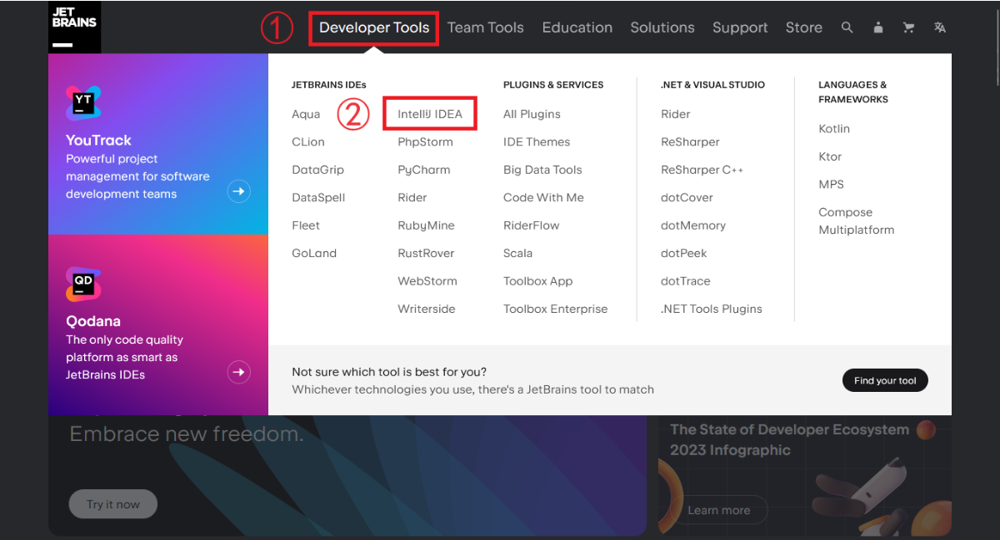

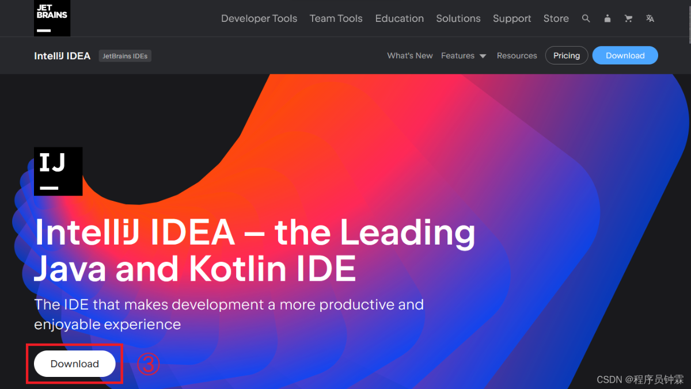

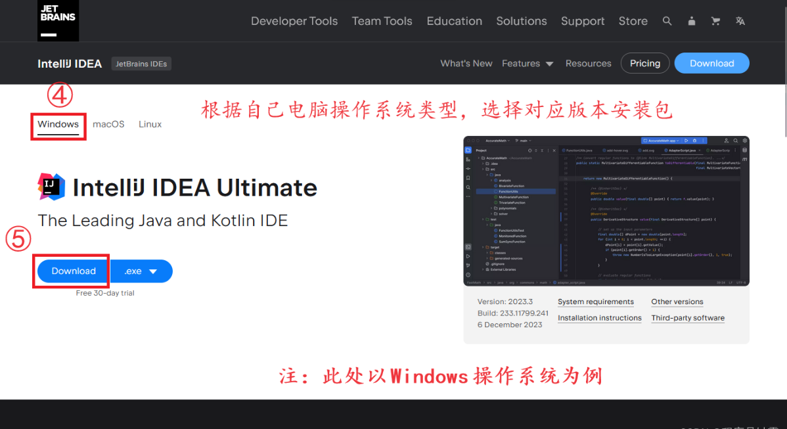

上述步骤下载的是最新的 Ultimate 版 IDEA，如果想要下载其他 Ultimate 版，则需按下图依次操作。 

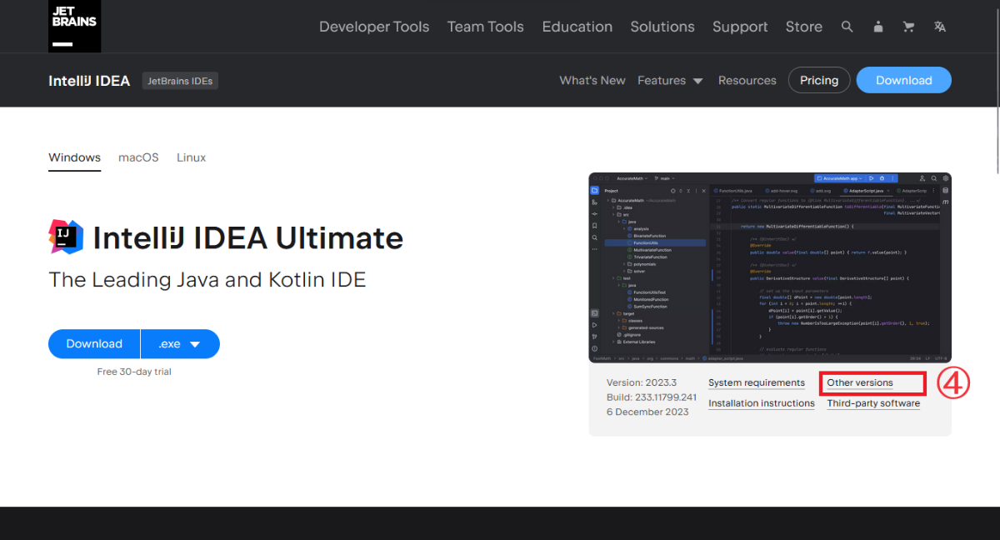

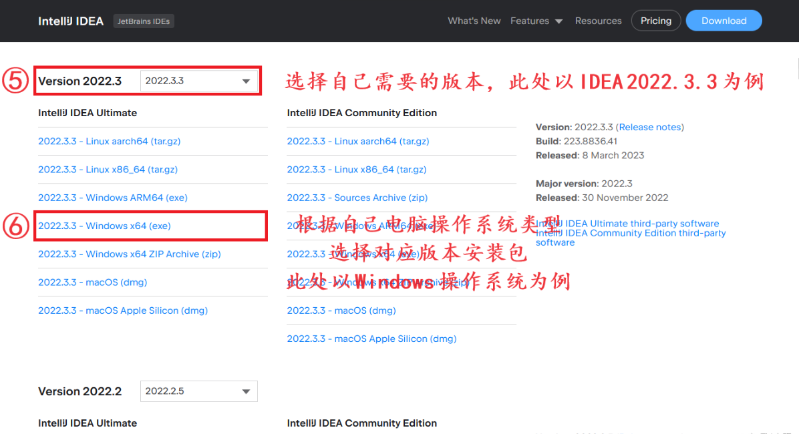


双击下载好的 IDEA 安装包，进入安装向导，如下图所示，点击下一步。

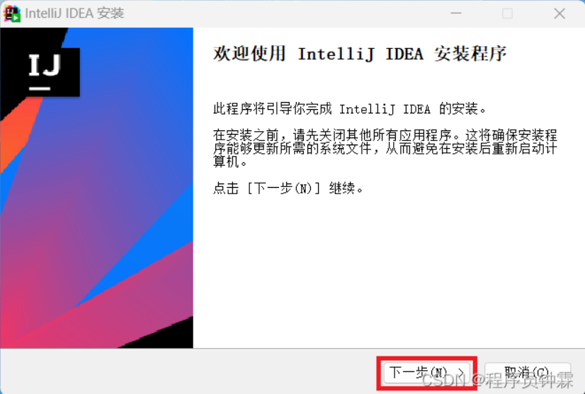

更改安装路径，按下图依次操作，建议路径名不要有中文/空格。 也可以使用默认路径，直接点击下一步。 

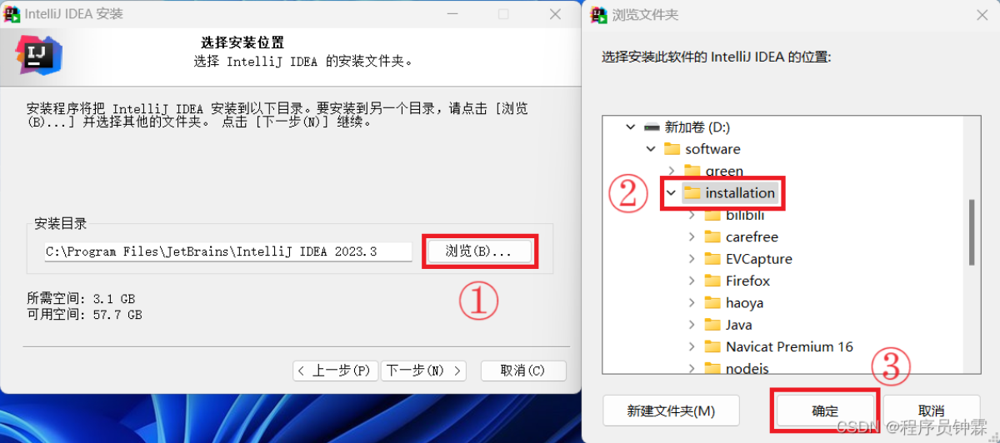

 

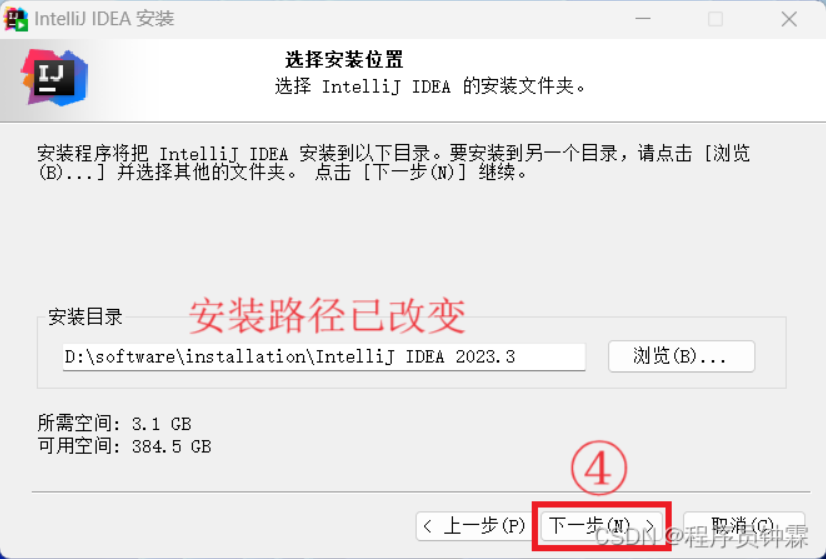

按下图依次操作，完成 IDEA 的安装。

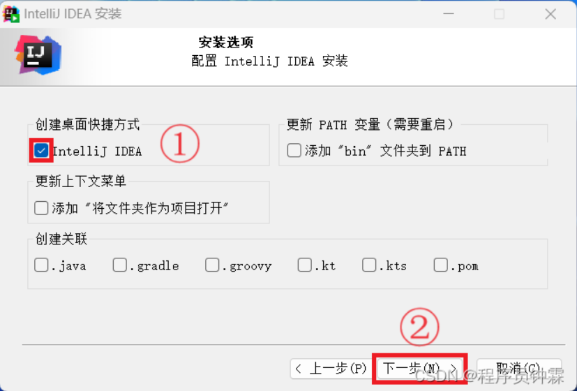

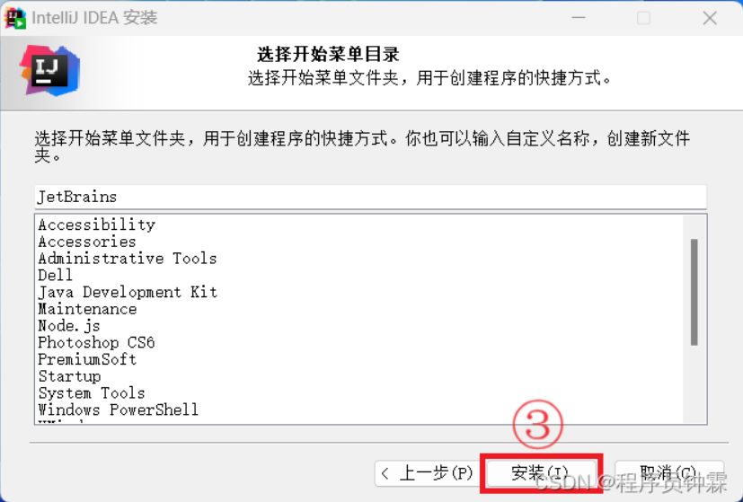

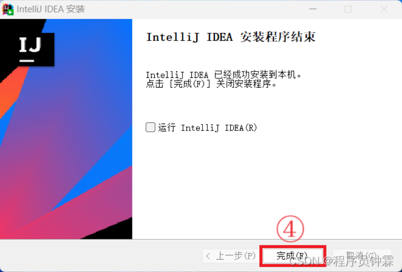


原文链接：https://blog.csdn.net/weixin_46485638/article/details/134891162

## 二、安装 spring boot 3.5 前
**🔍 前提条件:**

Java SDK 版本至少要 **17 或更高版本**。Spring Boot 3.x 要求如此。

有 IDE 或者构建工具（Maven / Gradle）准备好。

### 1、**Java SDK v17+**

Spring Boot 可以与“经典”Java 开发工具一起使用，也可以作为命令行工具安装。 无论哪种方式，您都需要 [Java SDK v17](https://www.java.com/) 或更高版本。 在开始之前，您应该使用以下命令检查当前的 Java 安装：

```shell
$ java -version
```

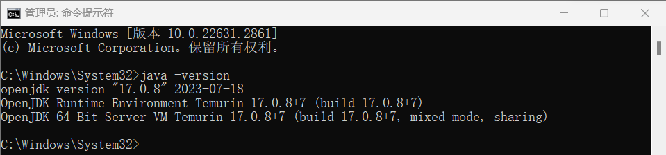

### **2、Maven 安装**

#### **1.下载 Maven**

Spring Boot 与 Apache Maven 3.6.3 或更高版本兼容。 如果您尚未安装 Maven，可以访问 Maven 官方网站并下载适合你操作系统的版本：

- Maven 官网：https://maven.apache.org/download.cgi

选择 **Binary zip archive** 或 **Binary tar.gz archive**（具体取决于你的操作系统）。如果你是 Windows 用户，可以选择 `.zip` 格式。

#### **2.解压文件**

将下载的压缩包解压到一个目录。你可以选择任何你喜欢的目录，但一般推荐解压到类似 `C:\Program Files\` 或者 `C:\maven`等路径。

- **Windows** 示例：
  将 `apache-maven-3.x.x-bin.zip` 解压到 `C:\Program Files\Apache\Maven\` 或其他目录。

#### **3.设置环境变量**

设置环境变量可以让你在命令行中全局使用 Maven。

1. **打开“环境变量”设置**
   - 右键点击“此电脑” -> 选择“属性” -> “高级系统设置” -> “环境变量”。
2. **添加 `MAVEN_HOME` 变量**
   - 点击“系统变量”中的“新建”按钮。
   - 设置变量名为 `MAVEN_HOME`，变量值为 Maven 解压目录（例如 `C:\Program Files\Apache\Maven`）。
3. **更新 `PATH` 变量**
   - 在“系统变量”中找到 `Path` 变量，点击“编辑”。
   - 点击“新建”，然后添加 Maven 的 `bin` 目录（例如 `C:\Program Files\Apache\Maven\bin`）。

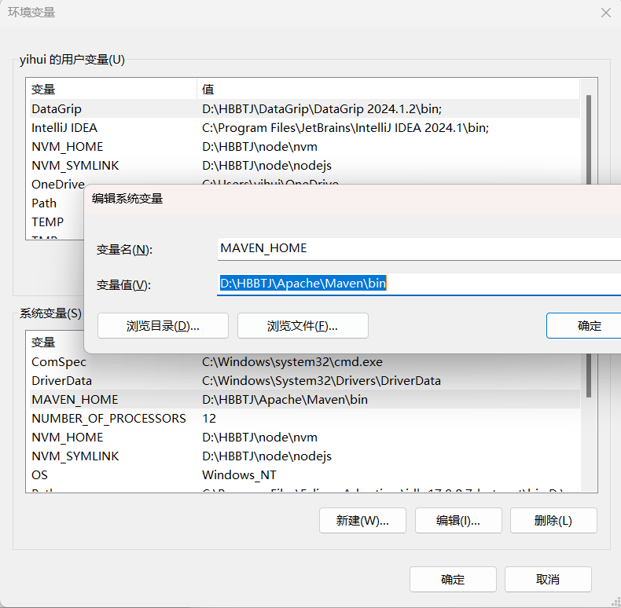

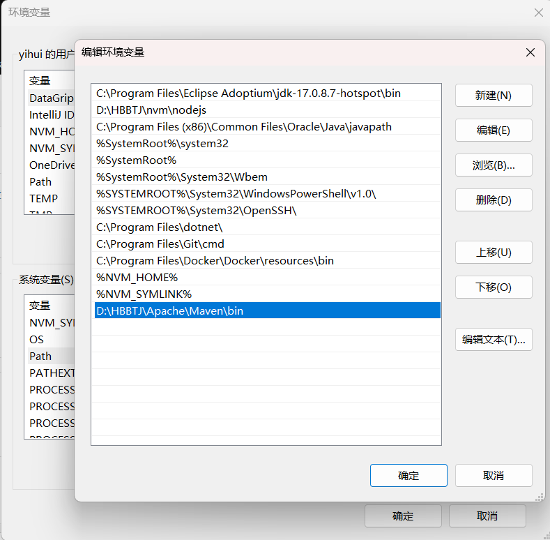

#### **4.验证 Maven 安装**

打开命令行（Windows 使用 `cmd` 或 PowerShell，Linux/macOS 使用终端），输入以下命令：

```bash
mvn -v
```

如果安装成功，你会看到类似如下的信息：

```yaml
Apache Maven 3.x.x (Some Version)
Maven home: C:\Program Files\Apache\Maven
Java version: 1.x.x, vendor: Oracle Corporation
Java home: C:\Program Files\Java\jdk-x.x.x
```

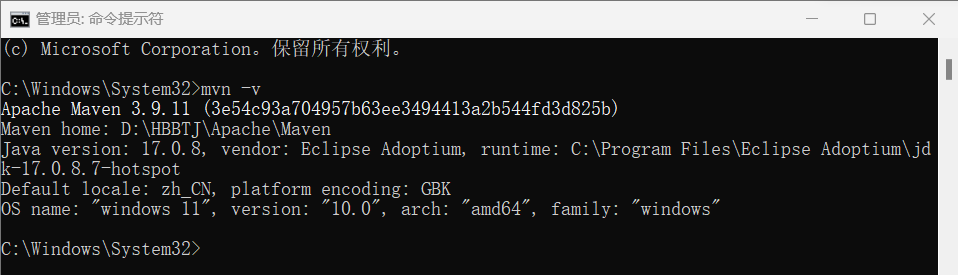

这表示 Maven 已经成功安装。

#### **5.配置Idea中的Maven**

在 `settings.xml` 中配置国内镜像

在 `D:\Apache\Maven\apache-maven-3.9.11\conf\settings.xml` 里添加：


```xml
<mirrors>
  <mirror>
    <id>aliyunmaven</id>
    <mirrorOf>central</mirrorOf>
    <name>Aliyun Maven</name>
    <url>https://maven.aliyun.com/repository/public</url>
  </mirror>
</mirrors>
```

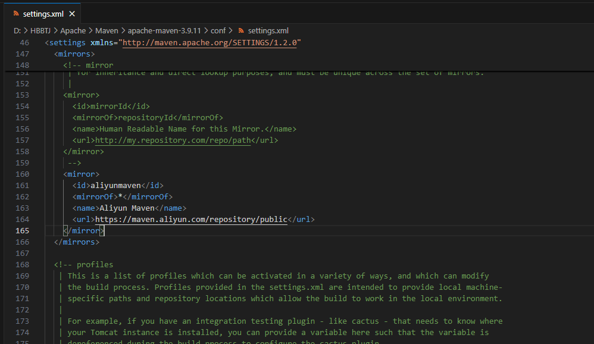

------

#### **6.确认 IDEA 使用的 Maven 配置**

- 打开

  File → Settings → Build, Execution, Deployment → Build Tools → Maven

  - `Maven home path` → 指向 `D:\Apache\Maven\apache-maven-3.9.11`
  - `User settings file` → 指向你刚才改过的 `settings.xml`
  - `Local repository` → 确认指向 `C:\Users\yihui\.m2\repository`

⚠️ 很多时候 IDEA 默认用的是它自带的 Maven，没有走你配置的镜像。

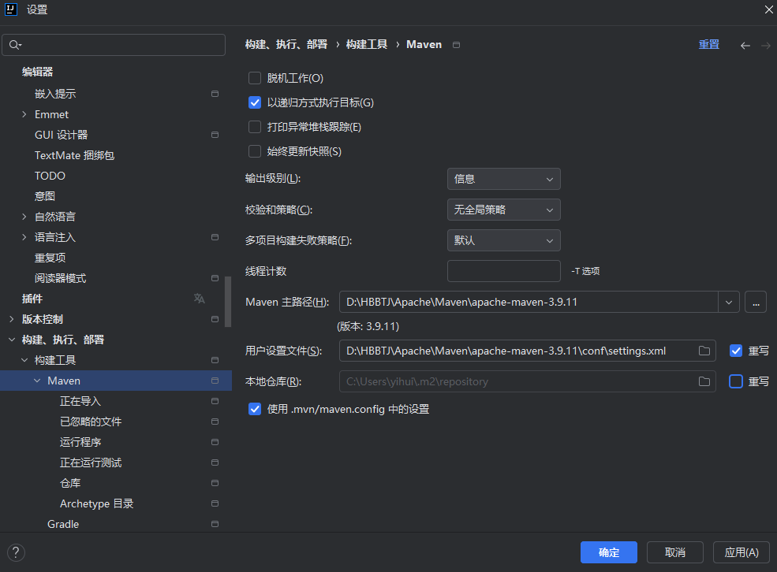


### 3、Docker Desktop安装MySQL

#### 1.拉取mysql镜像

win+R打开windows命令行窗口，输入以下命令拉取mysql镜像 

```dockerfile
#默认拉去最新版本（mysql：+版本名 [拉取指定mysql版本]）
docker pull mysql
```

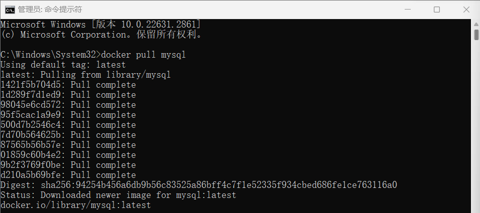  

这是mysql的配置文件和存储数据用的目录

#### 2.启动并配置mysql

切换到终端，输入命令，第一次启动MySQL容器

```dockerfile
docker run --name mysql -p 3306:3306 ^
-e MYSQL_ROOT_PASSWORD=123456 ^
-d mysql
```


命令解释:

run --name mysql

–name为容器指定名称为mysql

-p 3306:3306

指定端口映射，将主机端口3306映射到容器端口3306

-e MYSQL_ROOT_PASSWORD=123456

-e设置环境变量 ，设置root用户，密码123456

-d mysql:latest --default-authentication-plugin=mysql_native_password

-d后台运行，并返回容器ID ,mysql:latest 镜像名


#### 3.创建mysql本地持久化目录

D盘创建目录docker/mysql/conf,docker/mysql/data

准备复制MySQL镜像中的配置文件到刚刚创建的本地持久化目录

D:/docker/mysql/conf/

打开docker桌面，点击Images镜像==》选择mysql镜像==》点击In use进入容器==》

点击name:mysql==》点击Files==》打开目录etc/my.cnf点击下载到目录D:/docker/mysql/conf/

关闭容器

终端执行命令

```dockerfile
关闭容器
docker stop mysql

删除容器
docker rm mysql
```

  

重新启动容器，执行命令

```dockerfile
docker run --name mysql -p 3306:3306 ^
  -v //d/HBBTJ/Docker/mysql/data:/var/lib/mysql ^
  -v //d/HBBTJ/Docker/mysql/conf/my.cnf:/etc/mysql/my.cnf ^
  -e MYSQL_ROOT_PASSWORD=123456 ^
  -d mysql
```

-v //d/HBBTJ/Docker/mysql/data:/var/lib/mysql

映射主机目录d盘的/docker/mysql/data 到容器的/var/lib/mysql/目录

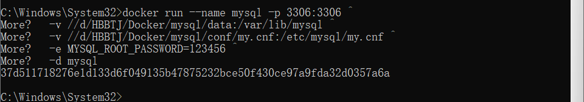

#### 4.测试是否持久化

进入 MySQL 容器：

```
docker exec -it mysql mysql -uroot -p
```

新建数据库：

```
CREATE DATABASE testdb;
```

查看 `D:\docker\mysql\data`，应该能看到 `testdb` 文件夹。

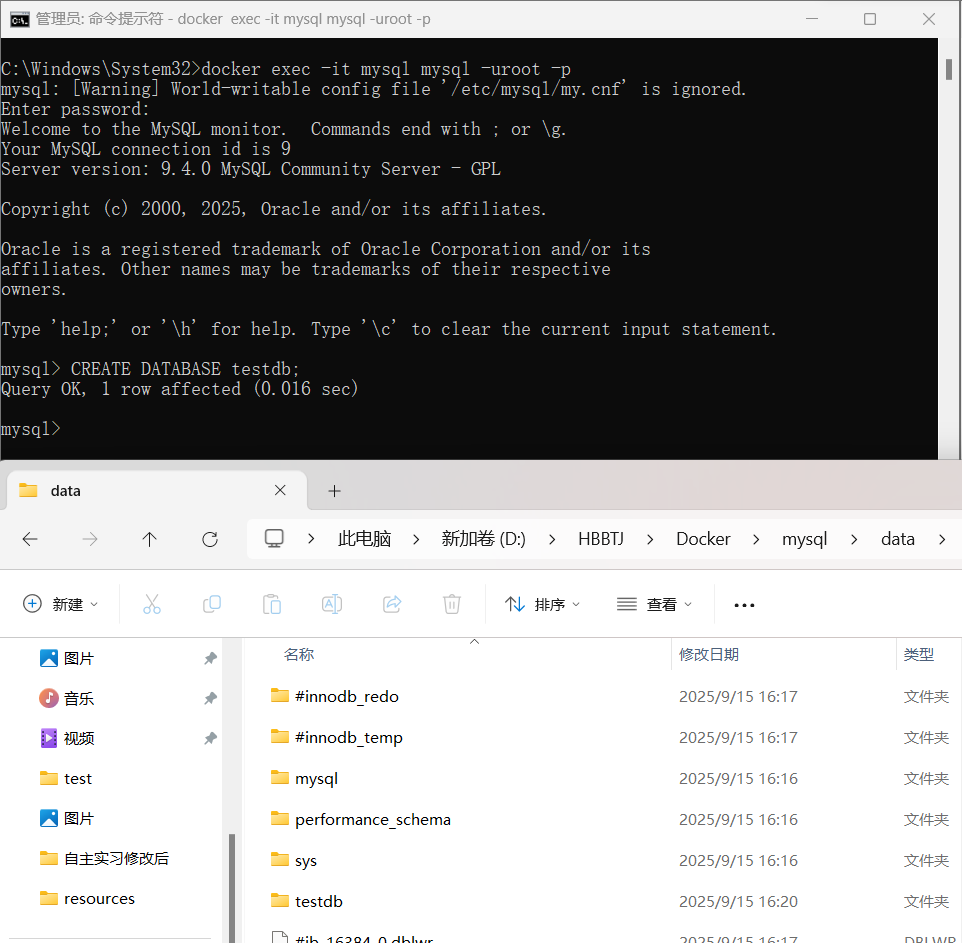  

数据会存到 Docker 管理的 volume 里，用 `docker volume ls` 可以查看。

#### 5.在Idea中连接mysql

在Docker中启动并登录mysql

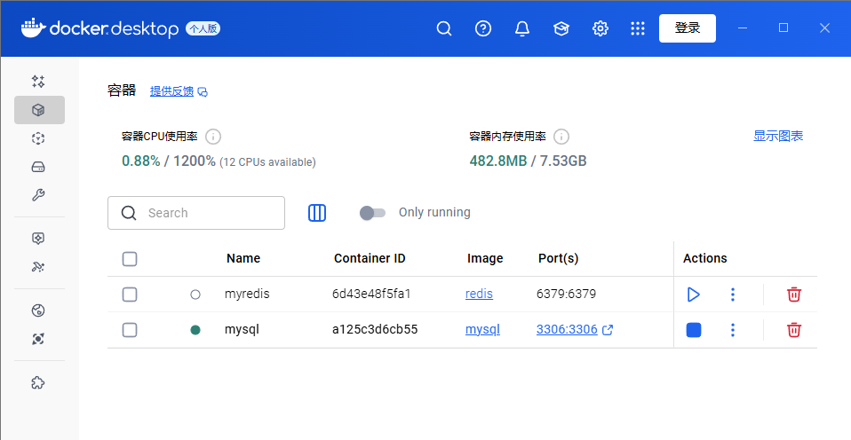

**打开 Database 工具窗口**

- 在 IDEA 右侧工具栏找到

  Database（数据库）图标，如果没看到：`View → Tool Windows → Database` 打开。

- 新建 MySQL 数据源
- 在 Database 窗口里，点击左上角的 **+**

- 选择 **Data Source → MySQL**（如果没有 MySQL，说明没装驱动，IDEA 会提示你下载）  

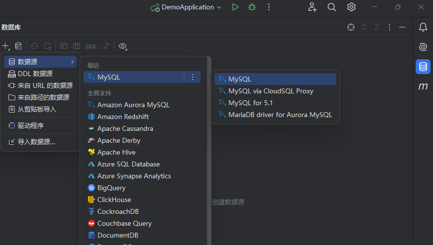

**填写数据库连接信息**

- **Host**：数据库服务器 IP，例如 `localhost`
- **Port**：MySQL 默认 `3306`
- **User**：你的 MySQL 用户名，例如 `root`
- **Password**：你的 MySQL 密码（可以勾选 Save）
- **Database**：要连接的数据库名（可以不填，先连上服务器再选）

------

**下载 MySQL JDBC 驱动**

- 第一次用 MySQL，IDEA 会提示你下载驱动：

- 点击 **Download Driver Files**（自动下载）
- 如果下载不下来，可以手动下载 MySQL Connector/J，然后在这里手动选择 JAR

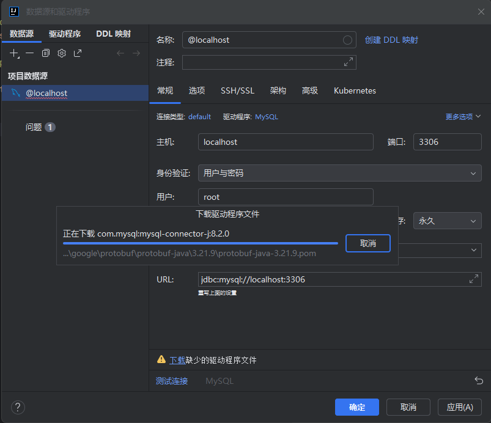

**测试连接**

- 点击右下角的 **Test Connection**，看到绿色 ✅ 说明连上了。

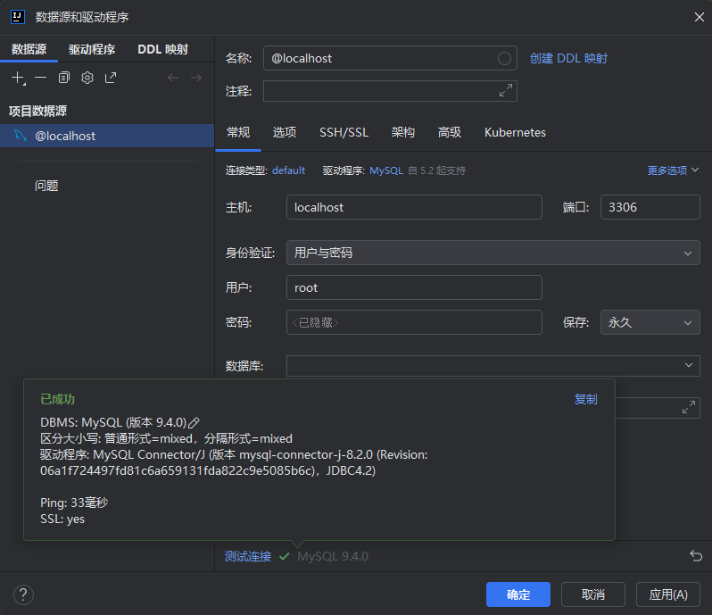

## 三、使用 Spring Initializr 创建 Spring Boot 3.5 项目

### 1、打开 Spring Initializr

- 在浏览器里输入 👉 [https://start.spring.io](https://start.spring.io/)
  这是 Spring 官方提供的项目生成器。在页面上你会看到很多选项：

- **Project（构建工具）**
  - `Maven` 或 `Gradle`
  - 推荐选 **Maven**（更常见，也适合新手）。
- **Language（语言）**
  - `Java`（推荐）
  - 也支持 Kotlin / Groovy，但 Java 最主流。
- **Spring Boot 版本**
  - 选择 **3.5.x**（比如 3.5.0、3.5.1，取决于最新发布的版本）。
  - ⚠️ 注意：Spring Boot 3.x **要求 Java 17 或更高版本**。
- **Project Metadata（元信息）**
  - **Group**：通常是你的组织名或包名前缀，例如：`com.example`
  - **Artifact**：项目名（生成的 jar 名），例如：`demo`
  - **Name**：项目名称，例如：`demo`
  - **Package Name**：默认会根据 Group + Artifact 生成，例如：`com.example.demo`
  - **Packaging**：选 `Jar`（大多数 Web 项目都用 Jar）。
  - **Java**：选择 **17 或以上版本**。

### 2、添加依赖

点击 **“Add Dependencies”**，搜索并添加你需要的依赖，例如：

- **Spring Web**：构建 REST API 或 Web 应用。
- **Spring Boot DevTools**：热部署（开发时更方便）。
- **Spring Data JPA**：如果你要用数据库。
- **MySQL Driver** 或 **PostgreSQL Driver**：连接数据库。

作为 Hello World 示例，先只添加 **Spring Web** 就行。

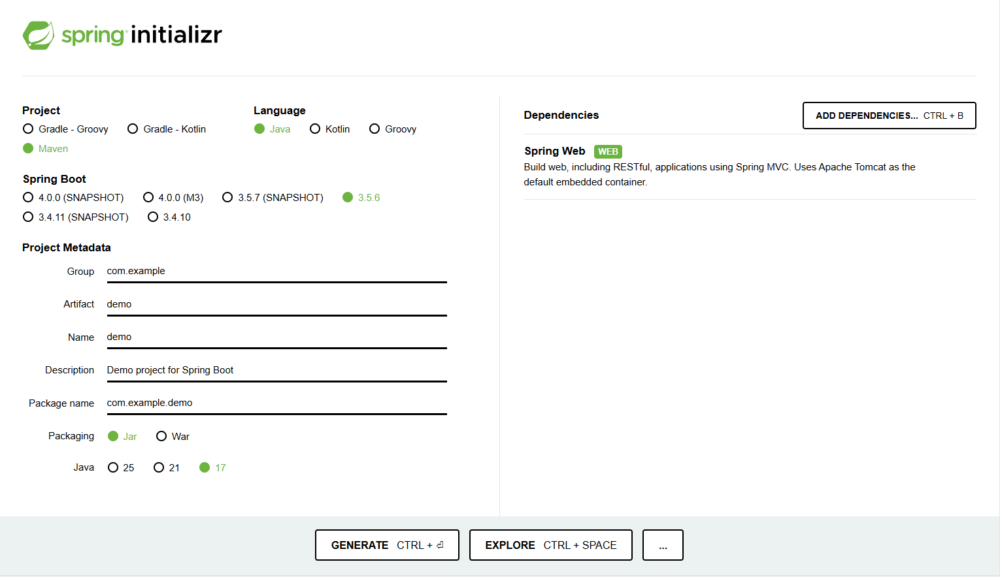

------

### 3、生成项目，导入到 IDE

- 点击 **“Generate”** 按钮。
- 它会下载一个 `.zip` 文件，比如：`demo.zip`。

- 解压 `demo.zip`。
- 打开你的 IDE（IntelliJ IDEA / Eclipse / VSCode）。
- 选择 **Open Project** 或 **Import Project**，选中解压后的目录。
- IDE 会自动识别这是一个 Spring Boot 项目，并下载依赖（第一次可能要等一会儿）。

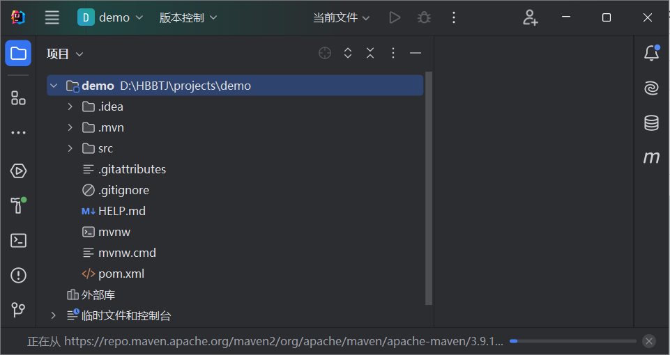


### 4、启动项目

在 IDE 里找到 `DemoApplication.java`（通常在 `src/main/java/com/example/demo/` 下），点击运行（或者用命令行）：

```bash
mvn spring-boot:run
```

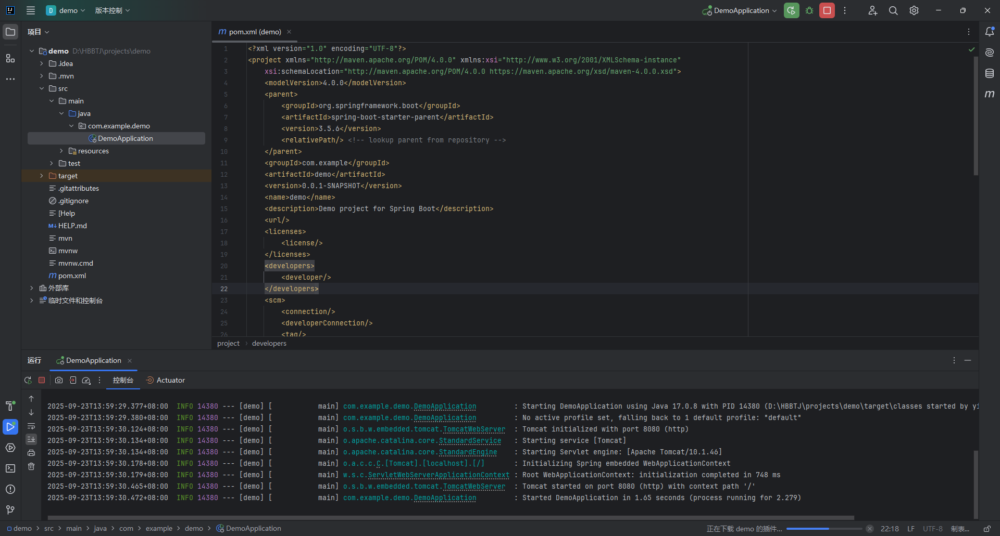

### 5、测试 Hello World

在 `src/main/java/com/example/demo/` 下，新建一个类 `HelloController.java`：

```java
package com.example.demo;

import org.springframework.web.bind.annotation.GetMapping;
import org.springframework.web.bind.annotation.RestController;

@RestController
public class HelloController {

    @GetMapping("/")
    public String hello() {
        return "Hello, Spring Boot 3.5!";
    }
}
```

### 6、在浏览器里访问

然后重新启动项目，启动成功后，在浏览器里访问：👉 [http://localhost:8080](http://localhost:8080/)你会看到输出：

```
Hello, Spring Boot 3.5!
```

------

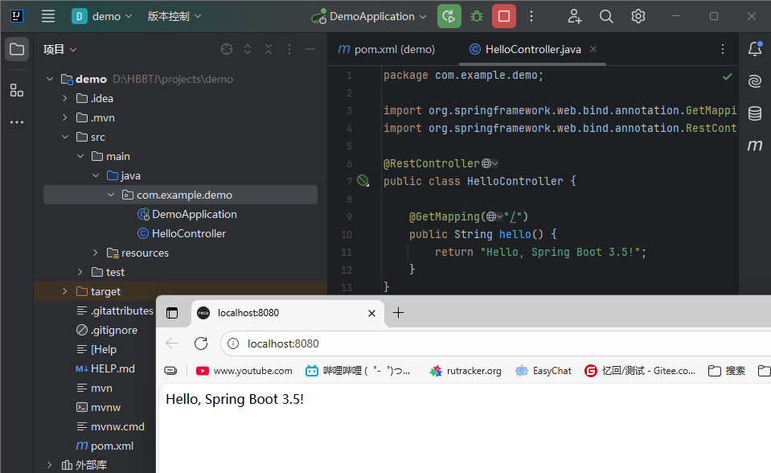

到这里，你就已经成功用 **Spring Boot 3.5** 创建并运行了一个 Web 项目。

